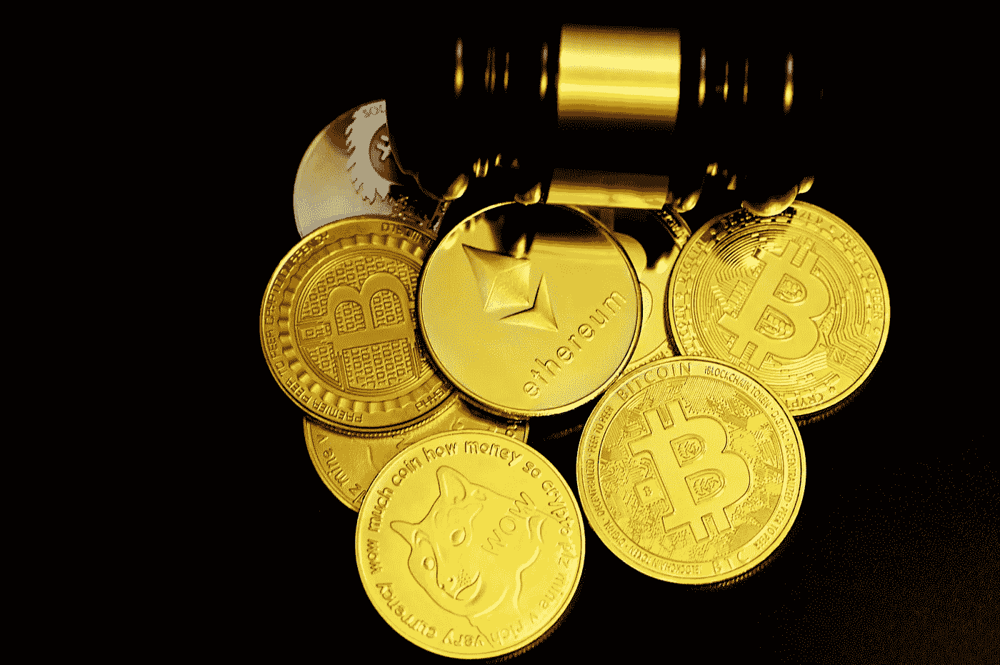

# 稳定铜的有用性质

> 原文：<https://medium.com/geekculture/the-useful-properties-of-stablecoins-475f7fa30c8e?source=collection_archive---------13----------------------->

通过使用这些来避免交易加密货币时的交易费用

Photo by [Executium](https://unsplash.com/@executium?utm_source=unsplash&utm_medium=referral&utm_content=creditCopyText) on [Unsplash](https://unsplash.com/s/photos/cryptocurrency?utm_source=unsplash&utm_medium=referral&utm_content=creditCopyText)s

加密货币极其不稳定。大部分从莱特币了解比特币的人都已经意识到了这一点。加密的波动性对一些交易者很有吸引力，因为它提供了价格突然上涨的可能性，这可能导致短期投资组合的增长。