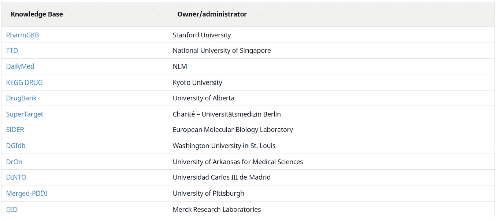

# 自动化药物警戒知识库的价值和发展

> 原文：<https://medium.com/geekculture/the-value-and-evolution-of-knowledge-bases-for-automating-pharmacovigilance-785fddd36423?source=collection_archive---------17----------------------->

药物警戒(PV)实践已被证明对制药公司非常有用，制药公司需要了解在产品的整个生命周期中哪些药物可能会引起药物不良反应(ADR ),以及在何种情况下会引起药物不良反应。

但是，传统的光伏活动也受到了最近的批评，因为它们过于依赖来自自发报告系统(SRS)的信息，而这些信息有时是不完整、不正确的，甚至是有偏见的。批评者说，传统的基于 SRS 的 PV 往往忽略了越来越多的[附加相关信息](https://www.sciencedirect.com/science/article/pii/S1532046416301794)，如产品标签、同行评审的医学文献以及来自社交媒体和其他在线来源的数据。

然而，利用所有这些信息对研究界来说是一个巨大的挑战，主要是由于医学文献的庞大(且不断增长)规模，历史上[标准化](https://pubmed.ncbi.nlm.nih.gov/23586589/)差，以及缺乏互操作性和可访问性。

由于这些原因，由机器学习(ML)驱动的用于上市后监测的自动化 PV 已经变得更加普遍。手动查阅所有这些数据成本太高，也太耗时——尤其是当一些监管机构要求公司每周进行一次审查时。

这就是为什么自动化的 PV 方法或多或少与标准化 ADR 知识库的增长同步发展。这些知识库有助于促进下一代光伏自动化，同时允许个体研究人员更容易地与全球数据集、生物医学知识和算法联系起来。

## 什么是药物知识库，它如何帮助 PV 自动化？

一般来说，[知识库](https://www.meddra.org/how-to-use/support-documentation/english/welcome)是计算机系统存储复杂信息(结构化或非结构化)的地方。知识库主要与基于人工智能(AI)的[专家系统](https://en.wikipedia.org/wiki/Expert_system)结合使用，这些专家系统旨在解决特别具有挑战性的问题，但通常需要大量数据来做出决策。

因此，药品不良反应知识库实质上是一个可计算的标准化信息数据库，这些信息来源于广泛的生物医学信息源。它提供了一个机器可读的信息库，可以更容易地促进人工智能和机器学习(ML)驱动的 PV 活动自动化。

使 ADR 数据标准化的方法包括世界卫生组织不良反应术语([世卫组织-ART](https://www.who-umc.org/vigibase/services/learn-more-about-who-art/) )。然而，该系统现在已不再被积极维护，大部分已被 [MedDRA](https://www.meddra.org/how-to-use/support-documentation/english/welcome) 取代，这是一个标准化的医学术语，“以促进人类使用的医疗产品的国际监管信息共享。”

这样的知识库和标准化对于使用 ML 和 AI 模型的 PV 活动的大规模自动化来说是必不可少的，这在历史上面临着[围绕可扩展性、数据互操作性、数据管理、可再现性、可访问性和安全性的重大挑战](https://journals.plos.org/plosone/article?id=10.1371/journal.pone.0083016)。

## 药物知识库示例

现在存在许多药物知识库，从集中的相对简单的项目到更大更全面的数据库。“这些精选的药物知识库为开发高效和有效的卫生信息技术以提供更好的卫生保健服务做出了重大贡献，”[朱等人解释道](https://pubmed.ncbi.nlm.nih.gov/29304188/)。

例如， [MediDrug 知识库](http://www.ebmconnect.com/html/medidrug_knowledge_base.asp)由四个专门的数据库组成:SFINX(药物-药物相互作用数据库)、Pharao(药物副作用)、Renbase(肾衰竭患者的药物安全性)和 Gravbase/Lactbase(妊娠和哺乳期间的药物安全性)。使用[等级系统](https://www.gradeworkinggroup.org/)将临床建议分类为 MediDrug。

这样的知识库允许用户基于以前的 ADR 和其他风险信号更容易地评估药物的风险概况。

其他常见药物知识库[包括](https://academic.oup.com/bib/article/20/4/1308/4785946)以下内容:

## PV 自动化药物知识库的发展

制药研究人员并不总是能获得如此丰富、公开的知识库。令人欣慰的是，过去十年的几项研究帮助证明了药物知识库作为知识共享工具的可行性，以及它们在自动化 PV 活动和 ADR 检测方面的实用性。

*   **纽伯特等人**。( [2013](https://pubmed.ncbi.nlm.nih.gov/23586589/) )使用世卫组织-ART 药品不良反应标准化、 [ATC 药品分类](https://www.who.int/tools/atc-ddd-toolkit/atc-classification)标准化和 [LOINC](https://loinc.org/) 实验室检验结果标准化建立了药品不良反应知识库(ADR-KB)，在近 1000 名儿科和内科住院患者的研究人群中对其进行了评估。该系统对内科患者的特异性达到 73%(高于 7%)，对儿科患者的特异性达到 91%(高于 19.6%)。

该研究的作者写道:“这项研究表明，患者用药数据与实验室测试结果的上下文关联是计算机辅助 ADR 检测的一种有用而合理的工具，也是朝着系统药物安全过程迈出的有价值的一步。”该系统能够在临床实践中自动检测 ADR，质量接近密集图表审查。"

*   **洛佩斯等人**。( [2013](https://journals.plos.org/plosone/article?id=10.1371/journal.pone.0083016) )创建了一个分布式光伏平台，包括一个源自集成和导入数据集的基于云的知识库，以帮助解决可扩展性、可再现性、安全性和互操作性问题。这个被称为 [EU-ADR 网络平台](https://bioinformatics.ua.pt/software/euadr/)的系统至今仍在使用。
*   **沃斯等人**。( [2017](https://pubmed.ncbi.nlm.nih.gov/28270198/) )创建了 LAERTES(与治疗证据标准化相关的大规模不良反应)开源和标准化知识库，该知识库整合了几个不同的证据来源，包括监管和临床用例，并结合了一个预测模型。预测模型证明了使用所有可用证据的模型的高预测准确性。

## 使用 CapeStart 自动进行药物警戒

与渴望获得越来越多合规信息的行业监管机构保持一致并不容易。公司需要基于最新的医学知识和文献，以更高效、更具成本效益的方式开展持续的光伏活动。CapeStart 的机器学习专家、自然语言处理工程师、制药主题专家和[药物警戒专家](https://www.capestart.com/solutions/post-market-drug-safety-monitoring-of-consumer-non-medical-reports/)帮助您为 PV 自动化和其他上市后监测活动导航和选择正确的药物知识数据库。

请立即联系我们，安排一次与我们专家的简短咨询。