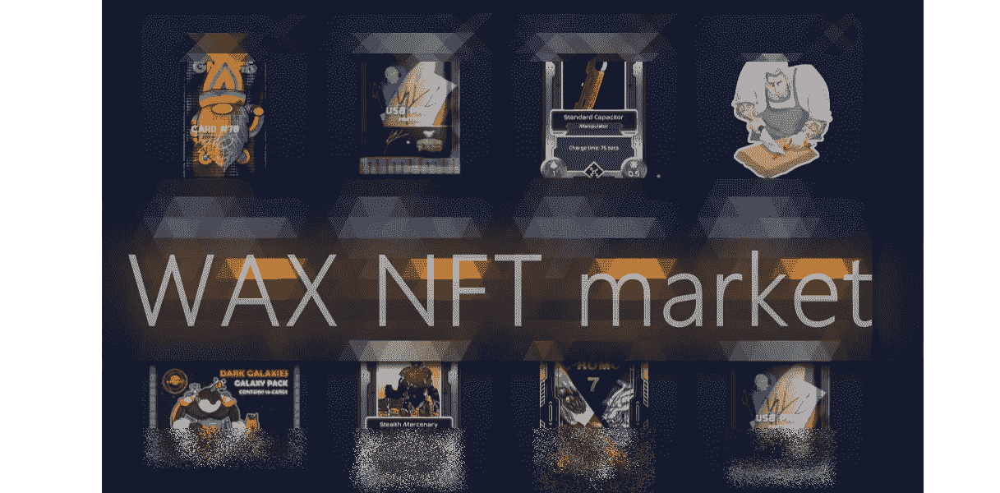

# WAX 加密网络很酷

> 原文：<https://medium.com/geekculture/the-wax-crypto-network-is-cool-87dd2a47b6f4?source=collection_archive---------23----------------------->

## 你可以从翻转 NFT 中赚钱

The image is an edited screenshot from [Atomic Hub](https://wax.atomichub.io/), made by the author

你小时候收集过交易卡吗？我不知道现在的孩子，但在我的童年，我们疯狂地收集各种各样的交易卡，尤其是当你可以发现它们被包在泡泡糖包里。每个人都嚼着口香糖，收集交易卡，在外面玩耍。没有智能手机或电脑。

甚至还有一个家长们常开的玩笑:

> "小心那块口香糖，如果你咽下去，会让你的肠子粘在一起的！"

我记得在 90 年代，在我住的街区的孩子们中有一股巨大的潮流，那就是交换 94 年世界杯足球赛的名片。这些卡片上有那个时代最好的球员，足球在那个时代更令人愉快。与其说是钱，不如说是纯粹的天赋。

超级跑车交易卡也是一种趋势，我记得我的布加迪威龙卡是一种罕见的卡。其他孩子想给我多张法拉利和迈凯轮的卡，只是为了给他们。

最受欢迎的卡片是那些有当时电影明星的卡片，如西尔维斯特·斯塔隆、查克·诺里斯、李小龙、阿诺德·施瓦辛格等。

在我读到关于 NFT 的第一批东西，尤其是一种类似于我们所知的交易卡的 NFT 收藏品之前，我从未想过交易卡的世界会再次流行起来。在蜡像网上，你可以找到非常好的例子。

# 在蜡网上能做什么？

你可以看到和购买许多虚拟交易卡形式的收藏品。你可以从漫画书和其他各种收藏品中找到卡片系列，也可以在游戏中使用卡片。《异形世界》是这个网络上一款非常受欢迎的游戏，我在这里写下了它:

 [## 令人惊讶的新的和改进的界面在外星世界

### 手机友好的小故障终于解决了！

medium.com](/geekculture/surprisingly-new-improved-interface-in-alien-worlds-4357e15e030a) 

这款游戏基于一系列可以从游戏中取出并在蜡网上出售的卡片，用于获取网络的加密货币，名为 [WAXP](https://coinmarketcap.com/ro/currencies/wax/) 。游戏的主要资源[外星世界 Trilium](https://coinmarketcap.com/ro/currencies/alien-worlds/) 可以通过 [Alcor Exchange](https://wax.alcor.exchange/) 兑换成 WAXP，但是你需要有一个[蜡云钱包](https://wallet.wax.io/dashboard)，它可以很容易地用谷歌帐户创建。

在 WAX network 上，你也可以创建你自己的 NFTs，但是如果你是一个已经有追随者并且能够证明这一点的艺术家，那就更理想了。你的 NFT 将被列入白名单，这将使其他人看到你的一套卡来自一个值得信赖的品牌。它们更有可能卖个好价钱，因为它们会在 NFT 市场上脱颖而出。

# 在蜡像网上翻转虚拟卡片

通过在属于 WAX 网络的[原子枢纽市场](https://wax.atomichub.io/)上翻牌，你可以成倍增加你的 WAXP 代币。就像任何市场上的买卖一样。你买一些你能找到便宜的卡片或者你做拍卖报价。然后，你以更高的价格出售它们，这个价格可以是市场推荐价格，也可以更高。由你决定。你可以试验一下，看看是否对你有效。

市场有一些简洁的功能，显示你能找到的某一 NFT 的最低价格，每张卡的建议价格，以及你的整张卡库存的美元价值。

我记得有人在 YouTube 上说，他只是在玩买卡和卖卡，结果他赚了 1000 美元，却没有投资任何东西。这是在网络存在的早期阶段。我最近尝试使用从游戏《外星世界》中提取的 Trilium，并将其转换为 WAXP。

我认为一些 WAXP 需要更多的网络资源，因为它们是正常运行所必需的:CPU、RAM 和 NET。我用一些 WAXP 代币买了一些 NFT 卡，发现比市场的中等价格便宜。然后，我把它们以更高的价格出售。其中一些一夜之间就卖出去了，其他的还在销售，所以我可以说这个东西正在起作用。我打算这样增加我的 WAXP 代币。如果我做了很多 WAXP，我会用新的文章通知你。

# 结论

以 NFTs 的形式翻转虚拟卡非常有趣，尤其是如果你知道如何设定价格，以便尽可能多地成功销售。这种购买和销售过程与在 WAX 平台上玩游戏和将 WAXP 用于下注是齐头并进的，以确保您有足够的系统资源。

我建议尝试一下，你可以从游戏《异形世界》中的 Trilium 开始，将其转换成 WAXP，然后在 Atomic Hub marketplace 上翻牌。

*如果你想阅读更多像这样的文章以及任何其他关于 Medium 的文章，你可以* [*订阅 Medium*](https://marchisflorin82.medium.com/membership) *。一个月只要 5 美元，但是你花的钱非常值得。*

**免责声明:** *我不是理财顾问，这篇文章无论如何都不应被视为理财建议。其中包含的信息只是为了教育目的。投资 crypto 是有风险的，除非你能承受你投入的钱的损失，否则不应该这样做。*