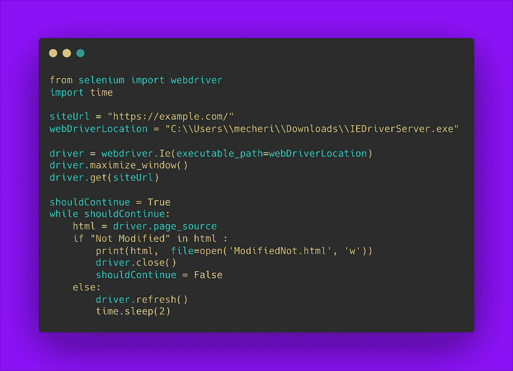
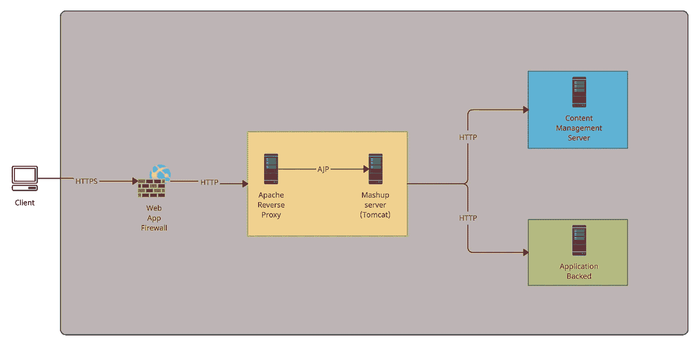
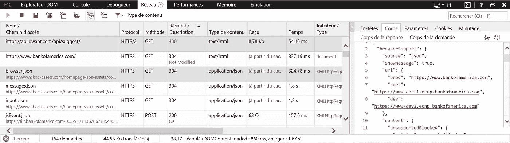
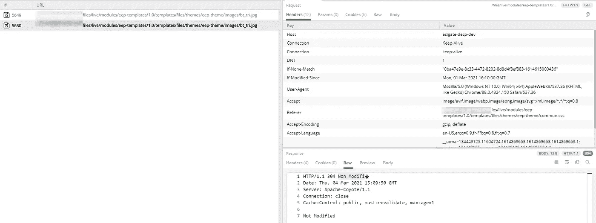
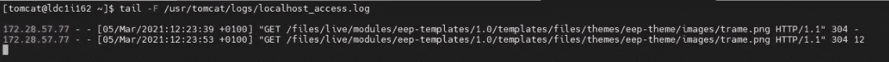

# 我在软件工程职业生涯中遇到的最大的产品缺陷。

> 原文：<https://medium.com/geekculture/the-weirdest-bug-that-i-faced-during-my-software-engineering-career-4278fa40215f?source=collection_archive---------45----------------------->

The unexpected “Not Modified” screen.

在这篇文章中，我将描述我一生中遇到的最奇怪的 Internet Explorer 错误，我们如何**诊断它，**以及我们如何在我的公司里设法**纠正它**。

当你读到这篇文章的时候，IE 可能已经不存在了，因为微软已经宣布在 2022 年 6 月 15 日之前放弃它，所以大多数公司和个人应该努力转移到另一个浏览器以保持安全，这对 web 开发人员来说是个好消息，因为他们知道 Internet Explorer 在 web 开发方面一直是个棘手的问题，主要是因为它的各种 CSS 和 JavaScript 不兼容，我们经常可以找到一些针对这类问题的补钉；**我在本文中要描述的问题与 JS 或 CSS 无关，这是 IE 在收到外来 HTTP 响应时的一种非常奇怪的行为，所以这一次我们不能说这是 IE 的错。**

## 背景📃

我在一家保险公司从事 B2B 项目，我们的一个客户在其所有 IT 基础设施中将 IE 部署为默认浏览器，因此我们需要确保我们的网站在 IE 上的运行与在其他浏览器上的运行一样完美，**最近，我们的客户向我们报告了一个影响我们一个网站的严重错误，这个错误是如此奇特，以至于我决定就此写一篇博文。**

**基本上，这个 bug 通过在我们网站的 DOM 开头添加多行“Not Modified”字符串后跟一些 HTTP 头来影响我们网站的显示。**

**是什么让这个 bug 如此奇特**👽

*   这个错误是随机发生的。
*   经过数千次尝试后，我们只能重现这个错误几次。
*   它只发生在 IE 和生产环境中。
*   在 bug 报告之前，没有重大变更被推送到 prod。

## 复制 Bug🐛

由于错误的随机性，这是一项艰巨的任务，即使在我们客户端的相同生态系统上进行了数千次刷新后，我们也无法在我们的机器上重现错误，我们最终做的是创建一个 Selenium 程序来为我们刷新页面，并检查页面的 DOM 中的**“Not Modified”**字符串。

Python Script for reproducing the bug

运行这个程序一段时间后，我们设法重现了这个错误，并导出了包含**“Not Modified”**字符串的 HTML。

The unexpected “Not Modified” screen.

> 既然我们成功地重现了这个 bug，我们就需要理解为什么我们会在页面顶部出现这个意想不到的内容。

为此，我们必须从基础设施的角度来看待应用的架构:

The Infrastructure Architecture of the app.

从下面的架构中，我们确定了一些潜在的有问题的组件，并有一些假设。

***哪些组件可以编辑 HTML 呈现的页面？***

1.  Mashup 服务器负责服务器端的集成，它直接作用于 HTML 渲染，它可能在从 CMS 检索缓存资产时有一个错误，所以我们试图禁用 CMS 服务器上的缓存，但错误仍然存在。
2.  Javascript 可以在客户端编辑 HTML 在发送一些 XHR 请求后，我们逐个分析了 XHR 请求，但它们都没有 304 响应代码，但**我们观察到“未修改”字符串不是第一个 paint 内容**的一部分，因此我们强烈认为 Javascript 应该对这一点上的错误负责(后来我们知道我们错了)。

## 深入调试🧿

> 当时，我们当然知道问题发生在客户端，因为“未修改”字符串不是第一个 paint 内容的一部分。

我们坚信一些 JS 负责在屏幕上打印这些奇怪的标题，我们分析了我们在传统 JSF 应用程序(应用程序后端)上使用的所有库，我们有许多 JS 库要分析，例如 [Sarissa JS](https://sarissa.sourceforge.io/howtos.html) ，Sarissa 很容易指出，因为它充当了 XHR 请求的包装器，我们审查了几乎所有的 JS 代码，只是意识到没有一行 JS 在我们应用程序的 DOM 上注入这些不需要的标题。

> 此时，我们知道错误发生在客户端，但 Javascript 对此没有责任。

与 Chrome 和 Firefox 等最新的网络浏览器不同，IE 没有一些像样的调试功能，IE 上的网络选项卡误导了我们的调查，让我解释一下原因:

IE — Network tab

这里关于 network 选项卡的误导之处在于，HTTP 304 响应与主体内容相关联，没有迹象表明主体是从本地缓存中检索的，而不是从实际的响应中检索的(应该没有主体内容与之相关联)，因此如果您没有真正注意，您很容易认为主体是通过 304 响应从服务器返回的。

我们决定查看如何从我们的后端接收单个 304 资源，为此，我们使用了一个非常有趣的名为 Fiddler 的程序，这是一个调试代理服务器工具，用于记录、检查和更改 web 客户端和 web 服务器之间的 HTTP 甚至 HTTPS 流量。

HTTP 304 response with a Body!

## 答对了。

通过使用 Fiddler，我们发现了一个严重的问题，我们注意到我们的 304 响应有一个违反 HTTP 协议的主体内容(12 字节)。

> 304 响应[不能包含消息体](https://httpstatuses.com/304)；它总是由标题字段后的第一个空行终止。

查看以下文章，以正确的方式学习 HTTP:)

 [## 在学习 Rest / Soap / GraphQL /之前你需要了解 HTTP！

### HTTP 代表超文本传输协议，最初是为 web 浏览器/服务器通信而创建的，它有更多的…

mecheri-akram.medium.com](https://mecheri-akram.medium.com/before-learning-rest-soap-graphql-you-need-to-understand-http-9eb80de6cfbf) 

现在我们知道，我们的服务器正在为缓存的资源返回一些奇特的 HTTP 响应，与 Chrome 和 Firefox 不同，IE 不容忍这种违反协议的行为，并通过将这些响应的正文直接打印到 DOM 上来表现怪异。

## 那么 304 HTTP 响应是从哪里得到正文的呢？

当我们直接从 Mashup 服务器获取资源时，我们会收到一个没有主体内容的 304 响应(L.1)，但是当通过 RP 时，我们会收到一个有主体内容的 304 响应(L.2)。

Tomcat access log

RP 通过 [AJP](https://en.wikipedia.org/wiki/Apache_JServ_Protocol) 协议连接到混搭服务器，我们对 Tomcat 服务器的 AJP 连接器做了一些研究，结果发现这个连接器确实存在[问题。](https://bz.apache.org/bugzilla/show_bug.cgi?id=55453)

Tomcat 7 . 0 . 43 版修复了这个错误，所以我们只需升级我们的 Tomcat 服务器版本来纠正这个问题。

## 最终想法:

我花时间写下这个特殊的经历有很多原因，首先，我希望面临类似错误的人可以在这里找到帮助，然后对于我的 web 开发同事，我想指出了解你的应用程序所有层的重要性，不要成为一个专属的前端或后端开发人员，否则，你将无法诊断一些严重的错误，就像本文中描述的那样，最后，产品经理，请停止使用/支持 IE:)

**就这样**，如果你觉得这篇文章有趣，请不要犹豫，让我发表评论和/或点击👏下面的按钮。

## 参考资料:

 [## 304 未修改

### 已收到条件 GET 或 HEAD 请求，如果不是因为…

httpstatuses.com](https://httpstatuses.com/304)  [## 55453 - AJP 发送状态为 304 的正文

### 编辑描述

bz.apache.org](https://bz.apache.org/bugzilla/show_bug.cgi?id=55453)  [## Windows 10 上的 Internet Explorer 的未来在微软 Edge

### 在过去的一年里，你可能已经注意到我们远离了对 IE 的支持，例如…

blogs.windows.com](https://blogs.windows.com/windowsexperience/2021/05/19/the-future-of-internet-explorer-on-windows-10-is-in-microsoft-edge/)