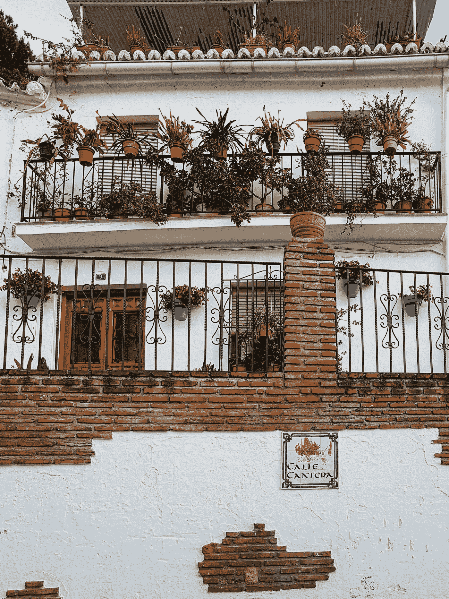

# 米哈斯的“白色城市”

> 原文：<https://medium.com/geekculture/the-white-city-of-mijas-4a50c9d89227?source=collection_archive---------12----------------------->

在马拉加省周围，你可以找到一些令人惊叹的"**pueblos Blanco**"——或者白人村庄！

有着粉刷过的房屋和狭窄的通道，米哈斯就是其中之一！

copyright ©️[AlexandraMDatcu](/@lexseries)

在回梅兹奎蒂拉的路上，我们在阳光海岸的这座美丽的**城市停留了一会儿，欣赏了它的小街、美丽的景色和一家**巧克力工厂**！**

# 是的，你可以参观它，是的…