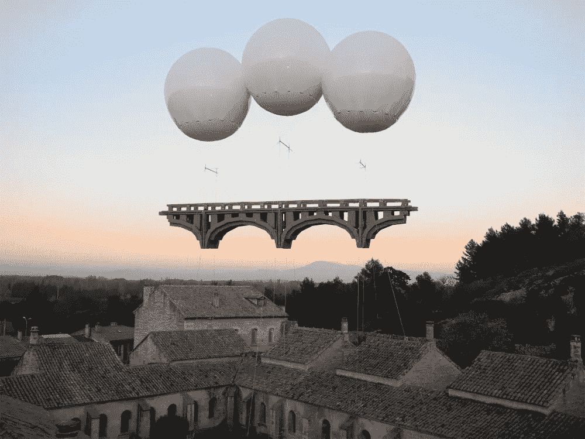

# “Winnebiko”，纸板桥，以及为什么人工智能不应该为你写代码

> 原文：<https://medium.com/geekculture/the-winnebiko-cardboard-bridges-and-why-ai-shouldnt-write-code-for-you-b937a6d7604a?source=collection_archive---------21----------------------->

## 这是你拖延症的材料！在我这周的“链接节”上

“Architecture en Fête, Villeneuve lez Avignon, France”, by Olivier Grossetête

周一到了，本周的“链接节”也到了——堆满了拖延而不是工作的材料。