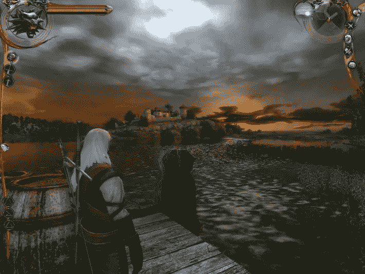

# 巫师 1 游戏评论

> 原文：<https://medium.com/geekculture/the-witcher-1-game-review-eb9ecc21a207?source=collection_archive---------10----------------------->

## 三部曲的第一部——独特的氛围

Image is taken from [gog.com](https://www.gog.com/game/the_witcher) (screenshot from the game)

那是一个冬天的晚上，我在乡下，我家有一栋房子。一切都是为圣诞节准备的。树做好了，炉子生了火，开始下雪了。

我刚刚在读一个叫做巫师 3 的新游戏，对三部曲中的其他游戏一无所知。我在 YouTube 上看了看，找到了一个关于这个游戏的视频演示。我立刻被《巫师 3》吸引住了，但我想从头开始，从第一个游戏开始，所以我先从玩《巫师 1》开始。

# 游戏三部曲背后的故事

游戏三部曲《巫师》的灵感来自波兰作家[安德烈·萨普克维斯基](https://en.wikipedia.org/wiki/Andrzej_Sapkowski)，他写了一系列名为《巫师》的书，游戏背后的团队 [CD Projekt Red](https://en.wikipedia.org/wiki/CD_Projekt_Red) 最初向他提出了游戏的想法，但作者对其潜在的成功持怀疑态度，并不在乎从游戏中获得版税。他只是接受了一次性付款。

后来，在《巫师三部曲》的游戏获得国际成功后，作者在法庭上要求更多的钱。最终，情况得到解决，双方达成协议。

# 游戏故事

这是里维埃拉的杰勒特的故事，一个巫师，在一个中世纪的幻想世界里，有着我喜欢的黑暗氛围。巫师的工作是杀死怪物，这样人们就不会受到这些野兽的骚扰或攻击。你通过杀死这些怪物来获得游戏中的金钱。

故事从书的结尾开始。众所周知，与尼尔加德帝国的战争一结束，里维埃拉的传奇人物杰拉尔德就去世了。事实是，他并没有死，而是被其他巫师救了出来，带到了一个安全的地方。这个地方遭到了农民的袭击，杰拉尔德在这里逃脱，并开始了他的旅程，前往其他地方，如维济马市，会见老朋友，与怪物战斗，试图恢复他失去的记忆。

这个故事非常复杂，有着你在该类型的其他游戏中不常看到的细节层次，尤其是 NPC 的脚本编写方式，以及他们如何与你互动。对于环境和昼夜变化也有很大程度的细节。

在 2007 年发布的第一个游戏中，故事是整个时间线的一部分，安德烈·萨普科夫斯基写的小说也是其中的一部分，三部曲的其他两个游戏也是如此，还有一个网飞系列。第一部巫师游戏中的故事发生在小说中的故事之后，杰拉德对过去发生的事情失去了记忆，并在游戏三部曲中慢慢恢复了记忆。

游戏从介绍视频开始，讲述了巫师和君主之间的契约，其中杰拉德必须解除君主女儿的诅咒，她在晚上变成了一只致命的野兽。

你可以在这里看到电影预告片:

Cinematic trailer from gog.com YouTube channel

# 游戏部分

## 性格；角色；字母

一个巫师从小就被训练，然后服用诱变植物的鸡尾酒来获得一套技能，使他更好地对抗怪物。杰拉尔德携带两种主要武器:一把更擅长对付人类对手的钢剑和一把更擅长对付怪物的银剑。他还可以携带其他武器，并且拥有魔法能力。

## 药剂，属性，天赋

里维埃拉的杰拉尔德使用魔药来增强他的感官，这样他就能看到物质世界的面纱之外，还能拥有夜兽的力量。属性和天赋系统帮助你选择巫师力量的进化方式。

## 摄像机和控制

相机主要是第三人称，过肩(我用的最多的一个)，但也有两种等距模式。你通过点击选择目标，然后再点击一次你就开始攻击，你点击的次数越多，攻击就进行的越快，到了一击致命的时候就可以结束目标。你很快就习惯了。

## 我的游戏体验

我玩过这个游戏，一旦你控制了游戏，进入了身临其境的故事，就很难离开。会上瘾的。你完成一个任务，然后你去 NPC 给你另一个任务，比上一个更有趣，你又玩了几个小时。它有一种身临其境的故事和良好的配音给人的独特感觉。

所有这一切都与乡村小屋的圣诞气氛和一杯葡萄酒完美地结合在一起。和休闲 RPG 有点不一样。在这个游戏中，即使只是去一个酒馆也很令人兴奋，在那里你可以和人们交谈并和他们玩骰子，因为你也可以通过玩骰子在游戏中赚钱。

# 图形、声音和系统要求

图形有时令人着迷。水面闪烁和反射，充满彩色花朵的田野，晚上可以看到月亮在云层后面升起，有与角色上的相机对话，游戏中的电影艺术，你有一个直观的游戏界面，以及许多其他使游戏成为沉浸式体验的东西。

请记住这是 2007 年发布的游戏。不要对这样一款老游戏的画面期望太高。我只能说我非常喜欢这些图片。

为了能够体面地玩游戏(不是最低)，你至少需要 Windows 7，3 GHz 的奔腾或速龙处理器，2 Gb 的系统内存，并推荐一个好的显卡，如 GeForce 7800 GTX 或镭龙 X1950 XT。

我在一台配有 8 GB 内存和英伟达 GTX 1050 显卡的 i5 笔记本电脑上玩了这个游戏。它只是在最大分辨率和所有设置最大化的情况下飞行。享受它，感受游戏环境中的黑暗氛围，是最好的方式。

# 结论

如果你觉得被最受欢迎的《巫师 3》游戏吸引，或者你可能看过《网飞》系列，你需要从头开始。这意味着要么阅读波兰作家的小说，要么玩《巫师》三部曲的第一个游戏。

你将有很多小时的乐趣，阴谋，肾上腺素，并沉浸在一个美丽的黑暗幻想世界与独特的氛围。说到读安德烈·萨普克维斯基的书，我自己有所有的小说，但我没有读完。我一读完就做复习。

*如果你喜欢你在这里阅读的东西，你可以通过* [*订阅媒体*](https://marchisflorin82.medium.com/membership) *来帮我。你将获得所有媒体文章的全部权限。我们都赢了！*