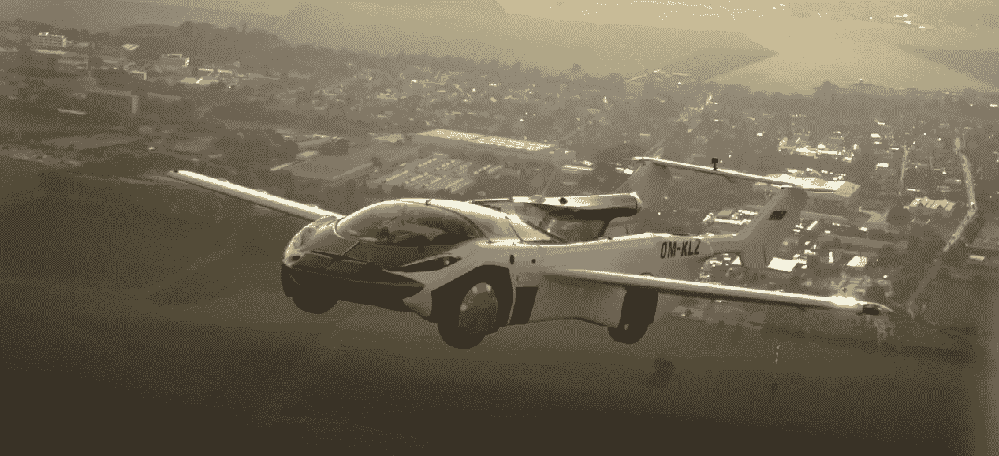

# 世界终于有了会飞的汽车

> 原文：<https://medium.com/geekculture/the-world-finally-has-flying-cars-fffefb616c0e?source=collection_archive---------1----------------------->

## 世界上第一辆飞行汽车

The AirCar flying over Bratislava (Source: Klein-Vision)

多年来，飞行汽车只是科幻电影中看到的概念。然而，飞行汽车的想法在 20 世纪初首次提出，当时没有人真正看到多少实用性。今天，我们将所有的梦想和希望抛在脑后，因为我们终于拥有了一辆 21 世纪的全功能飞行汽车，名为“AirCar”。