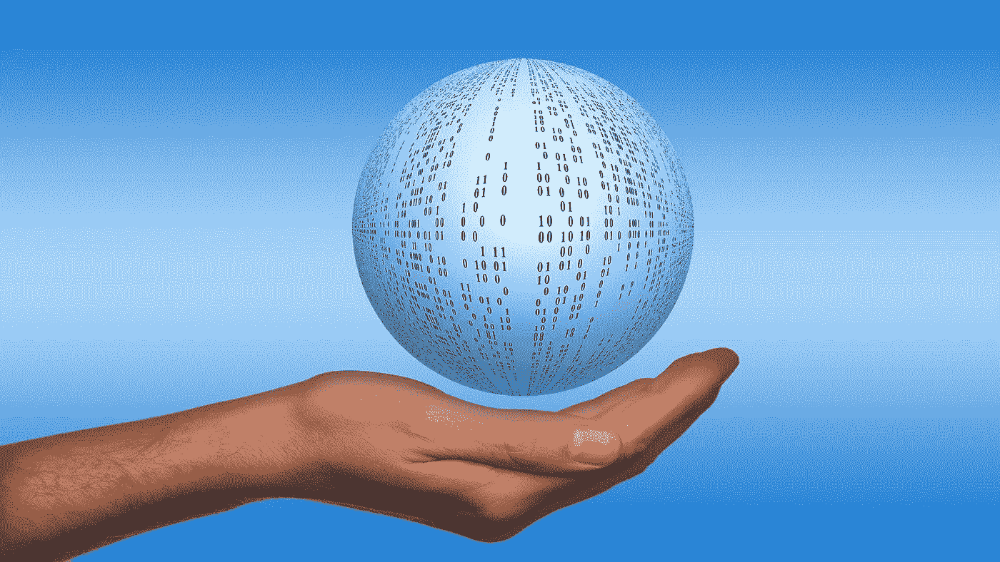

# 数据科学的世界

> 原文：<https://medium.com/geekculture/the-world-of-data-science-22246989fc46?source=collection_archive---------6----------------------->

## 普通人理解数据科学

Image by [Gerd Altmann](https://pixabay.com/users/geralt-9301/?utm_source=link-attribution&utm_medium=referral&utm_campaign=image&utm_content=457334) from [Pixabay](https://pixabay.com//?utm_source=link-attribution&utm_medium=referral&utm_campaign=image&utm_content=457334)

最近，我被邀请作为首席嘉宾参加一个面向本科生的定向课程，这些本科生将参加一个为期三年的数据科学理学学士课程。这个项目是为 SOMASA(数学、应用统计和分析学院，NMIMS)设计的，它是孟买一所非常著名的自治大学。在活动上发表主题演讲时，我意识到…