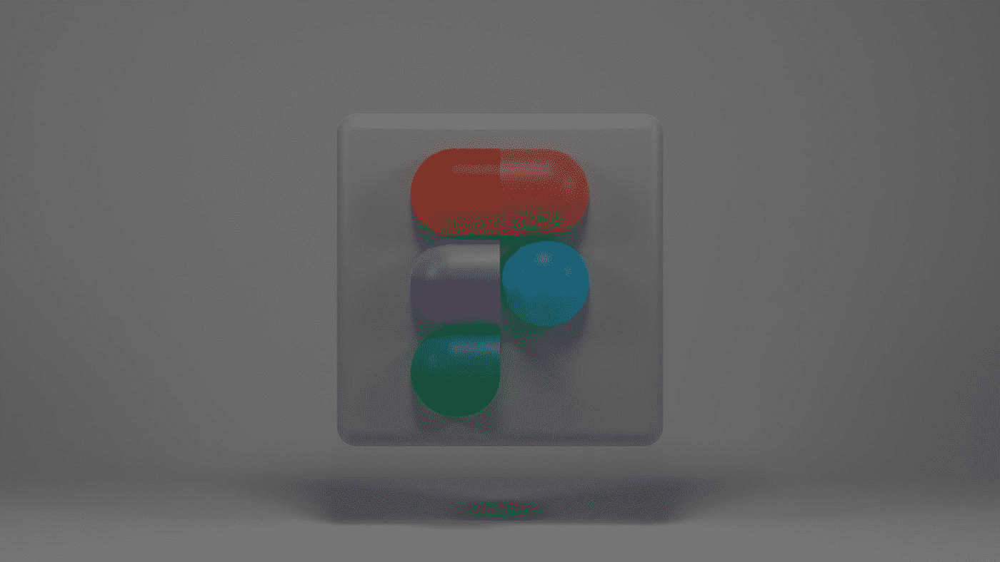

# Figma 的世界

> 原文：<https://medium.com/geekculture/the-world-of-figma-ad911a5a00bc?source=collection_archive---------16----------------------->

## Figma 是一个基于浏览器的协作式网页设计工具，可以轻松地创建令人惊叹的交互式设计！

Photo by [Shubham Dhage](https://unsplash.com/@theshubhamdhage?utm_source=medium&utm_medium=referral) on [Unsplash](https://unsplash.com?utm_source=medium&utm_medium=referral)

Figma 是一个矢量图形编辑器和设计工具，可在线免费获得。设计师用它来创建矢量插图，标志和图标。Figma 有一个用户友好的界面，可以很容易地创建设计。它也有一个图书馆…