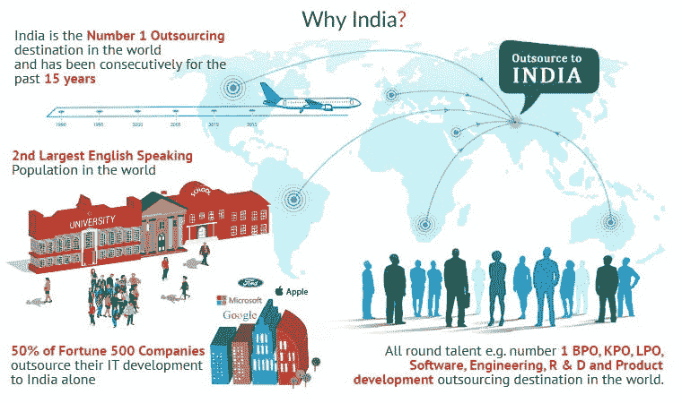
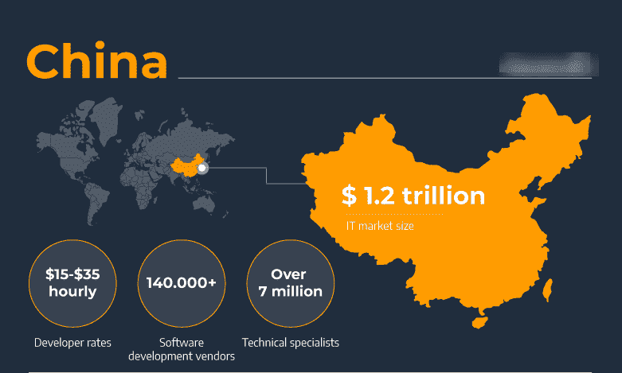

# 世界上外包 NodeJS Web 应用程序开发的最佳国家

> 原文：<https://medium.com/geekculture/the-worlds-best-countries-to-outsource-nodejs-web-app-development-5ff86223a757?source=collection_archive---------6----------------------->

Image Source: Inoxoft

NodeJS web 应用程序开发的最佳国家是那些能够为你提供令人鼓舞的商业环境、低运营成本和高质量人才库的国家。作为一个企业主，这很重要，因为这将让你专注于你的核心竞争力，同时保持管理费用下降。

嗯，要列出使用 NodeJS 进行 web 应用程序开发的最佳国家名称是一项相当困难的任务。但是困难是可以克服的，在这样做的时候，我考虑了一些帮助我选择和列出最佳国家名称的重要因素。

让我们开始旅程，但首先，寻找有助于对 NodeJS web 应用程序开发的最佳国家列表进行排序的参数。

**列出排名靠前的国家名称时要考虑的关键参数**

为了向您提供 NodeJS Web 应用程序开发的最佳国家列表，我考虑了以下因素:

*   每个国家的局限性
*   创新指数
*   外包成本
*   语言障碍
*   时区差异

**NodeJS 网络应用开发排名前五的国家**

根据上面提到的因素，下面提到的国家在使用 NodeJS 等先进技术开发领先的 web 应用程序的最佳国家名单中名列前茅。

**美国**

美国名列榜首，因为它是一个合适的国家，有天使投资者、风险资本家等融资选择。，所以你的创业想法在这里有更大的成功机会。时差使得它成为一个更值得信赖的外包地。

美国提供了一个高质量的人才库，包括熟练的 web 开发人员、设计人员和 QA 工程师，他们经过培训，能够使用 NodeJS 高效地构建网站的前端/后端。此外，美国 NodeJS 开发人员的英语能力允许您在工作时没有任何语言障碍地进行交流。

58.8%的美国营销人员注意到外包营销活动中没有与 COVID 相关的修改。

为什么更喜欢我们雇佣 NodeJS 网站开发人员？

*   构建一个 NodeJS web 应用程序的每小时价格是 34 到 40 美元。
*   美国的 NodeJS 开发者是 ASP.NET、NodeJS、AngularJS、ReactJS、React Native 等方面的专家。

**印度**

Image Source: Virtual Employee

印度排名第二，因为与美国相比，它是最大的外包国家之一，拥有大量熟练的节点开发人员，所以你可以期待这里的低成本服务。此外，许多公司选择印度利用 NodeJS web 开发服务，因为在数据挖掘、web 设计、测试和 QA 等各个领域都有人才。

外包到印度的另一个优势是，它与澳大利亚、新西兰和新加坡等邻近地区处于同一时区。这使您可以协作，而不必担心主要的时区问题。

根据德勤的数据，全球 59%的公司外包给印度。这一事实使得印度成为外包 web 应用开发项目的最佳选择之一。

**为什么印度更愿意雇佣 NodeJS 开发者？**

*   开发一个 NodeJS web 应用程序的每小时价格是 15 到 40 美元。
*   印度的时区差异适用于美国、英国和 AU 公司。
*   印度的 web 开发人员精通 ASP.NET、Codeigniter、Joomla、NodeJS、AngularJS、WordPress、ReactJS、Magento、React Native 等等。

**中国**

Image Source: Ascendix

在这份顶级 NodeJS 网络应用开发国家名单中，中国排在第三位。它是提供网站设计、电子商务解决方案等外包服务的重要枢纽。，也有经验丰富的开发人员，但不太精通英语

在中国完成 NodeJS web 应用开发的成本相对高于美国和印度。

**为什么选择中国聘请最好的 NodeJS Web App 开发公司？**

*   中国专注于整合最新技术，提供领先的 NodeJS web 应用程序开发服务，并交付令人满意的结果。
*   创建一个应用程序的小时价格是 19-38 美元。
*   经济外包率超过乌克兰。
*   联合王国(英国)

英国是一个值得信赖的外包地，因为它为你的项目提供了世界级的外包设施。英语口语能力也使这个国家更具竞争力，因为大多数公民都能流利地说英语。

英国有一个商业友好的环境，可以帮助你快速完成工作。此外，对初创企业和中小企业来说，好消息是与美国和其他欧洲国家相比，其运营成本较低。此外，有许多熟练的开发人员从事不同的技术，如 NodeJS、AngularJS 和 Ruby on Rails。此外，您可以期待来自英国 NodeJS web 开发公司的高质量的 Node JS 开发服务，这些公司以按时交付高质量的项目而闻名。

2020 年，[信息技术(IT)部门](https://www.statista.com/statistics/274807/information-technology-it-revenue-in-the-united-kingdom-uk/)的收入约为 25.65 亿英镑。

**为什么更喜欢英国雇佣 NodeJS Web App 开发者？**

*   创建一个 NodeJS web 应用程序的每小时价格是 22 美元到 43 美元。
*   英国的科技行业比该国的整体经济增长更快。

**乌克兰**

Image Source: Mangosoft

与其他国家相比，乌克兰是最可靠的网络发展国家之一。时差使得它成为一个更值得信赖的外包地。

50 多年来，这个亚洲国家一直是世界上最大的外包目的地之一，因此，如果你希望你的 NodeJS 基于网络的项目在那里完成，那么你可以期待更高质量的低成本服务。

## 为什么选择乌克兰外包 NodeJS 开发？

*   乌克兰的时薪是每小时 30-60 美元。
*   乌克兰专业人士擅长处理 ASP.NET、JavaScript、Xamarin、PHP、GraphQL、Ruby 相关任务。

## **菲**

Image Source: Kittelson & Carpo Consulting

菲律宾的宿务市正在成为外包和雇佣 NodeJS 开发人员的中心。这是发展最快的 IT 部门，拥有 200 多家离岸公司，在全球拥有许多潜在客户。宿务也被认为是做生意的最佳地点之一，根据做生意的便利程度，宿务在 190 个经济体中排名第 95 位，但在地点吸引力指数(LAI)方面排名第 10 位。

此外，由于其更经济的成本，许多企业正在考虑将该国作为外包 **NodeJS 开发服务**的可行替代方案。

**为什么选择菲律宾外包 NodeJS Web 应用程序开发？**

*   菲律宾的时薪是 28-65 美元。
*   NodeJS web 开发公司利用具有编程经验的离岸远程团队，包括 Ruby、PHP、HTML.ASP、C++、Java 等等。

# 每个国家的局限性

这里我提到了上面列出的每个国家的局限性；记住这些，你可以选择外包 NodeJS web 应用程序开发的国家。

中国:这个国家不提供英语支持。

**英国:**英国(UK)比其他国家要贵。

**菲律宾:**与乌克兰、印度和中国相比，菲律宾的熟练开发人员较少。

**美国:**由于涉及高度机密数据的大型项目需要高质量的编程标准，NodeJS web 开发服务在美国成本很高。

**印度:**印度是一个过度拥挤的网络开发外包市场，所以很难挑选和雇佣最好的公司。

**乌克兰:**这个国家不提供全天候支持。

# 外包 Web 应用程序开发排名前 6 位的国家对比表

查看该对照表，您可以做出合适的决定，选择符合您标准的最佳国家。

这里我提到了上面列出的每个国家的局限性；记住这些，你可以选择外包 NodeJS web 应用程序开发的国家。

中国:这个国家不提供英语支持。

**英国:**英国(UK)比其他国家要贵。

**菲律宾:**与乌克兰、印度和中国相比，菲律宾的熟练开发人员较少。

**美国:**由于涉及高度机密数据的大型项目需要高质量的编程标准，NodeJS web 开发服务在美国成本很高。

印度:印度是一个过度拥挤的网络开发外包市场，所以很难挑选和雇佣最好的公司。

**乌克兰:**这个国家不提供 24/365 全天候支持。

# 外包 Web 应用程序开发排名前 6 位的国家对比表

查看该对照表，您可以做出合适的决定，选择符合您标准的最佳国家。

这里我提到了上面列出的每个国家的局限性；记住这些，你可以选择外包 NodeJS web 应用程序开发的国家。

中国:这个国家不提供英语支持。

**英国:**英国(UK)比其他国家要贵。

**菲律宾:**与乌克兰、印度和中国相比，菲律宾的熟练开发人员较少。

**美国:**由于涉及高度机密数据的大型项目需要高质量的编程标准，NodeJS web 开发服务在美国成本很高。

**印度:**印度是一个过度拥挤的网络开发外包市场，所以很难挑选和雇佣最好的公司。

乌克兰:这个国家不提供全天候的支持。

# 外包 Web 应用程序开发排名前 6 位的国家对比表

查看该对照表，您可以做出合适的决定，选择符合您标准的最佳国家。

*仔细查看表格，我可以说，就小时费率和对英语水平的了解而言，* ***印度在外包 NodeJS Web App 开发方面排名第一*** *，之后，你可以选择中国和英国，它们分别排名第二和第三。*

**在选择国家雇佣人才库之前或期间，商人通常会想到一个问题**

这里提到的问题通常是商人在选择最佳公司招聘人才库时提出的。

# 外包项目的主要好处是什么？

外包项目的一些好处:

**全球人才**

外包可以让你从其他国家雇佣有才能的专业人士，他们可以用当地语言工作和交付项目。

**低成本**

它非常具有成本效益，因为它帮助组织节省时间和资源，同时交付令人满意的结果。此外，外包公司的时薪比在当地雇佣开发人员要低得多。这就是为什么公司希望在美国雇佣 NodeJS 开发人员的原因，在美国，由于高昂的费用，小企业很难负担得起。

**高质量的工作**

大量有才华的专业人员为您提供了大量的劳动力选择，他们可以在给定的时间范围内以一流的质量交付项目。此外，他们有创造性的想法来开发具有创新概念的项目。

# 在聘用最好的 NodeJS web app 开发公司时，我应该考虑哪些标准？

在雇佣 NodeJS web app 开发公司时，考虑他们在开发方面的专业知识。选择具有以下特征的人:

*   多年的市场经验。
*   客户的积极反馈。
*   NodeJS web 应用程序开发人员的高技能团队。
*   在 Node.js 上开发最新 web 应用程序的经验
*   一次处理多个项目的资源可用性
*   可以为您提供充足的后期开发支持和咨询

# 使用 NodeJS 构建应用的成本是多少？

由于 Node 等先进技术，Web 应用程序开发变得更加容易。然而，这并不意味着你的企业应该在成本等其他方面妥协。NodeJS 使用起来并不昂贵，但它也会根据您希望构建的应用程序的类型而有所不同。

NodeJS 是一个开源框架，使得在云上和本地部署都很容易。然而，与托管在共享服务器上的 PHP 或 Ruby On Rails 等其他服务相比，您将不得不支付略高的托管成本。此外，不需要定期更新软件，因为只有在有主要版本时才需要更新。

# 外包 NodeJS web app 开发最好的公司有哪些？

使用 NodeJS 进行 web app 开发的公司有很多，但如果我说最好的，那就很少了。为了帮助你找到最好的公司去**雇佣 NodeJS 专家**，我列出了最好的 NodeJS 网站开发公司的名字。

1.  FATbit 技术公司
2.  价值编码员
3.  Intellias
4.  IT Svit
5.  仙人掌

# 结论

你正在寻找外包 NodeJS web 应用程序开发工作的最佳国家吗？如果是，浏览最佳国家的列表，根据英语水平、小时价格、时区和符合你的标准来选择。之后，从被选中的国家雇佣最好的 IT 组织的 Node.js 专家。

聘请开发人员或利用顶级[**NodeJS 开发公司**](https://www.valuecoders.com/node-js-development-company-india?utm_source=Ang_N12&utm_medium=medium&utm_id=topnodecountries) ( **ValueCoders** )的**NodeJS 开发服务，可以帮助你快速形成有影响力的、独特的 web 应用。此外，您将能够轻松实现业务目标并提高公司的投资回报率。**

**你选择了哪个国家外包 NodeJS web 应用程序开发？在评论框里告诉我… :)**