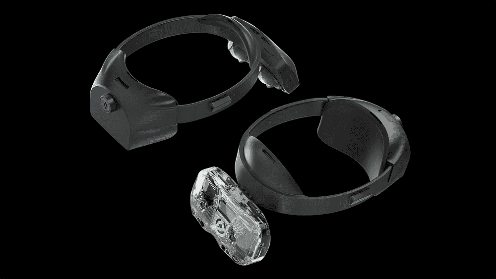
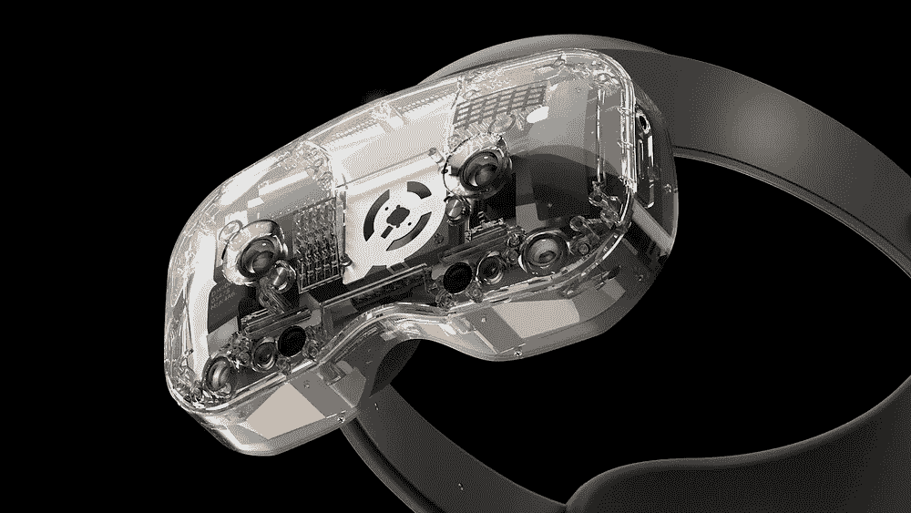
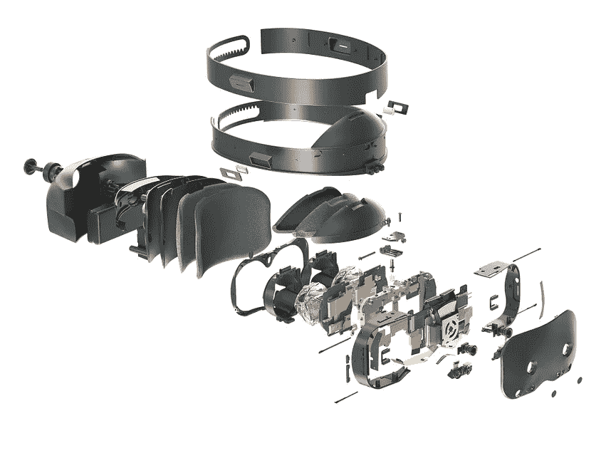
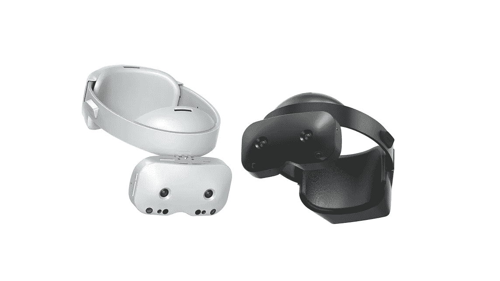

# 有一个 XR 耳机竞争对手，你买得起！

> 原文：<https://medium.com/geekculture/there-is-an-xr-headset-competitor-and-you-can-afford-it-41022642b1bd?source=collection_archive---------16----------------------->

## 决定是否支持 lynx r-1 XR 耳机活动时，您需要知道的 6 点

Collage by author, pictures by Lynx and Giorgio Trovato on Unsplash

如果你不是 VR、AR 和 XR 领域的新手，你可能听说过一家名为 *Lynx 的法国初创公司。*他们原本想打造一款售价 1.500 美元的商务 VR 耳机。但是他们做了一个大转变，创造了一个 **492 美元的 XR 消费耳机**！

耳机看起来很棒，似乎也很好用。它没有配备控制器，而是配备了 2 个手部跟踪摄像头，但你可以单独购买少量控制器。到目前为止，他们已经达到了他们的目标，但是你仍然可以在 Kickstarter 上支持他们。

> “我们的目标是提供一个硬件平台，通过设计，让用户以自己的方式处理数据。我们卖的是耳机，不是你的数据。”— Lynx Kickstarter 活动

在这篇文章中，我会给你一个关于 Lynx R-1 XR 耳机的**简短介绍，以及是否值得投资** [**他们的活动。**](https://www.kickstarter.com/projects/stanlarroque/lynx/)

You can look at some flashy images of the new headset in this Kickstarter reveal video of them

# **你应该支持 Kickstarter 吗？—利弊清单**

## 反政府人员

**没有应用商店的计划**

在 YouTube 的一个视频中，Lynx 的首席执行官 Stan Laroque 说他们没有关于 T21 应用商店的具体计划。这实际上不是你想听到的答案。一份清晰的声明，解释未来是什么样子，以及如何获得这些经验，会让人们对支持这场运动有更好的感觉。

如果你真的对 XR 很认真，你可能已经有产品了

如果你是一个企业，想要一个制作精良、值得信赖的 XR 耳机，已经有一个了:Varjo 的第三代 XR 耳机 Varjo XR-3。

但是这一点也有积极的一面，我将在后面提到。

Pictures of the Lynx R1 X

# 赞成

**直通式 AR 是迈向 AR 的现实一步**

从技术上来说，我们从科幻小说中知道的 AR 耳机仍然很遥远。从 AR 显示教皇 [Karl Guttag](https://www.thearshow.com/podcast/111b-karl-guttag-part-2) 到 facebooks 首席科学家本人 [Michael Abrash](https://www.theinformation.com/articles/facebooks-chief-scientist-mass-adoption-of-ar-is-years-away) ，他们都同意 AR 显示技术背后的挑战是巨大的，并且我们在未来几年内不会看到科幻透视 AR 眼镜。

然而，在穿越中有一个危险:如果在记录和回放实况图像之间有延迟，它可能会引起恶心。

我们在 youtube 的一个视频中看到，耳机的通透性似乎相当好。在 youtube 上的一个[实时更新中，你可以看到它在自然光照射的户外区域没有问题。](https://youtu.be/IxV17JXDkkI)

**不选，全用**

有 4 类耳机:虚拟现实，系留，独立和 AR 耳机。Lynx 提供所有四种使用方式，这使它成为市场上功能最丰富的耳机。

**支持竞争总是好的**

虚拟现实市场已经由 Oculus 主导，他们的下一代耳机可能也有更好的视频传输能力，这肯定不会改变他们的市场地位。

Lynx 正试图以有竞争力的价格向市场推出一款消费耳机。对于希望使用 VR、AR 和 XR，但没有钱购买 Varjo XR-3 以及所需订阅的企业来说，这款耳机可能是一个很好的解决方案。

**公司奉献**

几个月前，我试图注册他们的 Kickstarter 时事通讯，不幸的是，没有成功。我急于注册，所以我试图找到一个电子邮件地址。不幸的是，这也不容易，但我找到了他们的首席执行官斯坦·拉罗克的电子邮件地址。

所以我给他写信说注册不起作用，他们应该解决这个问题。他给我回了一封非常友好的电子邮件。这绝不是你应该购买这款耳机的理由，但**它显示了他们的专注。**

# 结论

如果你是一个爱好者，对行业的发展感兴趣，你应该考虑支持他们的 Kickstarter。当然前提是你有足够的钱。如果你只想进入 VR，享受自己，玩一些游戏，还有其他耳机你可能会喜欢。

这种耳机的价格很低，野心很大，看起来他们不会就此罢休。我还是个学生，没有钱买耳机，但是我可以买 t 恤。

*顺便说一下，我正试图写一些非虚构的媒体，特别是在 VR 和 AR 领域，如果你买了 Lynx 耳机，并且住在欧洲离我近的某个地方(我住在德国)，让我们联系一下，很乐意在这里回顾一下。向前看，康斯坦丁*

感谢[叶小乖茹](https://medium.com/u/1d462701f493?source=post_page-----41022642b1bd--------------------------------)的剪辑！