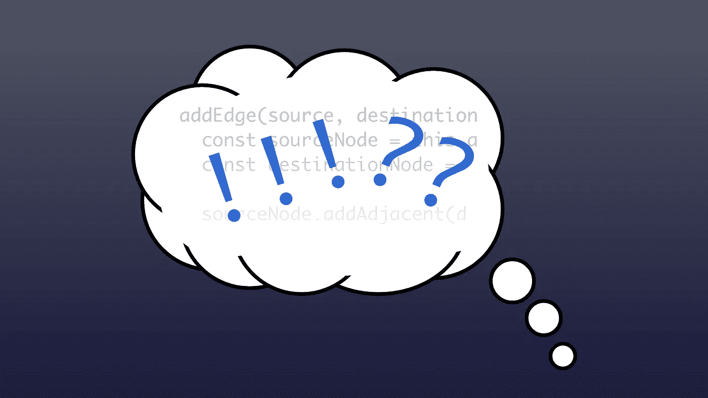

# 编码不仅仅是代码

> 原文：<https://medium.com/geekculture/theres-more-to-coding-than-code-8f6e39727950?source=collection_archive---------37----------------------->

## 如何停止像小戴夫一样思考

当你是一个 jr. dev 时，一切都是关于技术的。你知道哪些框架，你会用多少种语言，你的作品集网站能放多少动画等等。但是，随着你在编码生涯中的进步，事情开始发生变化。它变得更少关于技术，更多关于你的整理项目。你的工作能力…