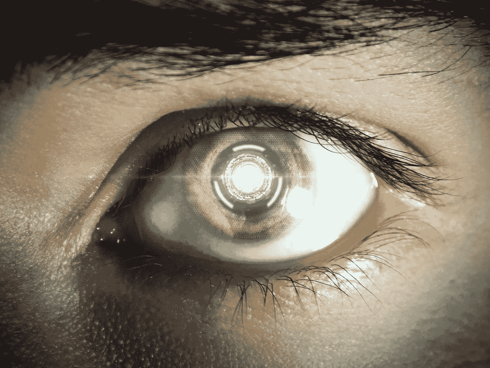

# 这 7 个思维科技应用将改变你对未来的看法

> 原文：<https://medium.com/geekculture/these-7-mind-tech-applications-will-change-how-you-see-the-future-6a19b1f8a3dd?source=collection_archive---------6----------------------->

## 神经技术将彻底改变我们的生活

By [Angel](https://pixabay.com/es/users/angel-kun-50012/) in [Pixabay](https://pixabay.com/es/)

虽然物理学[被认为是](https://www.bbvaopenmind.com/en/articles/when-past-becomes-future-physics-in-the-21st-century/)20 世纪科学的女王，但专家们认为思维科学将是 21 世纪的女王。

> " 21 世纪将是心智科学的伟大世纪."——爱德华·庞赛特，作家……