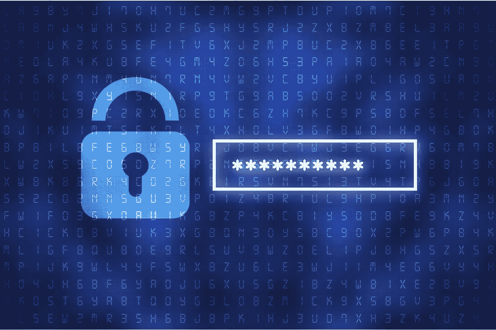

# 这 9 个事实将帮助你理解种子短语的重要性

> 原文：<https://medium.com/geekculture/these-9-facts-will-help-you-understand-the-importance-of-seed-phrases-60f9e47ac354?source=collection_archive---------4----------------------->

## 当涉及到加密货币时，安全性是每个人都关心的问题。因此，你需要了解你的数字钱包中最关键的部分:种子短语。

Image courtesy of [Canva](https://canva.com)

即使安全性是我们加密货币的一个重要话题，种子短语仍然是不同的。种子短语备份您的所有信息，以便在您放错地方或丢失设备时进行恢复。

种子短语是你的数字钱包最重要的方面。如果有人可以在没有安装指纹扫描等二级认证的情况下访问这些设备，那么任何人都可以代表该人的账户汇款。所以请记住这九个关于种子短语的事实，以及为什么它们对某些人如此重要！

# 什么是种子短语？

种子短语是一系列单词，让您能够访问与您的钱包相关联的加密货币。当然，你可以丢失或删除你的钱包，但只要你有这个密钥/密码，那么里面的所有加密货币都可以访问！

然而，如果您丢失了种子短语，这是恢复您的信息并访问其中所有加密货币的唯一方法。让我强调一下；你不能丢失你的种子短语！不可能恢复。我们后面会讲一个案例研究的例子。那么，种子短语是如何工作的呢？

# 种子短语是如何工作的？

结合种子短语软件，种子短语生成具有密钥列表的种子。这些种子短语可以是离线或在线种子短语(冷或热，稍后讨论)。备份种子时，备份的是种子短语，而不是私钥。

如果您想要备份您的种子(短语和所有内容)，您需要使用离线种子短语。所有备份都将生成一个新种子，方法是使用原始种子作为起点，并向其中添加另一个单词，直到没有更多空间。如果您正在寻找一个以“123”开头的短语，那么只要使用了三(3)个单词(即 123，ABCD)，它就会停止并生成下面的种子短语。

如果您想要备份您的种子短语和种子，您需要使用在线种子短语。此种子短语将最终向您显示您的种子，然后再显示用于恢复与主要钱包相关联的所有钱包的种子短语。同样，这个种子是至关重要的，因为如果有人发现它连同设备本身，他们可以访问所有的种子短语。

因此，种子短语似乎很重要。有人能黑吗？

# 有人能破解我的种子短语吗？

虽然种子短语没有加密，但是它们由非连续的单词组成，这使得很难(但不是不可能)暴力破解种子短语。然而，由于种子短语没有被加密，所以知道种子的其他人可以访问种子短语。因此，您必须保密，就像密码一样。

无论您使用什么流程来生成种子短语，在创建种子短语和获得它之间使用尽可能少的步骤。

只有你的眼睛能看到它。

# 种子短语是如何生成的？

您可以使用多种种子短语生成方法。一种流行的种子短语生成方法是使用歌曲作为种子短语。在这个种子短语生成过程中，歌曲的第一行被用作种子短语，歌曲后续行中的每个子串被附加到种子短语，直到它达到 256 个唯一字符。用这种方法生成的种子短语不会是一个不连续的单词序列，但是需要注意的是，这种方法可以创建一个最长为 24 个字符的种子短语。

种子短语必须易于用户记忆，并且难以被外界猜测。因此，这些种子短语被称为助记种子短语。

# 所有钱包供应商都使用相同的方法生成种子短语吗？

并非所有的种子短语都是用相同的方法创建的。例如，使用歌曲作为种子的方法生成的种子短语没有非连续的单词，但是它们更容易记住，并且比不使用歌曲作为种子的方法生成的种子短语更长。不使用歌曲的种子短语生成方法的一个例子是用户可以选择他们的种子短语生成方法，或者种子短语是随机生成的。然而，种子短语总是一系列可识别的单词。

示例:DoorFileSandwichCatBulldozer 推土机

这句话不容易记住，但是你总是可以用一种记忆技巧来回忆它，这就是重点。种子短语必须对你容易，对他们(对手)难。

# 那么，一旦我为我的钱包生成了种子短语，我会被它困住吗？

是的。

但是，如果您可以转移到新的钱包，您将生成一个新的种子短语。即使由你来修改种子短语也不容易。这就是它的安全性所在。所以，做一个你会满意的选择。花时间决定你的种子短语并不是一个坏主意。

计划一下。

# 一个冷热种子短语有什么区别？

种子短语有两种类型:冷的和热的。您可以将热门种子短语存储在计算机、电话和连接互联网的硬件(如路由器)上。冷种子短语离线存储，如纸张或金属，或 USB 驱动器或 SD 卡等设备。

冷种子短语通常被认为更安全，因为它们不需要互联网连接来访问它们生成的密钥。相比之下，热门种子短语确实需要互联网来访问它们的密钥，一些热门种子短语以纯文本形式存储种子。

# 种子短语存储

就像密码一样，有许多方法可以存储您的种子短语，以便您在使用它来保护您的资金时可以访问您的种子短语。

如果这种方法是物理的，您可以在种子短语生成设备本身上存储一些种子短语，例如打印在一张纸上的纸质种子短语或像身份证一样雕刻的金属种子短语。其他种子短语存储方法包括在设备上随机生成种子短语并存储在其存储器中。

您可以物理地存储这些种子短语、加密的种子短语，这些种子短语是用密码打印或加密的，以防止不知道种子短语生成方法或解密所需密码的任何人使用种子短语。

然而，加密您的种子短语是不必要的。相反，您添加了另一个步骤，它是上一个步骤的重复。您必须存储该密码短语才能获得种子短语，然后才能进入您的钱包。

# seed 短语平均有多长？

种子短语是 12-24 个简单的单词。选择长度由你决定。当然，时间越长越好，但一定要记住这句话。即使你刻了密码，任何事情都可能发生，你可能需要依靠你的记忆。

不要将种子短语存储在连接到互联网的设备上！

# 丢失种子短语的案例研究

彼得·希夫是华尔街资深人士和投资者，自 2008 年以来一直主持彼得·希夫节目。

他还撰写了四本《纽约时报》畅销书:

*   *防崩溃:如何从即将到来的经济崩溃中获利*
*   *熊市中的牛市小书:如何在市场下跌时保持你的投资组合上涨(这是“末日博士”的最爱)*
*   *靶心投资:在虚幻的市场中瞄准真实回报*
*   真正的崩溃:美国即将破产——如何拯救你自己和你的国家。

希夫是比特币的强烈反对者，但一位投资者不断在某种程度上试水。他在 BTC 投资。因此，在一个忠诚的日子，2020 年 1 月 20 日，他出来公开声明他放在 blockchain.com 的钱包已经被贪污了。三天后，真相大白。希夫把他的 PIN 和种子短语搞混了。

任何人都会犯错。所以，要格外小心你的种子短语，因为如果它丢失了，没人能帮你。

# 从这里去哪里？

种子短语用于访问加密货币钱包，因此您必须花时间选择一个安全且易于记忆的种子短语。种子短语也可以用密码加密或打印在纸上以增加安全性。不幸的是，如果你的种子短语丢失了，没有人能做什么，因为我们不能恢复种子短语。

最后，你是你的密码保管链中最薄弱的一环。这很难听，但我们有时需要严厉的爱来放大一个临界点。我怎么强调你的种子短语对你来说都不为过。

明智地选择。

请阅读我在[媒体](https://tcgunterwriter.medium.com/)、 [LinkedIn](https://www.linkedin.com/in/tcgunterwriter/detail/recent-activity/posts/) 、 [Quora](https://thecryptocurrencygazette.quora.com/) 上的其他作品！

还有，别忘了向你的朋友提及 Medium！他们的会费直接支持我。此外，他们将可以完全访问媒体上的每个故事！[点击这里报名](https://tcgunterwriter.medium.com/membership)。