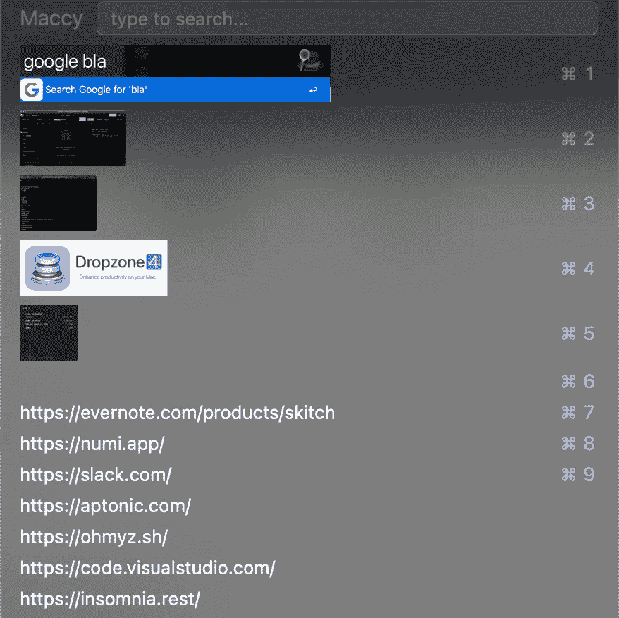

# 这些工具提高了我在使用 Mac 时的开发效率，也许对你也有帮助

> 原文：<https://medium.com/geekculture/these-tools-boost-my-development-productivity-while-using-my-mac-maybe-it-will-help-you-too-8752265d05b0?source=collection_archive---------4----------------------->

## 使用正确的工具可以为更大的利益节省时间。

梅西(免费)

Maccy, Mac clipboard manager

Maccy 对我来说是一个简单而重要的工具。这是一个剪贴板管理器，帮助管理我的复制和粘贴。我经常在各种环境中进行 API 测试，本地、开发和…