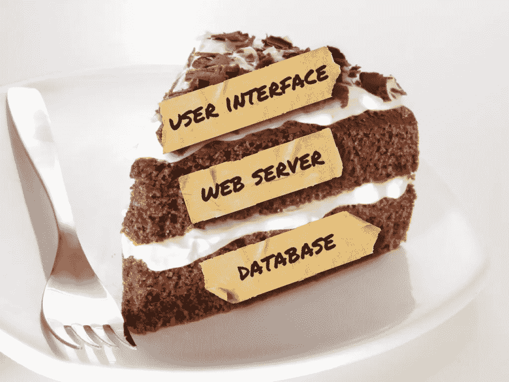
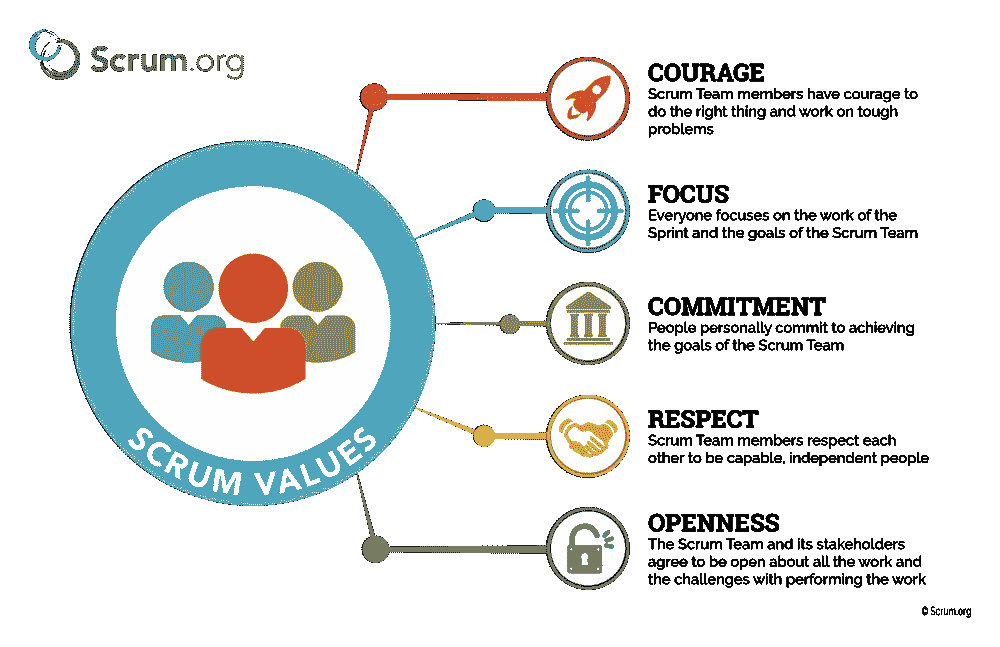

# 我从 SCRUM 中学到的(和喜欢的)东西

> 原文：<https://medium.com/geekculture/things-i-learned-and-love-about-scrum-13f7e17492b8?source=collection_archive---------13----------------------->

这是一种几乎适用于任何事情的心态。

Photo by [Greg Rakozy](https://unsplash.com/@grakozy?utm_source=medium&utm_medium=referral) on [Unsplash](https://unsplash.com?utm_source=medium&utm_medium=referral)

作为一名产品作家，我做过的最有价值的事情之一就是获得 SCRUM master 认证。

我知道很多人讨厌“SCRUM”这个词似乎带来的近乎狂热的追随者。但是听我说:它的核心，它的概念和价值观可以应用到你生活的许多方面。它可能不能解决你所有的问题，但是如果你把它作为一个简单的思维实验，你可能会惊讶于你可以把它应用到多少不同的情况。

这篇文章是关于我对 SCRUM 的了解，以及作为一名[产品作者](https://uxdesign.cc/what-else-do-ux-writers-do-besides-write-47873ddeaa38)，它如何让我受益。

# SCRUM 是什么？

有很多好的资源可以比我更好地解释 SCRUM。就个人而言，我觉得你不能忽视[官方 SCRUM 指南](https://www.scrum.org/resources/scrum-guide?gclid=CjwKCAjwh5qLBhALEiwAioods0TM0AiiOHPFOu3tJy4w0poTduz7cvw4UvfmOf8_RboztxfkOD-9ERoCqocQAvD_BwE)的清晰和简单。

SCRUM 是一个帮助组织以敏捷的方式解决复杂问题的框架。分割[敏捷蛋糕](https://www.thoughtworks.com/insights/blog/slicing-your-development-work-multi-layer-cake)的方法。SCRUM 附带了某些仪式，你可以选择适合你的特定组织的方式。因为软件(或任何产品或服务)是一个多层蛋糕，真正的味道是通过不同层的混合来实现的，这些仪式有助于将这些层聚集在一起。重要的是，这是一个框架，它促进了产品和构建它的人的发展和成长。

The vertical slice of the Agile cake. Image: [Jeremy Jarrell](https://www.jeremyjarrell.com/vertically-slicing-user-stories/)

# 到目前为止它对我有什么帮助？

简而言之:它给了我一个新的视角和心态，我可以应用到我生活的许多方面，而不仅仅是工作。

作为一个曾经谴责例行公事的人，我惊讶于 SCRUM 框架给了我如此多的自由，不仅可以计划，还可以以一种现实和全面的方式实现我的目标。

SCRUM values: Courage, Focus, Commitment, Respect, Openness. Image: Scrum.org

# 它帮助你整体思考，拓展你的世界观

通过设计，SCRUM 迫使你着眼于更大的图景。SCRUM 团队由不同学科的人组成。这允许 SCRUM 团队端到端地交付产品或功能。它最小化了与依赖其他部门相关的风险，因为交付特性或产品所需的所有部分都存在于团队中。

SCRUM 关注的不仅仅是交付能力，还有工作质量。因为许多功能聚集在一起实现一个共同的目标，团队将与来自不同学科的其他人进行讨论。一端是挑战，另一端是机遇。

作为一名产品作家，我并不总是 SCRUM 团队的一员，但它教会了我如何与不同领域的人一起验证我的想法。产品写作的本质是，它不总是关于文字，而是关于隐藏在引擎盖下的东西——支持交互的技术或逻辑。即使我没有和专门的前端或后端开发人员一起工作，我也会从不同的角度来看待“问题”。

# 它帮助完美主义者不再是完美主义者

检查和持续改进有助于达到我认为比完美更好的状态——有价值。这意味着没有思考和过度思考的余地，因为它有助于在“完成”和“足够好”之间找到一个微妙的平衡。我学到的是，当真正的数据来自一个功能或产品在现实世界中的使用情况时，完美主义没有什么价值。

正如他们所说，你需要一些东西在客户手中，以了解如何改进它，增加它带来的价值。同样，我已经学会了“放手”，让别人进入我的副本。尽管当时可能很艰难，但我知道让别人检查我的工作永远不会太早。我越早这样做，我就能越早地改变和发展我已经得到的东西。

# 帮助你拥抱变化

许多人谈到旋转的好处，这似乎很清楚，但问题是，如何做？SCRUM 自然有助于应对变化。这是一个受欢迎的消息。它接受变化是一个常数！因此，它没有等待了解一切(完美)，而是接受将会有一些需要改进的地方，以及从发布的内容中学到一些东西。

这是因为它鼓励增量开发、测试和最终的学习。你在一个有时间限制的 sprint 中工作，因为它是有时间限制的，所以鼓励你真正考虑每项工作所需的努力，这样你就可以在任何给定的 sprint 中致力于完成它。自然地，你不可能在一个时间范围内完成所有的事情，所以你把工作分成更小的、可以完成的部分。这种将事情分成更小块的倾向也是一种最小化过度烘焙风险的方式，如果需要改变，更容易“改变”,因为工作是根据更小的、可实现的故事规划的。

有一句老生常谈的话，生活中唯一不变的是变化，我在 SCRUM 团队工作中学到的所有价值观都帮助我处理了(或者至少增强了我的心态)我自己生活中的变化。

# 促进共同理解和认同

获得利益相关者的认同是一项无价的技能。我个人很钦佩那些能让它看起来很容易的人，因为任何每天都要做这件事的人都可以证明，这一点都不容易！利益相关者有各种各样的形式和规模，以清晰、简洁的方式表达你的建议绝对是一门艺术——更不用说让人们兴奋和参与了。

我相信获得认同的艺术对某些人来说比其他人更容易，我认为 SCRUM 仪式在这方面有助于公平竞争。从冲刺计划到站立和回顾，SCRUM 确保获得认同是过程的一部分。透明、检查和适应的 SCRUM 价值观直接反映了这一点。这并不是说你可以不安排特定的会议或对话来获得利益相关者的认同。这只是意味着，如果做得正确，SCRUM 团队会不断地在他们自己和关键决策者之间形成一种共同的理解。

# 让远大的目标成为可能

冲刺计划的 SCRUM 仪式和相关的实践，如故事分解会议、分配评估和积压整理，都鼓励将大目标分解成小的、可实现的部分。类似于我之前关于 SCRUM 帮助我们拥抱变化的观点，计划接下来几个冲刺阶段将要发生的事情，将工作分解成小故事，对它们进行评估，然后通过整理待办事项清单来提炼对这项工作的理解，这些都有助于让大块工作变得可行，最重要的是，完成它。

# 提供清晰和重点

理想情况下，任务和目标的清晰性(包括业务需求，如何衡量成功，影响和价值)在投入到 sprint 之前就已经确定了。这可以通过许多 sprint 规划和 backlog 整理会议来完成。一旦清楚了这一点，SCRUM 团队就有足够的理解来分配故事评估，因此，也就有能力在 sprint 中投入工作。

最好的冲刺是那些有共同目标的——它让每个人都专注于交付一个功能或一项工作。并将此应用到我自己的生活中，最令人满意的目标是那些专注而清晰的目标。我意识到挑战的一部分是将目标提炼成清晰的东西，很难不去实现！

# 生活的心态和框架

自从我被介绍到 SCRUM 的世界并体验了这种工作方式后，我已经加入了许多不同的团队。每个团队对 SCRUM 都有不同的理解和应用。我甚至去过一些团队，在那里，这个概念被认为是一个脏话，在那里，我们实践着业内所知的“水-scrum-fall”。

但是我从这个框架中学到的东西从未让我失望——它很灵活，适用于生活的许多方面，即使你不打算成为 SCRUM 大师，我也强烈推荐你去了解这个框架。它可能会帮助你找到解决工作或其他方面复杂问题的方法。

**作家简历**

*我是一名产品内容专家和合作者，已经(正式和非正式地)在许多不同的行业中闯出了一条路，包括房地产、会计、非营利和技术。我通过语言和设计帮助创造轻松清晰的产品体验。*