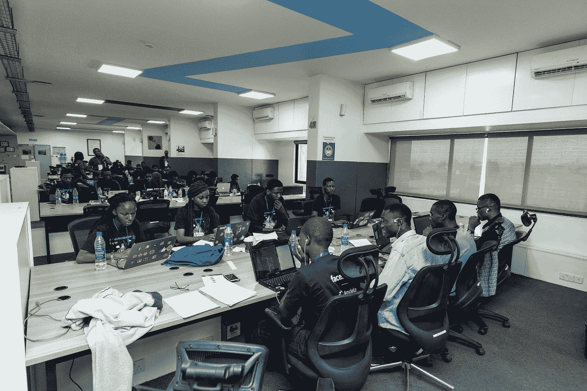
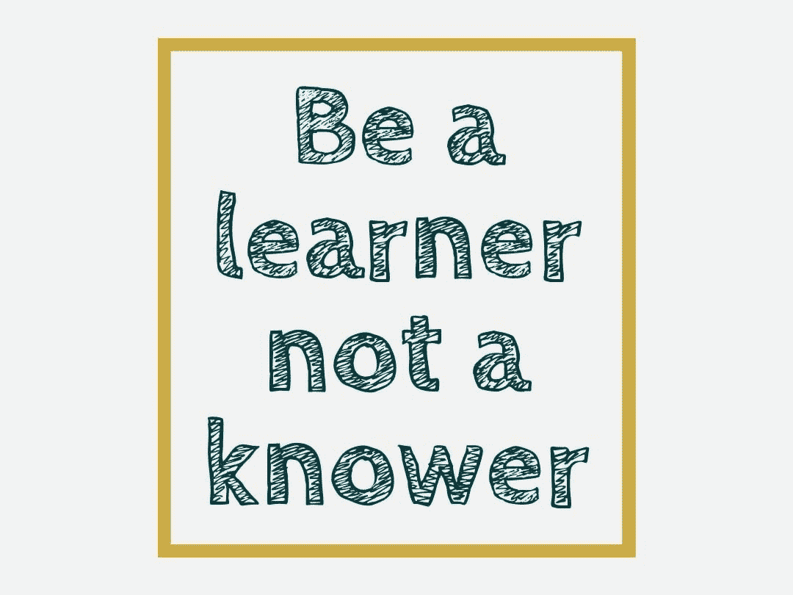

# 我希望在开始编码时就知道的事情

> 原文：<https://medium.com/geekculture/things-i-wish-i-knew-when-i-started-coding-8e7fd521ce1b?source=collection_archive---------13----------------------->

# 嗨，我是 Nextwebb👋…4 年前我写了第一行代码，从那以后它彻底改变了我的生活。

对我来说，编码带来了某种满足感。能够给计算机编程序做你想做的事情的技能，学习应用程序如何在引擎盖下工作，我喜欢视频游戏…是的，对一些技术人员来说，那是火花..太刺激了！我有一项有用的技能！🤩。好奇心让我不断进步😃。

除了自由职业和教授编码，我在 2019 年在一家酒店公司找到了我的第一份编码工作，从那以后我下定决心，“每天编码都可以很有趣，直到它不再有趣😂! "。

这些年来，我已经面对了编程工作好的、坏的和丑陋的一面😅。

我将谈谈我希望在开始学习🖊️.理工大学时就知道的技巧

# 编程不是编码，编程是用编码解决问题。

在我看来，这种心态可以改变你很多的视角，加速你的成长。

不要把编程看作业余爱好者，而是用技术解决问题的专业人士。如果我们采取这种心态，开发者社区将会更少毒害…作为一个软件开发者，抛开情绪，识别机会。

事实是，软件开发有很大的潜力，不仅作为一种职业，而且作为创业的工具。作为一名开发人员，你有能力在计算机的帮助下创造出你想到的任何东西。通过学习编程语言编写任何代码的技能。将想法变成现实的可能性。

# 沟通技巧和编码技巧一样重要。

当我们开始学习编码时，我们对自己的成长投入了很多。对我来说，我用尽了所有的空闲时间编码，编码，再编码😆！

虽然编码是一项很好的技能，但这还不够🤔！

能够把自己推销成一个好的开发者和成为一个好的开发者一样重要。不要害怕说出你的想法，不要等待别人给你一个高级/技术领导的职位。先做这个人😉！

在科技领域，重要的是，你要把自己推销成一个专业人士，而不是一个业余爱好者，建立并维持一个在线形象。Twitter、社交活动、撰写/阅读文章和博客，以及有效沟通都是开始的地方。

*hack4justice2020 黑客马拉松*

技术是公共的。这就是为什么我们有团队、结对、开源、堆栈溢出、会议、书籍、黑客马拉松和博客。利用这一点！🚀

# 接受改变并愿意学习。

软件工程已经改变了很多🤔。没有人重新发明轮子(浪费时间)。对于软件工程师来说，时间是一种稀缺商品😏专业人员已经沦落到将技术粘合在一起，从第三方库、API、框架，很多时候是开源软件，目的是生产和创新一个产品(SAAS)。

保持相关性是所有专业人员的持续需求，但对开发人员来说可能更是如此。随着技术日新月异的发展，在这个行业的许多领域，这将是最快的生存方式。

*   及时了解行业新闻/技术堆栈和其他新闻
*   我知道我们喜欢建造。我们喜欢编码😅…只需使用现代图书馆。它们通常会让你的生活更轻松。至少公司会使用它们🤷‍♂
*   不要犯停止你的教育的大错误。你努力工作才取得今天的成就，其中大部分无疑包括教育(不管是正式的还是非正式的)。
*   最好的学习方式是和同龄人联系；在线社区是做这件事的好地方。Twitter 有一个很棒的开发者社区。好好利用，好好学习。
*   参加聚会和技术会议
*   简单地阅读新的职位描述，并与市场保持联系，会告诉你一个关于什么样的实用技能最令人感兴趣以及如何提升的信息世界。

好吧，利用变化的现代软件领域。

# 你会有冒名顶替综合症。

有时你会觉得自己像一个耗尽运气、很快就会被识破的骗子😩。这很正常，它会发生在每个人身上，无论你处于什么水平。当我们有这种感觉时，重要的是我们不要让它阻止我们，否则我们会过多地考虑我们在编程方面有多糟糕😏。

**如何反击我们内部的批评者**

*   接受现实，继续前进:你不会知道所有的事情。知道几件事没关系。
*   分享你的知识
*   试着列举你的成就
*   给予优秀的人荣誉，帮助他人
*   教授你所知道的
*   是什么给了你可信度？
*   知识
*   经验
*   贡献
*   写一份简历，内容包括:
*   角色:例如团队领导、项目经理、志愿者、后端开发人员、前端开发人员、社区领导、导师。
*   技能:例如，表现出同理心，解决冲突，团队合作，有效沟通。
*   优点:我坚持不懈，努力变得更好。
*   经历:我为雇主创造了价值，我拥有自己引以为豪的技能。
*   价值观:积极的态度，沟通，思想开放

上面列出的建议值得一试，有几个原因让你觉得这是件好事，你不会有任何损失🤷‍♂️.它可以帮助你不断学习和成长。它可以作为一个道德指南针，帮助你在谦逊和自信之间保持正确的平衡😀。

# 照顾好自己的身心健康。

有一种东西叫做沉迷于编程。凡事都有代价。让我们始终控制成本。

找到工作和生活的平衡点。从长远来看，我们不是机器人。我们会被工作压得喘不过气来，感到疲倦，失去动力，人际关系会受到影响，我们会筋疲力尽。

我们工作太多，以至于不吃饭、不休息，以及一些不强调过度工作的休闲时间，这是不健康的。编程可能会使人身心俱疲。我们努力休息好是很重要的，我们会惊讶于适当的夜间休息能提高多少工作效率😃。

# 你不会什么都知道。

如果说作为一名程序员我学到了什么的话，那就是把编程语言当作完成工作的工具。最重要的东西在语言语法或库之上。

不要陷入关于哪个是最好的不必要的争论中。事实上，一个开发人员所能拥有的最好的技能就是成为一个问题解决者。

你总会在某个时候需要知道更多，这种情况总是会发生，尤其是在这个行业。所以你不可能把所有的文件都排好，你需要学习更多的东西。所以开始做点什么吧。任何愿意雇佣你的人都希望看到有人愿意学习，愿意学习新东西并完成工作。

# 慢慢来，把基本面学好。

有大的目标和计划是可以的。但有时匆忙跳过学习的基本过程可能是一个陷阱。了解和跟踪你所知道的很重要。

我对初露头角的开发者的建议是选择一门语言并学好它。不要被社区里的炒作所左右，很多时候是被人的情绪所左右，而不是市场的需要。例如，JavaScript 并不完美，但它是有效的。所以好好学。

说到软件开发，要考虑长远。软件开发是一场马拉松，而不是短跑。

你不可能在一周内学会 10 项技术，然后第二周就能开发出一个全面的应用💔。

慢慢来，享受旅程。不着急。😊

我还没有到达我想要的地方，每天对我来说都是一次学习的经历！💪

开始了。这就结束了我关于这个主题的 7 大技巧文章。希望这能帮助一个新手做得更好，做出更好的决定。

感谢观众，希望这篇文章对你有所帮助🤗。你可以随时在 Github、T2、推特和 T4 的 LinkedIn 上联系我。一定要点赞、评论和分享😌。

*最初发布于*[*https://blog . next Webb . tech*](https://blog.nextwebb.tech/things-i-wish-i-knew-when-i-started-coding/)*。*