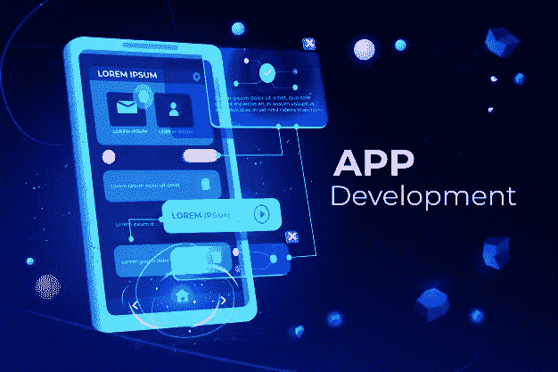

# 移动应用程序开发需要知道的事情

> 原文：<https://medium.com/geekculture/things-need-to-know-for-development-of-mobile-application-2ed136b53af0?source=collection_archive---------34----------------------->

如果你是移动应用程序开发领域的初学者，对如何开发移动应用程序一无所知，那么在这里你会得到关于如何开发移动应用程序以及开发一个应用程序需要什么的提示和想法。我们开始吧:

# 做 App 之前

*   抓住你的想法，并在现实中将其形象化。
*   根据你的想法，分析市场，分析需求，研究在市场上推出哪种类型的 app 会更好。
*   了解你的用户和他们的需求，然后对他们进行研究。

一旦你把这些都整理好了，进入下一步，

# 在制作应用程序时

首先，你必须为你的应用程序创建草图。在此之后，列出您将在应用程序中添加的所有附加功能/特性，如谷歌地图、用户手机图库、联系人、视频通话、音频通话等。
完成所有这些后，现在应用程序开发部分开始了，你必须知道的事情在这里:
**选择你想要制作的应用程序类型:
→** 原生(仅针对特定平台)
**→** 混合(针对跨平台)
**→** Web 应用程序(类似原生的体验和在所有浏览器和设备上运行的能力，包括笔记本电脑、平板电脑、移动设备、智能手表或电视。)
选择类型后，制作 app 需要以下东西:

1.  **编程语言(针对 UI +后端):
    *Native:***[Java](https://www.java.com/en/)， [Swift](https://swift.org/) ， [Objective C](https://developer.apple.com/library/archive/documentation/Cocoa/Conceptual/ProgrammingWithObjectiveC/Introduction/Introduction.html) ，[Kotlin](https://kotlinlang.org/docs/home.html)
    ***Hybrid:***[Dart](https://dart.dev/)，[React Native](https://reactnative.dev/)
    ***Web App:***

2.**后端(用于 api 开发)** :
[。网](https://docs.microsoft.com/en-us/dotnet/)，[拉勒维尔](https://laravel.com/docs/8.x/installation)，[姜戈](https://docs.djangoproject.com/en/3.2/)

3.**数据库(用于存储数据):** [Mongodb](https://www.mongodb.com/) ， [Oracle](https://www.oracle.com/database/technologies/) ， [postgreSQL](https://www.postgresql.org/docs/)

把这三个放在一起，你就可以开发出一个你想要的应用。

# 做了一个 App 之后

首先对你的应用程序进行测试，向 10 或 20 个用户公开，这样你就可以在向所有人公开之前了解你的应用程序的错误和缺陷。此后，您需要将应用发布到 **play store** 或 **app store** 供用户使用您的应用。你还需要在市场上为你的应用做广告，这样用户就会知道。

此外，你还需要考虑从你开发的应用程序中获得的收益:

*   广告
*   应用内购买
*   赞助
*   签署
*   销售商品
*   免费增值追加销售
*   交易费用
*   佣金

这些都是你做 app 必须要知道的。一旦你开发了一个应用程序，就要把新的更新和新的特性添加到你的应用程序中，让应用程序更具用户交互性，这样用户就会喜欢你的应用程序。
希望你能了解应用程序开发所需的要点。

如需了解更多信息，请购买《让你自己成为软件开发人员:让我们深入了解 Flutter》一书。

继续编码，继续学习:)
谢谢！！！