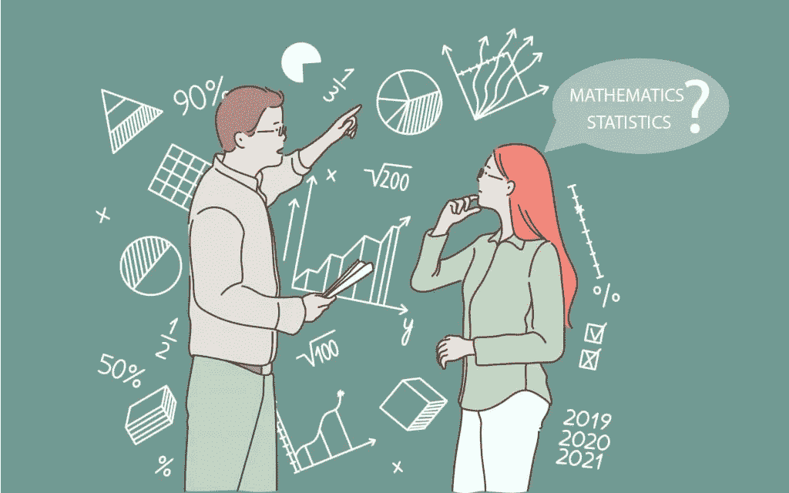
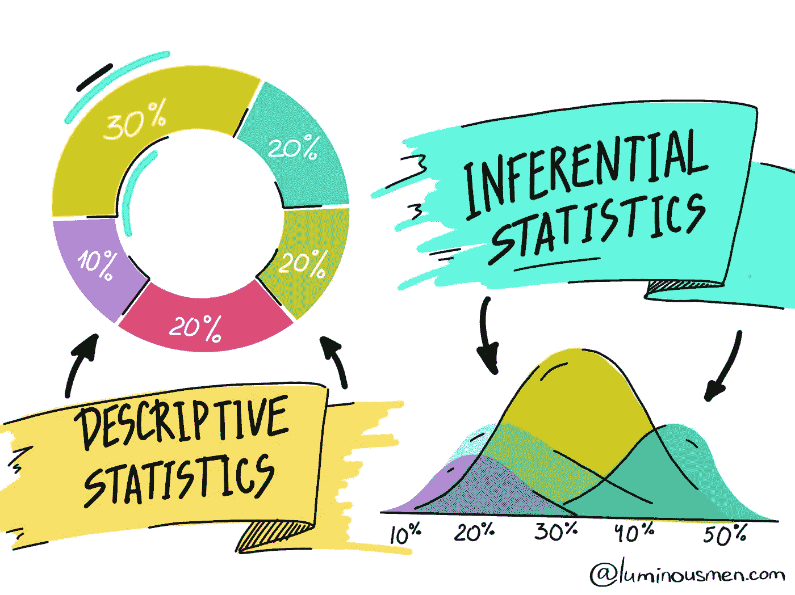

# 数据科学统计学要学的东西…

> 原文：<https://medium.com/geekculture/things-to-learn-in-statistics-for-data-science-88c067786367?source=collection_archive---------17----------------------->

**统计学**是关于数据的**收集、组织、分析、解释和呈现的学科。**

有两种类型的统计数据，

1.  **描述性统计**
2.  **推断统计**

[https://www.google.com/](https://www.google.com/)

描述性统计描述数据，推理性统计允许您根据该数据进行预测。使用推断统计，您可以从样本中获取数据，并对总体进行归纳。

现在，让我们看看在数据科学的统计学中，我们必须学习哪些概念。

我只是把整个统计数据分成三个主要部分，

1.  基本统计
2.  中间统计
3.  高级统计学

让我们一个一个来看，

> **基础统计**

1.  随机变量
2.  可能性
3.  集中趋势(平均值、中间值、众数)
4.  人口和样本
5.  总体均值和样本均值
6.  总体分布和样本分布
7.  离差的度量
8.  范围
9.  差异
10.  标准偏差

> **中间统计**

1.  相互关系
2.  协方差
3.  歪斜
4.  皮尔逊相关系数
5.  斯皮尔曼等级相关系数
6.  高斯分布(正态分布)
7.  标准正态分布
8.  概率密度函数
9.  累积密度函数
10.  z-分数
11.  假设检验

*   虚假设
*   替代假设

> **高级统计**

1.  中心极限定理
2.  切比雪夫不等式
3.  二项分布
4.  二项分布
5.  泊松分布
6.  对数正态分布
7.  博克斯-考克斯变换
8.  统计检验(Z 检验、T 检验、ANOVA 检验、卡方检验)
9.  贝叶斯定理
10.  置信区间
11.  统计显著性
12.  一型和二型
13.  p 值

这就是数据科学中的统计学。

如果你想学习数据科学的统计学，我推荐一本最著名的书，即**数据科学家实用统计学**。您可以使用以下网址下载这本书:[https://github . com/SagarDhandare/Books/blob/main/Statistics % 20 book . pdf](https://github.com/SagarDhandare/Books/blob/main/Statistics%20Book.pdf)

请随时留下您的评论、建议或任何错误。😊

给我接通[LinkedIn](https://www.linkedin.com/in/sagardhandare/)|[GitHub](https://github.com/SagarDhandare)|[邮箱](mailto:%20sagardhandare3@gmail.com)

快乐学习！！！^_^