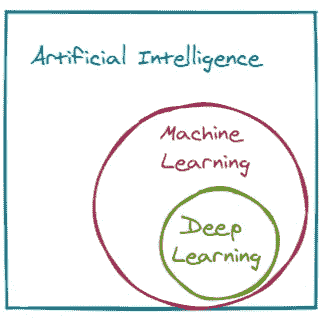
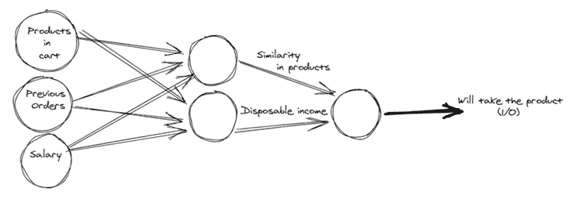
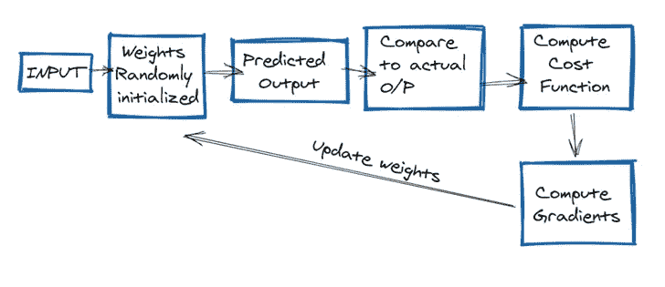
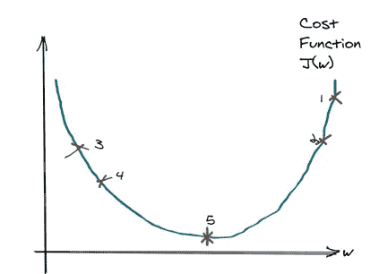
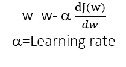
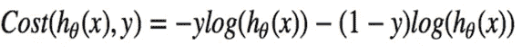
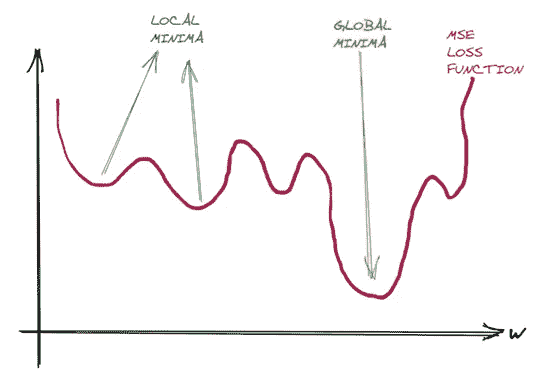
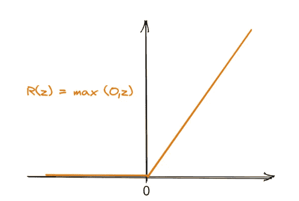

# 深度学习需要记住的事情

> 原文：<https://medium.com/geekculture/things-to-remember-in-deep-learning-eca746ed29c8?source=collection_archive---------66----------------------->

## ***深度学习快速游***

Photo by [Alex Knight](https://www.pexels.com/@agk42?utm_content=attributionCopyText&utm_medium=referral&utm_source=pexels) from [Pexels](https://www.pexels.com/photo/high-angle-photo-of-robot-2599244/?utm_content=attributionCopyText&utm_medium=referral&utm_source=pexels)

## 介绍

当有人为任何数据科学或机器学习职位面试你时，第一个问题会是:告诉我你知道的机器学习技术。然后你将开始回答这个问题，陈述你已经研究和工作过的许多算法。面试官会在你解释概念的时候挑选一些关键词，问你一些相关的问题。

我也会用那种方式解释事情，这样我们就能把事情联系起来。

**深度学习**

image by author

深度学习是机器学习的一个子集。在机器学习中，我们给出输入和输出，并使用一些指定的模型，而在深度学习中，神经网络根据给定的数据进行训练，以找出自身有用的模式。

Example for Neural Network

神经网络模拟输出变量和输入信号之间的关系。在我们的例子中，输入是购物车中的产品、以前的订单和薪水。

神经网络将试图从输入中找出一些特征，并通过权重来证明输入(独立变量)的强度。也许购物车中的产品和以前的订单告诉我们这些产品之间的相似性，所以在这种情况下，给予薪金的权重将非常小。

以前的订单和工资告诉我们客户的可支配收入。根据产品和可支配收入的相似性，我们可以预测客户是否会购买该产品。

注意:在上面的例子中，输入变量之间的特征是产品和可支配收入的相似性，在神经网络中可以是任何东西。这个想法是神经网络自己学习这些特征

**神经网络中的步骤**

Steps Neural Network

需要记住的要点

**1。** **为什么随机赋权，为什么不赋零？**

如果 w 和 b 等于 0 而不是一个随机数。

第一个隐藏层中的每个神经元将执行相同的计算，因此即使在梯度下降的多次迭代之后，该层中的每个神经元将与其他神经元计算相同的东西。

现在的问题是什么是梯度下降？

梯度下降是一种寻找最佳权重和偏差的方法，其中梯度意味着斜率。

Gradient Descent

假设我们的成本函数只是 w 的函数，我们的权重和成本函数的曲线将如上所示。我们的优化问题是找到点 5，这是全局最小值。

在向前移动之前，用于更新权重的公式是:

注意:同样的公式也适用于偏差，但在这种情况下，J 将是 w 和 b 的函数。

当我们分配随机权重时(设 1 为 pt。)，我们观察到梯度，即 dJ(w)/dw 为正，因此重量将减少。

另一方面，如果我们在点 3，梯度将是负的，因此重量将增加。这个过程将继续下去，直到我们接近全局最小值。

梯度下降也用于逻辑回归以优化成本函数

**2。** **为什么我们在逻辑回归中使用上述成本函数而不是 MSE？**

首先，记住逻辑回归是最简单的神经网络之一，也没有隐藏层。

我们在逻辑回归中不使用均方误差，因为当我们对权重绘制 MSE 损失函数时，获得的曲线是*而不是凸曲线*，这使得很难找到全局最小值。

Non-Convex Function

逻辑回归的均方误差的非凸性质是因为非线性是以 sigmoid 函数的形式引入的(非线性)，

这使得权重和误差之间的关系非常复杂。

**3。** **什么是乙状结肠功能？**

sigmoid 函数是非线性的，并且 sigmoid 函数中的值存在于 0 和 1 之间。它有助于发现分类问题中的概率。

sigmoid 函数是可微的，我们可以计算斜率。

用于神经网络时，Sigmoid 函数会减慢学习过程。记住我们的体重更新公式:

如图所示，如果我们在那些梯度接近 0 的位置，w(重量)将变化非常缓慢，因为我们的α也很小。因此使得*α* dJ(w)/dw*为非常小的值。

Sigmoid Function

这里的学习非常缓慢，因为斜率(梯度接近于零)

4.如何克服以上挑战(因为乙状结肠学的慢)？

我们使用 ReLU 函数作为替代

ReLU

ReLU 函数有 R(z) = max {0，z} 在 z = 0 处不可微，其他任何地方梯度都不小。所以，权重更新和学习会很快。

爱情！活下去！笑！干杯