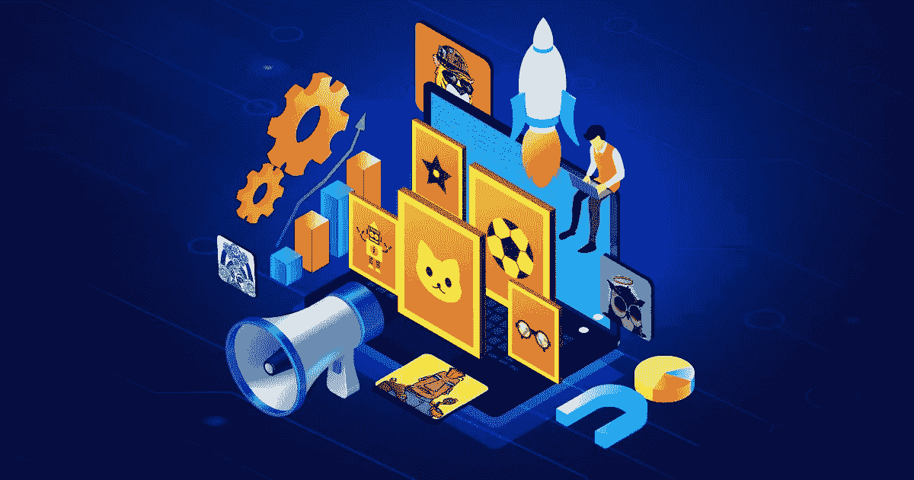

# 关于 NFT 营销你需要知道的事情

> 原文：<https://medium.com/geekculture/things-you-need-to-know-about-nft-marketing-f3e0f7e8e99e?source=collection_archive---------14----------------------->

NFT Marketing

NFT 正在爆炸式增长，NFT 的营销计划像闪电一样传播开来。它还是全新的。因此，它对新思想非常开放。买家，尤其是千禧一代，对数字货币和资产以及维护和营销流程有着强烈的亲和力和理解。在未来几年，这个领域将会飞速发展。企业是时候抓住不可替代代币(NFT)提供的机会，用新策略来发展和挑战市场，以提高知名度，建立新的用户旅程，并提高商业价值和忠诚度。

为了提高项目的影响力，品牌必须遵循特定的 [**NFT 营销**](https://www.appdupe.com/nft-marketing-services?utm_source=medium&utm_medium=blog8jun&utm_campaign=Yasmeen) 方法。NFT 营销帮助公司提高客户参与度，创造现金和收入。非传统的营销和推广策略可以通过加强与目标受众的联系来提高公司的声誉。继续读。

# **你如何营销 NFT？**

NFT 营销有更重要的事情要考虑。NFT 营销吹嘘一个 NFTis 有多优秀，并通过各种渠道进行推广。它们还包含分析、持续活动、监控和新的研发项目。NFT 市场展将提升到一个全新的水平，将 NFT 推向最前沿。因此，实际的营销是推广或宣传市场和 NFT 系列。检查以下阶段，了解更多关于做 NFT 搜索引擎优化。

## **第一阶段:构思**

营销 NFTs 最重要的组成部分是构思，它发生在开发开始后，包括研究市场，寻找 NFT 产品可能恰好适合的好地方。这一点很重要，因为如果 NFTs 不能满足加密领域交易者的需求，有效性和卓越性就不会有任何影响。构思部门也进行 NFT 市场研究，并致力于将一个想法从草稿变成正式的框架。

## **第二阶段:最佳 NFT 营销策略**

如前所述，制定一个成功的 NFT 营销战略的需求已经增长。有这么多的 NFT 市场，有几个选项来建立品牌的 NFT 营销活动。既然你们[艺术家/创作者]理解了营销服务的重要性，你们可能想知道它们可能是什么，以及如何开始使用它们。准备马上了解一下。

 [## 8 NFT 营销策略支持你的业务

### 建立你的 NFT 业务并不容易。传播你在 NFT 的产品、服务或信息…

blog.cryptostars.is](https://blog.cryptostars.is/8-nft-marketing-strategies-to-bolster-your-business-b635f36f9d9b) 

📌**参与社交媒体平台**

虽然不需要介绍，但让我们澄清一下如何利用社交媒体营销来吸引 NFT 买家。是的，社交媒体平台对当今世界有着巨大的影响。另一方面，它从未停止为消费者提供福利，这些福利改善了他们的生活方式，并经常在一个人的业务增长中发挥重要作用。考虑到这一点，你可能是那些使用社交媒体平台作为营销品牌中心的人之一。

📌**不和谐营销**

当讨论社交媒体网络时，我们不能忘记提到 Discord，一个确定的文本和语音通信工具。尽管游戏玩家普遍使用它，但它最近改变了潮流，为公司所有者营销他们的业务扫清了道路。是的，公司巨头们正转向不和谐营销来与他们的同行互动。

Discord 建立一个服务器和几个频道只需要很少的时间。它有许多特性和功能，允许用户出于商业目的使用它。所以，现在是你开始构建服务器并邀请公众加入的时候了。这将使交流项目信息和举办活动变得更加容易。

📌**运行/组织活动**

如果你想的是公关营销风格，你是对的！创建活动或发布新闻稿可以帮助你接触到你的核心人群。与 [**广告活动**](https://www.indeed.com/career-advice/career-development/types-of-marketing-campaigns#:~:text=A%20marketing%20campaign%20is%20a,social%20media%20and%20email%20marketing.) 不同，新闻稿主要关注的是双向沟通。它允许你将目标受众的基本要求内在化，并相应地销售你的非功能性广告。因此，你的 NFT 将迅速扩大两倍的受欢迎程度。

📌**坚持影响者**

最近的技术进步为内容创作者在各自领域的蓬勃发展铺平了道路。在这种情况下，你可以联系有影响力的人来宣传你的 NFTs。他们将帮助你以一种新颖的方式接触到你的目标受众，这无疑会吸引大量的受众。使用影响者营销的主要优势在于，你可以将他们的支持者转化为有价值的 NFT 买家。是不是很惊艳很惊艳？

📌**电子邮件营销和时事通讯**

当然，我们都听说过广义的“电子邮件营销”方法。它不仅仅是通过电子邮件向您尊贵的 NFT 消费者发送简讯。事实证明，这种有效的方法可以通过引人入胜的内容吸引大量观众。但是请记住，你并没有抛弃他们，他们收件箱里频繁的时事通讯会创造奇迹。

## **第三阶段:目标获取**

每一项营销服务都是从一个要实现的目标开始的，而 NFT 的推广策略将基于这个目标的实现而实施。我们的 [**NFT 营销服务部**](https://www.appdupe.com/nft-marketing-services?utm_source=medium&utm_medium=blog8jun&utm_campaign=Yasmeen) 也将进行分析、增长破解和增强，直到实现目标。最后一步是 NFT 推广营销的最终目的地，实现既定的目标。

## **收尾**

营销是一个组织成功的最重要的组成部分之一。它提供了早期接触想法的机会，并保持交易者和投资者的兴趣。在区块链和加密货币领域，营销扮演着更重要的角色。

然而，NFT 营销并不像看起来那么简单。需要基础的研究知识和市场经济分析。因为这需要很长时间，所以宣传你的项目的最好方法是鼓励公司把重点放在 NFT 营销上。最后，你所要做的就是编制一份 NFT 营销代理 的 [**名单，查看他们的业绩记录和经验，选择一家提供卓越有效的 NFT 营销服务的公司。同时，联系一家最适合你的 NFT 营销项目的 NFT 营销服务公司。**](https://bit.ly/3NWwCXM)

 [## 2022 年十大受欢迎的 NFT 营销公司

### 在这个 NFTs 的时代，创作者将他们的 NFTs 卖给合适的潜在买家是高度竞争的。的…

medium.com](/coinmonks/top-10-popular-nft-marketing-companies-in-2022-5e3a3c287ca8)