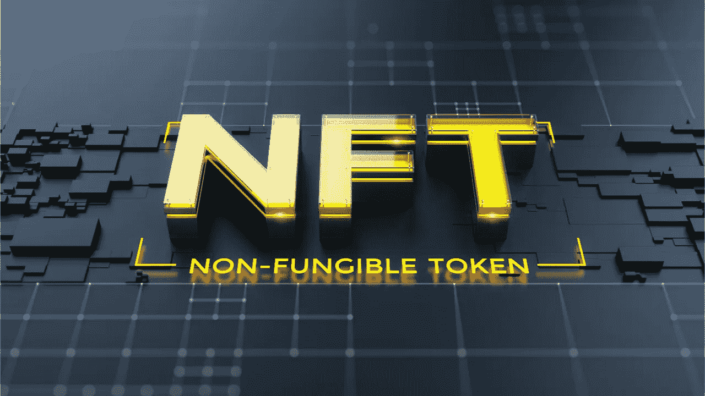

# 关于 NFT 市场你需要知道的事情

> 原文：<https://medium.com/geekculture/things-you-need-to-know-about-nft-marketplace-5747bc56b126?source=collection_archive---------15----------------------->

在疫情之前，世界并不知道 NFT 的。他们通过加密货币和其他数字资产进行交易。众所周知，游戏玩家、内容创作者会找到技术途径来最大化他们的收入，并获得巨大的优势。今天，全世界都在大肆宣传 NFT 氏症。

什么是 NFT？

NFT 是代表现实世界财产的数字资产，如艺术、音乐、游戏中的物品和与所有权证明相关联的视频。NFT 通过智能合约识别信息，这使得 NFT 的更独特，没有其他方法可以像其他令牌一样复制。

NFT 的货币和加密货币完全不同。加密货币与其他一些加密货币具有同等价值。相比之下，NFT 的价值观与 NFT 的价值观不同。正因如此，许多创作者、艺术家现在将他们的想法投资于 NFT 的发展，并通过 NFT 市场出售，以获取巨额利润。

**什么是 NFT 市场？**

NFT 市场是买卖你的 NFT 的唯一地方。NFT 市场只不过是储存数字资产的地方。市场上有过多的 NFT 市场来买卖你的数字资产。但并非所有的市场都是一样的。

每个人都有自己独特的功能和特点，你必须找到合适的市场。有一些著名的 NFT 市场，如 Opensea、Raible 等等。不可否认的事实是，与 NFT 的创造者相比，NFT 市场的所有者获得了更多的利润。

**NFT 市场有多赚钱？**

许多企业家已经启动了 NFT 市场，以促进无缝 NFT 交易并获得高回报。在这里，我列出了启动 NFT 市场的原因。

它能产生巨大的投资回报

吸引大量用户

高度优选的加密业务

只要 NFT 存在，就有牢不可破的业务增长

需要的维护更少

**推出你自己的 NFT 市场**

在密码市场中，推出 NFT 市场是企业家们最想做的事情。尽管有各种区块链网络平台，如 BSC、以太坊、Cardano、polygon、Tron 等。

但币安智能链吸引了投资者的注意，因为它的汽油费更少，交易更快，而且跨链互操作。正因为如此，他们中的大多数人都将自己的 [NFT 市场建立在 BSC](https://maticz.com/bsc-nft-marketplace-development) 之上。

**结论**

推出 NFT 市场是下一代商业理念之一。现在是时候为你的追随者树立一个标杆了。这种业务采用将为难以置信的利润提供新的方法和方向。认识到这一点很重要，你必须找到最好的 NFT 市场开发者，在你想要的网络上建立你的 NFT 市场。

我们让著名的 [NFT 发展公司](https://maticz.com/nft-development-company)在你想要的网络上建立你的 NFT 和 NFT 市场，他们拥有传奇的区块链开发者。让自己在成功的道路上前进一步