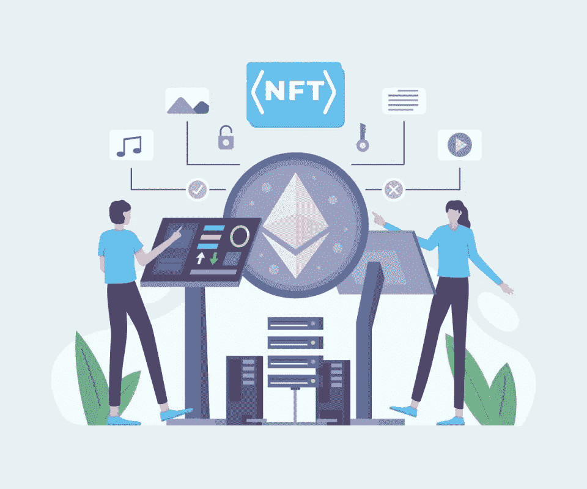
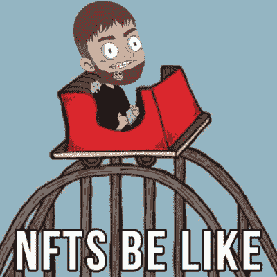

# 在开始开发 Nft Exchange 之前，您应该考虑的事情

> 原文：<https://medium.com/geekculture/things-you-should-look-into-before-starting-your-nft-exchange-development-91d3450e8bf5?source=collection_archive---------12----------------------->

NFT Exchange

不可替代的代币正在对当今人们拥有资产的方式进行一场革命。如果你观察区块链行业，你一定会注意到从 2021 年最后一个季度开始 NFT 持有者的突然激增。那一年的总销售额达到了 250 亿美元，仅上一季度就达到了 110 亿美元。从艺术家到体育，NFT 正在入侵每一个可能的行业。从独立自由艺术家到名人，每个人都在从事非功能性写作。

你知道吗？歌手凯蒂·佩里的《NFT 滴血》仅在一级销售中就赚了 120 万美元，二级销售中它的价值正在飙升。对 NFT 的需求如此之大，以至于它们的价值在二次销售中急剧上升。这促使企业家开始发展 NFT 交易所。这个博客是为企业家在开始开发过程之前获得一些基本的见解而策划的。

# **为什么 NFT 风靡全球？**

不可替代的令牌是在区块链上铸造的，以赋予资产专属所有权。由于区块链和 Web 3.0 正在创造一场新的技术革命，人们正在尽一切可能使用区块链。一切都变得数字化，世界慢慢走向无纸化货币。这同样适用于所有权文件。

NFT 仅限于资产吗？不要！其实任何独一无二的东西，任何数字化的东西，任何东西都可以做成 NFT，存储在区块链里。这是不可检查的，只有在满足某些条件并且它执行一组代码时，才能修改所有者。

你知道吗，甚至有足球比赛门票被制作成 NFT？。

元宇宙是另一项获得巨大反响的技术，尽管它仍处于开发过程中。预计在不久的将来，它将影响数十亿人，而 NFTs 将成为它的基础。元宇宙是一个使用多种技术的数字世界，包括区块链。在这个数字世界中，NFT 被用来拥有数字资产。

[**最贵的 NFT 代币**](https://en.wikipedia.org/wiki/List_of_most_expensive_non-fungible_tokens) **> > >**

# **什么是 NFT 交易所？**

NFT 交易所是一个平台，让人们可以很容易地与他人进行 NFT 交易。人们可以轻松地交换数字艺术品、交易卡、图像文件、音乐和 NFT。也有专门的 [**NFT 交易平台或市场**](https://www.appdupe.com/nft-marketplace-development) 只托管特定的流派。由于 NFT 最近被大肆宣传，二级销售获得的收入比一级销售获得的收入要多。二次销售是指人们将他们在发布期间购买的 NFT 再次出售给对其感兴趣的其他用户，以获得更高的价值。

有许多利基期待着一个专门的 NFT 交流平台。下面是其中的一些例子

*   音乐 NFT
*   运动 NFT
*   时尚的 NFT
*   NFT 借贷平台
*   NFT 建筑奖
*   房地产 NFT
*   NFT 艺术符号化

**NFT 交易平台是如何运作的？**

NFT 交易平台或市场是一个平台，在这里用户可以很容易地向其他用户购买、出售和拍卖他们的非功能性交易。NFT 交易平台的工作流程如下。

*   用户将不得不注册自己的基本信息，如电子邮件 id，用户名和电话号码。
*   然后，他们可以登录该平台，查看待售的 NFT。
*   用户现在必须整合他们的钱包，以便他们可以轻松地购买和存储他们的 NFT。一些市场使用专门为该平台设计的本地令牌和钱包。
*   平台中的非专利技术要么以固定价格直接出售，要么进行拍卖。用户必须将他们的出价放在平台上。出价最高的人将能够在拍卖结束时购买 NFT。
*   用户也可以稍后再次从市场上转售他购买的 NFT。
*   另一方面，用户也可以发布他们的 NFT 进行销售。该平台将有一个审查过程来检查 NFT 的真实性。
*   一些市场允许用户在平台上铸造他们的 NFT，并在那里出售或拍卖。

**如何搭建 NFT 交流平台？**

现在，使用白标解决方案可以轻松构建 NFT 交易所平台。它们只是预先开发和测试的解决方案，可以定制到任何程度。也就是说，从用户界面、功能和工作到它所基于的区块链网络。也可以为这个解决方案开发本地令牌，并带来一个全新的 NFT 交换平台。在开始开发过程之前，对以下事情有一个清晰的认识是很重要的。

*   NFT 交易所将要研究的区块链必须得到高度重视，因为它决定交易费用和速度。
*   本地令牌开发和钱包集成选项
*   易于使用、用户友好的界面，以便新的 NFTs 用户也可以轻松访问该平台
*   使其在其他平台中独一无二的平台特性。有创新的想法要补充吗？把它写下来，和你的开发者讨论它的可行性
*   平台的工作流程不应复杂。
*   各种支付网关选项，以便用户在交易时有选择。
*   绕过外部威胁的安全功能。应该包括双因素身份认证、AML 和 KYC，以便用户可以放心使用可靠的环境。

**外卖**

在选择你的发展伙伴时，你也应该给予重视。选择一个在区块链领域多年的开发者，会对目标受众有所了解。这将使 [**NFT 交易所发展**](https://www.appdupe.com/nft-exchange-development) 发挥出最大的潜力。查看他们以前的项目，与他们取得联系，尽早开始你的开发过程。