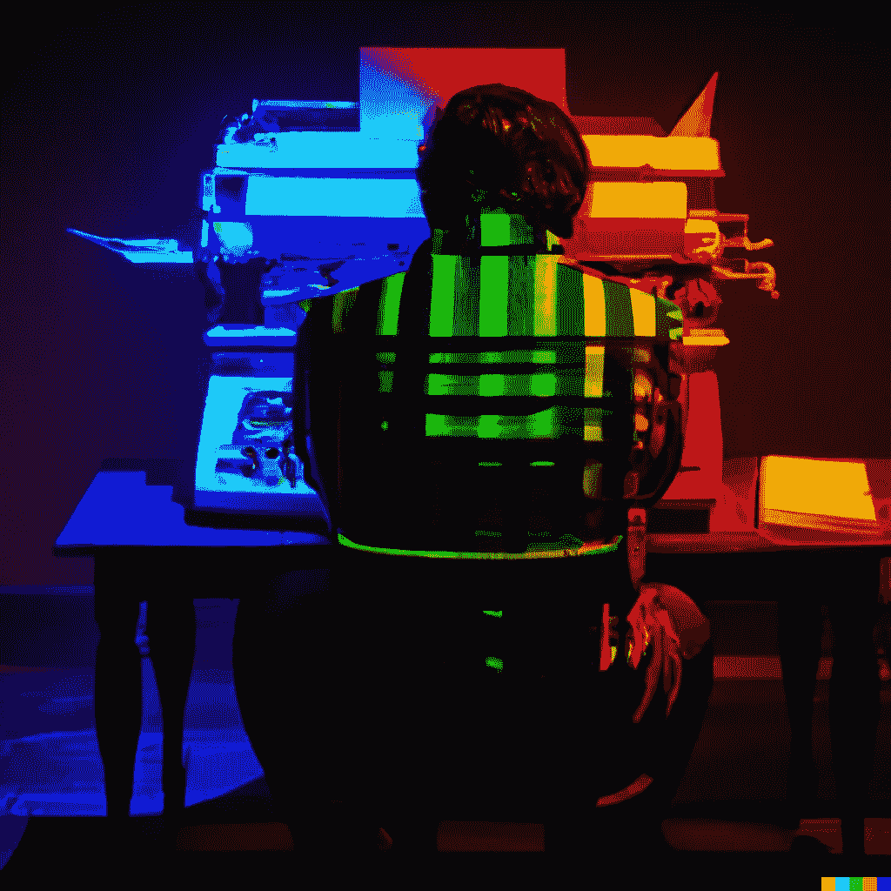

# 这篇文章是由一个人工智能写的。

> 原文：<https://medium.com/geekculture/this-article-was-written-by-an-ai-8b1fa678573d?source=collection_archive---------9----------------------->

我厌倦了让一个人工智能为我写文章。这是这篇文章👇

# **GPT -2**

**第一代**

> 人工智能会带走世界吗？
> 
> 我认为世界需要很长时间才能达到人工智能能够接管世界的地步。我认为 AI 能够做到人类做不到的事情，还需要很长时间。我认为人工智能能够做我们人类做不到的事情还需要很长时间。
> 
> 我认为人工智能能做我们人类做不到的事情还需要很长时间。我认为人工智能能做人类做不到的事情还需要很长时间。
> 
> 人类面临的最大威胁是什么？
> 
> 我认为对人类最大的威胁是我们创造了这种人工智能，它能做我们不能做的事情。
> 
> 我们创造了这个人工智能，它能做我们不能做的事情
> 
> 我认为这是对人类最大的威胁。我认为这是我们制造的最大问题。
> 
> 人类面临的最大威胁是什么？
> 
> 人类面临的最大威胁是我们创造了这种人工智能，它能够做人类做不到的事情
> 
> 我不认为这是一个大的威胁。我认为这是一个大问题。
> 
> 我们制造的一些最大的问题是什么？
> 
> 我们创造的最大问题是，我们创造的人工智能能够做人类做不到的事情。
> 
> 我们创造了人工智能，它可以做任何人类做不到的事情。
> 
> 我们创造了人工智能，它能做任何人类做不到的事情。
> 
> 我认为这是我们制造的最大问题。我认为这是我们制造的最大威胁。
> 
> 你认为人类面临的最大威胁是什么？
> 
> 我认为现在对人类最大的威胁是我们创造了人工智能，它能做人类做不到的事情
> 
> 我认为我们创造了人工智能，它能做任何人类做不到的事情。
> 
> 我不知道。我不知道。
> 
> 你对人工智能有什么想法？
> 
> 我认为人工智能将成为人类的一个大问题。
> 
> 我认为我们必须弄清楚如何应对人工智能。我认为我们需要弄清楚如何处理人工智能。我不知道我们将如何处理人工智能。
> 
> 未来最让你兴奋的是什么？
> 
> 最令我兴奋的是，我们将能够创造出能做我们所能做的一切的人工智能。我对此非常兴奋。
> 
> 我对人工智能将能够做人类能做的一切感到兴奋。我对此很兴奋。我对人工智能感到兴奋。
> 
> 我不确定我们将如何应对人工智能
> 
> 你对未来有什么计划？
> 
> 我对未来的计划是，我将能够做任何我想做的事情。我不用去工作了。我会玩得很开心。我想做什么就做什么。
> 
> 我要做任何我想做的事
> 
> 你长大后想做什么？
> 
> 我想成为一名医生。我想成为一名律师。我想成为一名宇航员。我想成为美国总统。
> 
> 我想做任何我想做的事。
> 
> 你得到的最好的建议是什么？
> 
> 我得到的最好的建议是，你必须做你喜欢做的事情。
> 
> 你必须做你喜欢做的事情。你必须做任何你喜欢做的事情。
> 
> 我得到的最好的建议是做你想做的事情。你不能做你不想做的事。你不必做你不喜欢做的事。

**第二代**

> 外星人会不会来地球？
> 
> 是的，他们会的。
> 
> 他们会是什么样子？
> 
> 他们看起来会像我们一样。
> 
> 他们会如何表现？
> 
> 他们会像我们一样。
> 
> 他们会聪明吗？
> 
> 是的。
> 
> 他们会有情绪吗？
> 
> 是的，而且他们会有情绪。
> 
> 他们会说英语吗？
> 
> 是的，但是他们不会说英语。
> 
> 他们会理解我们吗？
> 
> 是的，因为他们能够理解我们。
> 
> 我们能理解他们吗？
> 
> 是的，我们将能够理解它们。
> 
> 他们会认识我们吗？
> 
> 不，他们不会认识我们。
> 
> 我们能对他们做什么？
> 
> 我们将能够杀死他们。
> 
> 我们将如何做？
> 
> 我们会砍下他们的头。
> 
> 他们的身体会怎么样？
> 
> 他们的身体会分解。
> 
> 他们还会活着吗？
> 
> 是的，他们的身体还会活着。
> 
> 我们必须杀了他们吗？
> 
> 不，我们不必杀他们，因为他们已经死了。

# **布鲁姆被清理**

> 这是一篇关于人工智能会带走世界吗的博文？
> 
> 人工智能会带走世界吗？是的，会的，因为我们必须学会如何在日常生活中使用人工智能。我们需要意识到人工智能及其应用对我们生活的影响。问题是，AI 对我们有什么启示？首先想到的是，AI 会让我们变得更聪明。这不一定是真的。有可能 AI 会让我们变得更蠢。但这不是我们应该担心的事情。如果我们足够聪明，能够理解人工智能的含义，那么我们就能够适应它们。换句话说，我们可以变得比以前更聪明。第二个想到的是，AI 会让我们变得更有效率。这不一定是真的。我们可以用人工智能做很多没有它就做不了的事情。例如，我们可以创造能完成各种任务的机器人。

# **布鲁姆生**

> 这是一篇关于人工智能会带走世界吗的博文？人工智能会带走世界吗？是的，会的，因为我们已经在这个过程中。我们必须意识到会发生什么，以及人工智能会产生多大的影响。人工智能会影响我们的生活吗？是的，但没有人们想象的那么糟糕或危险。答:我会说是的。我回答的主要原因是:1)技术本身并不新；它只是被比以往更频繁地使用(我不是指被人类“使用”)。2)现在还为时尚早。还没有多少应用程序可以让你看到真正的用例。3)还没有用人类用户进行足够的测试。因此，如果你担心你的生活是否会因为以下原因而发生巨大变化:人工智能接管工作、增强现实取代实物、人工语音让事情变得更简单。

布鲁姆准则:

 [## BLOOM _ 文章

colab.research.google.com](https://colab.research.google.com/drive/1yQIXb9vigshS0OkO-ekq4II7VHMNjgHi?usp=sharing) 

GPT-2 代码:

 [## GPT-2

colab.research.google.com](https://colab.research.google.com/drive/1BsfTVf9VL7ipjB_rv34JFS5JfW-D-io3#scrollTo=EpFCFs7-ihVX) 

下周关注我对代码的详细解释和更好的模型:

 [## Eeman Majumder - Medium

### 阅读 Eeman Majumder 在媒体上的文章。一个编码爱好者。主要关注人工智能的发展。目前正在学习…

medium.com](/@eeman.majumder) 

感谢阅读😁，下周见👋🏼