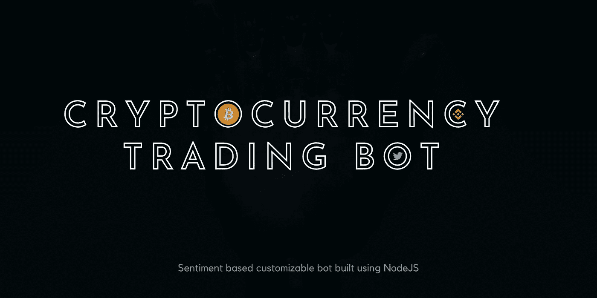
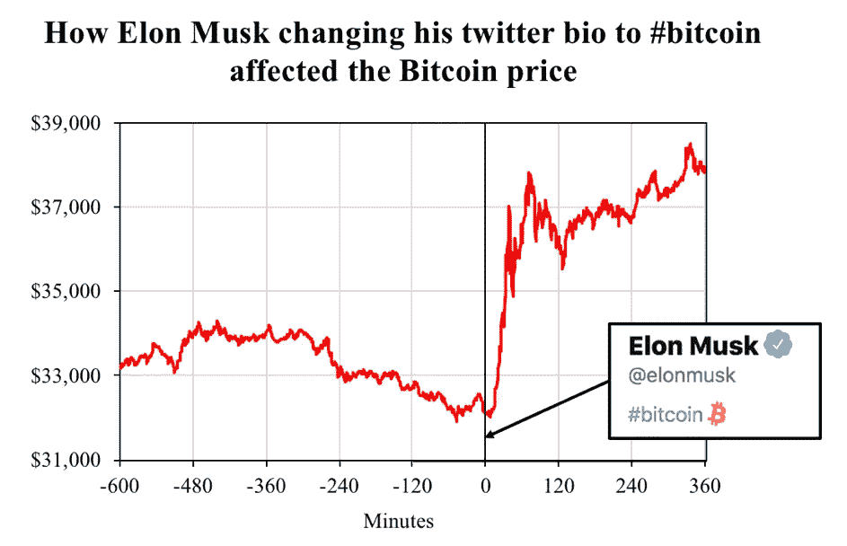
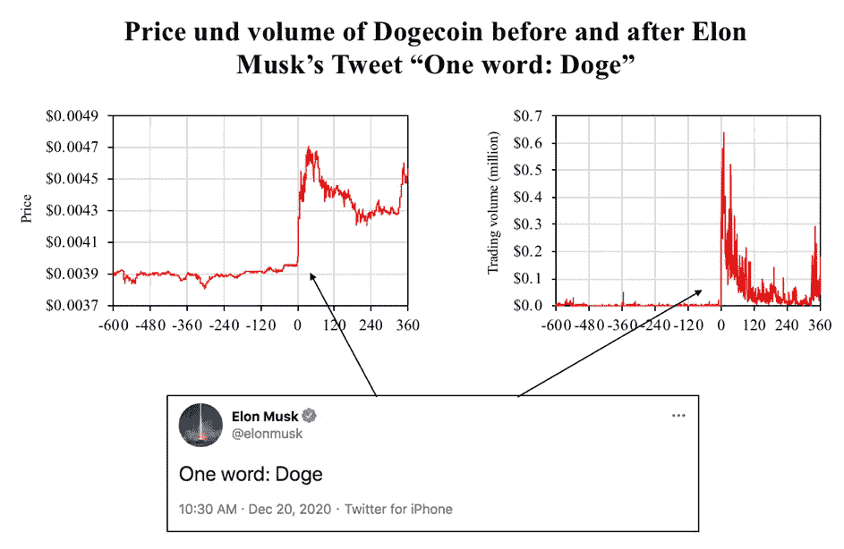
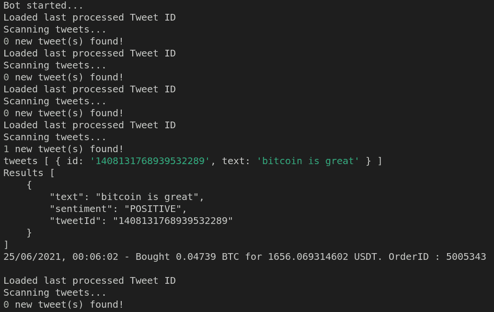
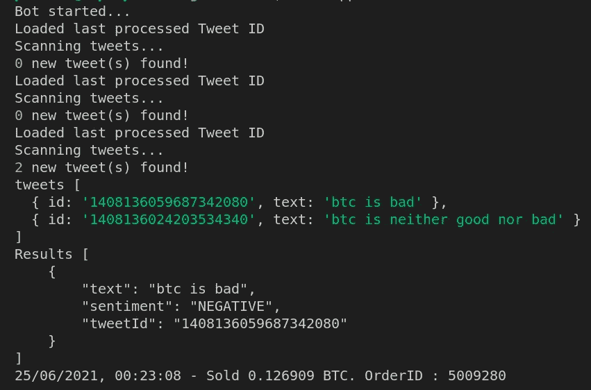

# 每当埃隆·马斯克在推特上发布比特币时，这个机器人就可以交易比特币

> 原文：<https://medium.com/geekculture/this-bot-can-trade-bitcoin-whenever-elon-musk-tweets-about-it-614b95633663?source=collection_archive---------19----------------------->

## 使用 NodeJS 的币安情感交易机器人



是啊！在这篇文章中，我们将构建一个可定制的交易机器人，**,每当埃隆·马斯克发布推文时，它可以根据推文情绪在币安买卖**比特币。

> 问题:你能告诉我们这个机器人背后的动机吗？
> 
> 回答:当然，为什么不呢？！



Source: [Blockchain Research Lab](https://www.blockchainresearchlab.org/2021/02/08/the-musk-effect-how-elon-musks-tweets-affect-the-cryptocurrency-market/)



Source: [Blockchain Research Lab](https://www.blockchainresearchlab.org/2021/02/08/the-musk-effect-how-elon-musks-tweets-affect-the-cryptocurrency-market/)

你能看到价格变动吗？他们称之为“麝香效应”。

> **免责声明**:它纯粹是为了好玩和**教育** **目的**而建造的。这篇文章不鼓励或批评任何人或事。目标只是演示交易机器人的技术植入。这不是财务建议或推荐。

在我们进入实现部分之前，让我们做好准备。

# 📝先决条件:

*   NodeJS:要运行这个 bot，您需要在您的机器上安装 NodeJS。如果你还没做，用这个[链接](https://nodejs.org/en/)。
*   [Twitter 开发人员帐户:](https://developer.twitter.com/en/apply/user.html)用于获取不记名令牌以向 Twitter API 发出有效请求。
*   [币安测试网按键](https://testnet.binance.vision/):在币安测试网交易所编程下单时需要这些按键。您可以通过 GitHub 帐户登录来获取。

# 🧘准备:

让我们为这个 bot 创建一个新目录，并将当前目录切换到它。我要称它为**“麝香机器人”**。

```
mkdir musk-bot && cd musk-bot
```

通过运行`npm init`初始化一个新项目。

本项目中使用的依赖关系如下:

*   [**axios**](https://www.npmjs.com/package/axios) :向 Twitter API 发出 http 请求
*   [**dotenv**](https://www.npmjs.com/package/dotenv) :读取环境变量的值
*   [**节点-币安-api**](https://www.npmjs.com/package/node-binance-api) :在币安交易所(testnet)下单
*   [**情绪**](https://www.npmjs.com/package/sentiment) :检索推文的情绪。

我们需要安装所需的依赖项。

```
npm install axios dotenv node-binance-api sentiment --save 
```

为了增加 bot 的一致性，我决定将交易日志和最后处理的 tweetId 存储在文件系统中。因此，我们需要在项目目录中再创建两个文件。

```
touch trade.logs tweetId.txt 
```

太棒了。👏现在是实现的时候了。

# 💡算法:

我们的机器人的工作方式非常简单明了。

*   首先，它从最后处理的推文中获取多达 10 条推文。当我们第一次启动 bot 时，它从给定的 twitter 用户 Id 中获取最后 10 条 tweets。
*   我们将维护一个单词数组，用于检查哪些 tweets 需要处理。没有那个词的推文被忽略了。在我们的例子中，单词数组类似于`['btc', 'bitcoin']`。tweet 中可能有一些超链接包含数组中的单词，因此我们将使用 Regex 从 tweet 中删除超链接，然后再对照单词数组进行检查。
*   从推文中提取情感得分。如果中性或者它没有突破阈值，我们就忽略它。
*   如果推文打破了正/负阈值分数(可以在文件中定义，检查实现以了解更多细节)，我们将根据情绪发出买入/卖出订单。
*   然后我们将交易日志和`lastProcessedTweetId`记录在一个文件中。
*   如果所有 10 条 tweet 不包含任何与 word 数组中的单词相关的 tweet，那么我们只需将`lastProcessedTweetId`更新为 Twitter API 返回的 tweet 数组中的最新 tweet(即，`lastProcessedTweetId = tweets[0].id`)并等待下一次迭代(滑动窗口技术)。

# ⌛️Implementation:

在项目根目录下创建一个名为`app.js`的新文件，并添加以下内容。

现在我们需要创建配置文件来定制这个机器人。创建一个名为`config.js`的文件来存储这个机器人的基本配置。

```
module.exports = {BASE: "BTC",QUOTE: "USDT",//buys BTC using 30% of USDT balance
BUY_PERCENT: 30,//sells 35% of BTC 
SELL_PERCENT: 35,//bot checks for these words in the tweets
shouldInclude: ["btc", "bitcoin"],//UserId of the twitter user. It can be obtained from this [API](https://developer.twitter.com/en/docs/twitter-api/users/lookup/api-reference/get-users-by-username-username)
twitterUserId: "elon_musk_id_goes_here",//Frequency to check for new tweets (in minutes)
interval : 2};
```

如前所述，这个机器人是可定制的。它不仅限于交易比特币或对埃隆·马斯克的推文进行投票。您可以根据需要更改这些参数。

现在让我们创建另一个文件`.env`来存储环境变量。

```
BEARER_TOKEN = <TWITTER_BEARER_TOKEN>
BINANCE_API_KEY= <BINANCE_TESTNET_API_KEY> 
BINANCE_SECRET= <BINANCE_TESTNET_SECRET_KEY>
```

快到了！我们需要创建一个助手函数来在币安测试网交易所下订单。在项目目录中创建一个名为`helpers`的新文件夹，并将以下内容添加到一个新文件中:`placeOrder.js`

上述脚本将基于指定的选项工作。

*   如果传递给函数的动作是`BUY`，那么脚本将从总 USDT 余额中计算出`BUY_PERCENT`(在我们的例子中是 30)，并在给定的市场(BTCUSDT)下一个`MARKET BUY`订单。
*   如果行动是由于负面情绪引起的`SELL`，那么剧本以市场价出售总持有量的大约`SELL PERCENT` (35%)。

# 😋现在是现场表演的时候了:

出于测试目的，我在`config.js`文件中添加了我的 Twitter 用户 Id，并通过运行`**node app**`命令启动了机器人。

与此同时，我发布了一条正面的推文，声明`bitcoin is great`。输出如下所示:



Trading Bot Output 1

`trades.log`文件插入了以下交易数据。

```
25/06/2021, 00:06:02 - Bought 0.04739 BTC for 1656.069314602 USDT. OrderID : 5005343
```

酷✨之后，我发布了一些负面和中立的推文。结果很完美！



Trading Bot Output 2

你可以看到，我们的机器人忽略了带有`neutral`情绪的推文，并对负面推文下了卖出订单。它像预期的那样工作。

我还尝试使用埃隆·马斯克的账户，以确保机器人按照要求计算情绪。为此，我需要进行一些配置，从他的帐户中获取一些旧推文，并用我们的机器人处理它们。这是我们机器人的情感结果。

```
Results [
    {
        "text": "#Bitcoin 💔 ",
 **"sentiment": "NEGATIVE"**
    }
]...Results [
   {
    text: '[@Cointelegraph](http://twitter.com/Cointelegraph) This is inaccurate. Tesla only sold ~10% of holdings to confirm BTC could be liquidated easily without moving market.\n' +
      '\n' +
      'When there’s confirmation of reasonable (~50%) clean energy usage by miners with positive future trend, Tesla will resume allowing Bitcoin transactions.',
 **sentiment: 'POSITIVE'**
  }
]...
```

你可以看到我们的机器人正确地评估了情绪💥

> *这个 bot 的源代码可以在 GitHub* ***这里找到***[***。***](https://github.com/PraneshASP/crypto-trading-bot)****

# **👋结束注释:**

**是的，我同意这个机器人非常简单，一如既往，有很大的改进空间。但主要目标是展示我们如何利用 Twitter API，并使用币安 API 下订单。这个机器人非常有趣，它帮助我们学习一些新的有趣的东西。您可以尝试更改配置文件，并尝试使用这个机器人。如果你发现任何问题或希望分享你的想法，请在评论中发表。**

**编码快乐！🔥🔥**