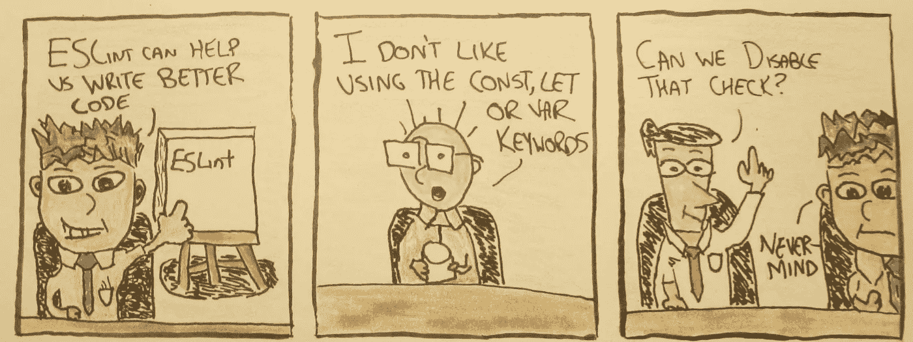
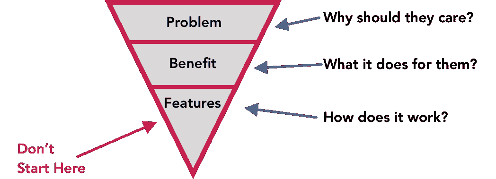
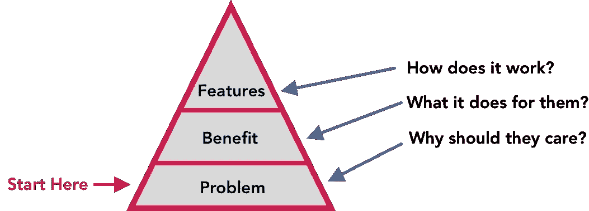

# 这个常见的错误导致大多数开发工具失败。

> 原文：<https://medium.com/geekculture/this-common-mistake-causes-most-developer-tools-to-fail-769e22c4a951?source=collection_archive---------27----------------------->


# 我曾经相信构建一个成功的开发工具是相对简单的。打造让顾客生活更轻松的产品。减少整合阶段的摩擦。看着成功发生。这是直觉。每个人都在这么做。这也是完全错误的。

事实是，这是落后的。构建一个成功的开发工具是违反直觉的，为了成功，你需要采取相反的方法。你可能会觉得难以置信，但你需要**让你的客户痛苦**。

到本文结束时，您将理解为什么大多数开发人员工具产品都是向后构建的，并且您将有一种新的方式来思考如何构建它们。

**通过这篇文章，我将带您了解如果您正在设计一个代码林挺工具，您可能会面临的一些挑战。**同样的挑战也适用于任何开发工具。这篇文章的目标不是关注特性功能，而是从客户开始，逆向工作。

# 事情是这样的…

开发者工具很难。摩擦不可避免。即使是相对简单的产品。

我认为大多数林挺工具也是相对简单的产品。如果你试图推动代码林挺工具的采用，比如 ESLint，你可能也会面临很多阻力。

**这篇文章的目标是学习如何像我们的客户一样思考代码。**一旦我们了解了他们如何看待我们的工具，我们就可以帮助他们以一种有助于说服他们使用该工具的方式来思考这个问题。

在了解了产品的哪些方面可以帮助我们推动采用后，我们可以考虑如何围绕他们关心的事情来设计产品。

让我引导您了解客户对这个问题的想法。

有没有注意到当你在你的代码库中集成了一个 linter 时，它会抱怨改变你的代码？

代码碎片增加了开发过程中的摩擦。它在工程工作流程中增加了一个额外的步骤。如果代码不符合任意规则集，它会阻止您发布代码。如果您试图构建一个需要开发人员采用的工具，这是一个可以考虑的完美例子。

为什么人们会使用像 ESlint 这样的工具？从表面上看，这只会让工作更难做。如果你试图说服某人使用你的林挺工具，这里有一个完全有效的理由列表，你可以选择忽略。

*   安装和配置需要时间
*   该工具本身不会给应用程序增加任何功能
*   安装后，它会突出显示应用程序中的所有问题
*   你需要对你的应用程序做一次大的梳理，以便提前解决问题
*   接下来，你前进过程中的每一个改变都需要你保持警惕，关注结果

尽管有这些原因，还是有很多人在使用这个工具。

为什么有人会选择这种类型的问题？

> *如果我们能清楚地向客户传达我们产品的价值，我们就能围绕他们关心的东西来设计我们的产品。*

如果我们无法向客户传达我们产品的价值，那么从功能设计到优先级排序，一切都只能通过一种策略来实现:猜测。

# 开发者对开发工具的评价是什么？

你与顾客分享的[价值主张](https://en.wikipedia.org/wiki/Value_proposition)有助于他们理解**如果你使用该产品**你会得到什么。

告诉开发人员产品的功能是很直观的，所以让我们从这里开始。

# 销售功能

让我们再次以 linter 为例。以下是我刚刚编造的一些关于 ESLint 的事实。它们可能是真的，但是为了这篇文章，让我们假设它们是真的。

*   **我们的 linter 工具兼容新的 es2085 语法。**
*   **我们的棉绒比最快的替代产品快 85%。**
*   **我们的 linter 包括对您可能从未考虑过的全新问题的检查。**

听起来不错，对吧？

如果你有销售或市场营销的经验，你可能会看到这里的问题。这种信息是在宣传一种功能，而不是宣传其优势。

**简而言之:**描述一个特性就是从技术的角度谈论工具。

它回答了这个问题**这个产品怎么最好？如果你在市场上寻找一种新的棉绒工具，这些理由会引起共鸣，并且极具说服力。**

问题是，如果一个开发人员不积极地比较不同的林挺工具，我们产品的任何特性或功能都不会真正引起这种心态的用户的兴趣。

**简而言之:**潜在客户可能不会在意。当你告诉他们时，他们可能会有这样的想法:

> “听起来不错，我肯定有人会喜欢。我就是不需要。”

有一个分享产品特性的地方，但它不能是你第一个分享的东西。

# 销售优势

让我们用这个 linter 例子来加强我们的游戏。我想根据我对 ESLint 的了解，这些细节大部分应该是准确的。

*   我们的 linter 工具将帮助你写出更好的代码。
*   这会让你更容易与队友合作。

听起来好多了，对吧？

与顾客分享产品的好处有助于他们理解**这个产品对我有什么好处？**

大多数工程师都想写出更好的代码。让协作变得更容易听起来也不错。销售好处会激起用户的好奇心，即使他们并不喜欢你提供的工具。

好奇心会把大多数顾客带到第一个障碍前。不幸的是，他们通常会在第一次反抗时就放弃。或者他们会忘记这件事，因为他们会专注于其他事情。

## 现状:你最可怕的噩梦

现状对你的客户来说很好，但却是你最糟糕的噩梦。你的客户可能认为到目前为止他们做得很好，正因为如此，他们没有很大的动力去改变。

以 ESLint 为例，大多数开发人员喜欢标准化的想法，假设你围绕他们喜欢的方式*进行标准化。找到一个喜欢**大部分标准**但想在**少数情况下**有所不同的开发人员并不疯狂。*

> *“这对其他人来说很有用。我的代码不一样。”*
> 
> **–几乎每个开发人员**

*我有一种感觉，至少一旦一个团队开始迁移到林挺系统，关于琐碎细节的谈话就变成了完全浪费时间，项目就被废弃了。*

**

*这就为我们带来了解决方案销售的基石:*

***没有痛苦，没有改变。***

*人们安于现状。如果你试图推动你的开发者工具的采用，如果你没有把你的客户推向痛苦，他们会在第一个反抗的迹象时停下来。*

# *销售问题*

*您的客户遇到的问题会激励他们克服障碍、挑战并实施您的解决方案。当你在设计你的产品时，你需要围绕客户的问题来设计，并且尽可能的大。*

*您的工作是帮助客户认识到现状是一个浪费他们时间、损害他们的职业生涯和浪费他们公司金钱的主要问题。很多。*

*谈论顾客的问题不是抱怨。它帮助人们认识到现状是多么不可持续。*

## *JavaScript:他们最大的噩梦*

*让我们回到我们的 linter 例子。谈论使用 linters 的好处可能无法证明实现这样一个特性所需的工作量是合理的。然而，棉绒解决的问题可能就是诀窍。*

***在*“JavaScript 好的部分”*中，有一个部分叫做“ *JavaScript 坏的部分*”，这里概述了语言中的所有问题**。这可能是一个开始的好地方。一个明显的例子是两倍等于和三倍等于的区别:*

```
*1 === '1'; // false
1 == '1';  // true*
```

*这是现实世界中许多应用程序出现主要问题的原因。*

*如果你想说服一个团队需要棉绒，谈论这个问题可能会有帮助。更有效的方法是在他们的代码库中找到一些主要问题，这些问题是这个错误导致的。*

*   *今天，您如何防止这类问题的发生？*
*   ***如果应用程序的关键流程中出现了这种类型的逻辑错误，该怎么办？***
*   ***你的应用程序上一次因为发布的错误而关闭是什么时候？***
*   ***这些问题有什么影响？***
*   *你的经理对他们有什么看法？*
*   ***这些问题如何影响您的业务？***

*帮助客户关注这些问题的答案将有助于他们关注在他们的代码中不使用 linter 是多么的不可持续。*

*因为我不能访问你的代码库，现在，我们可以专注于 linters 以不同的方式解决的问题。*

*立即观看整个视频。时长 4 分钟。这完全不同于你的预期，每一分钟都是 100%值得的。我保证。*

*[**观看:加里·伯恩哈特的窟视频**](https://www.destroyallsoftware.com/talks/wat)*

*我曾经认为编程语言很直观，很容易推理。这个视频破坏了这种观点。如果有人告诉你编程语言很容易推理，linters 只适合新手，也许你可以替我问他们这个问题:*

> **窟？**

*现在，ES6 已经修复了许多问题，并且 linters 不能解决语言中存在的所有问题，但是如果你能解决其中的大类问题，你认为它们会有意义吗？*

# *你是如何积聚痛苦的？*

*这就是你正在构建的开发工具的秘密。你可能没有一个 4 分钟的短片可以链接到上面，但是有一些系统和公式可以让你大规模的使用。*

*你的产品需要建立在你能为客户开发的问题之上。在讨论你的解决方案时，你需要把问题放在第一位。*

*我打算以后再写，所以如果你有兴趣深入这个话题，可以订阅我的时事通讯。如果你不想，我完全理解。*

# *齐心协力*

*作为一名工程师，首先考虑你正在构建的技术是很直观的。然后再想想你的顾客。这篇文章就是这么写的，为了直观理解。*

*大多数人在考虑构建技术时都是按照这个顺序来考虑问题的:构建的技术、用户的结果以及解决方案解决的问题(按照这个顺序)。*

*当把顾客放在第一位时，这个顺序是反向分层的。*

**

*相反，你需要以相反的方式来构建它。从问题开始，讲述好处，然后谈论特点。你为用户解决的问题需要成为一切的基础。*

**

*如果你想说服一个开发者尝试一个新的林挺工具，这里有一个关于 linter 的策略。*

## *几个示例问题…*

*要在与潜在客户的销售电话中应用这些原则，您可以从他们遇到问题的地方开始，并在深入您的问题的特征功能之前了解他们的情况和需求。*

*这些问题经常跨越多个对话，但是这些可以给你一个从哪里开始的想法。*

***构建问题***

> **你知道 JavaScript 中的双倍等于和三倍等于是不同的吗？你认为这是为什么？你觉得这重要吗？**
> 
> **你的应用程序上一次因为发布的错误而关闭是什么时候？**

***好处***

> *你认为代码库的一致性很重要吗？为什么？*
> 
> **你曾经因为一致性问题在你的应用中发布过 bug 吗？**
> 
> *你如何在你的项目中与个人编码风格不同的其他工程师合作？如果你用同样的方式编码会有帮助吗？怎么会这样*
> 
> *你认为人们为什么会使用棉绒？*

***特性***

> **我们的 linter 工具兼容新的 es2085 语法。**
> 
> *我们的棉绒比最快的同类产品快 85%。*
> 
> *我们的 linter 包括对你可能从未考虑过的全新问题的检查。*

*如果你和一个潜在客户开始对话，并探究每个问题的含义，他们会开始和你一样思考这个问题:重要。*

*我将在以后的文章中阐述建立需求的策略。*

# *如何设计一个开发者工具产品？*

*开发人员工具最常犯的错误是他们从技术工作到用户。通过了解用户的想法，你就能了解他们看重什么。*

*作为一名产品设计师，你需要首先了解用户面临的问题。如果你的产品对他们的问题是一个可行的解决方案，并且会让他们的生活变得更好，他们会愿意改变他们的工作流程来采用你的产品。*

## *你需要优先考虑的事情是那些能让你的工具成为他们问题的可靠解决方案的事情。*

*这比区分特性功能的优先级更重要，因为这些细节只对那些已经决定实现像您的工具这样的解决方案的用户重要。*

# *如果你喜欢这篇文章，请点击下面的推荐按钮，这对我意义重大！🙌*