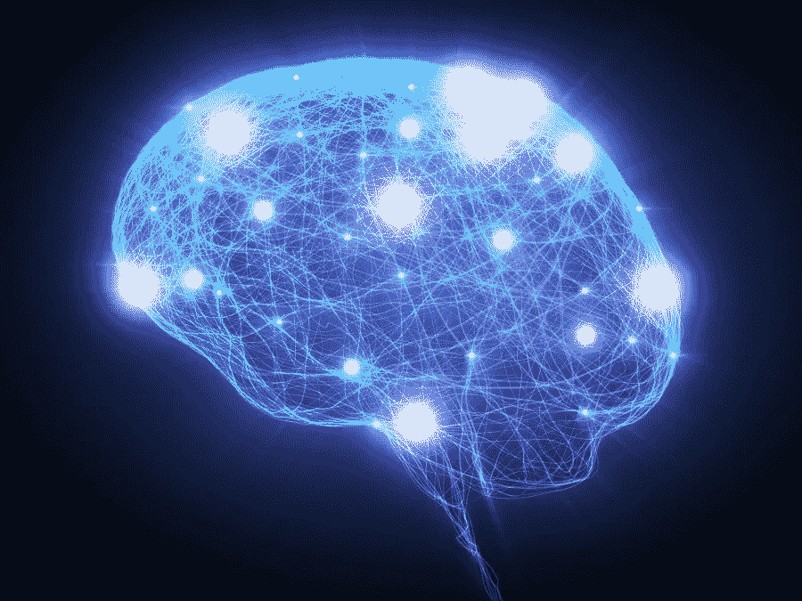
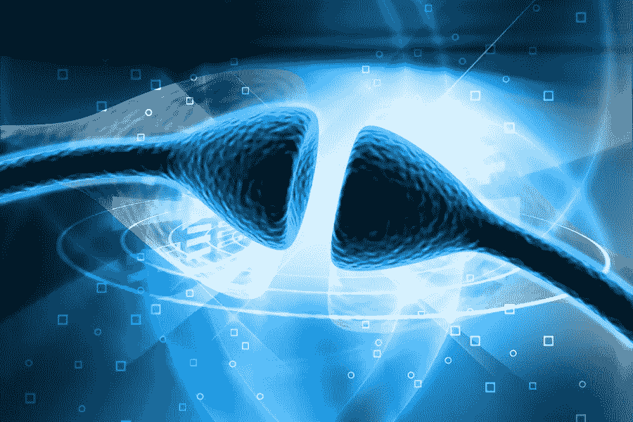
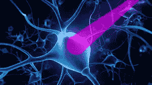
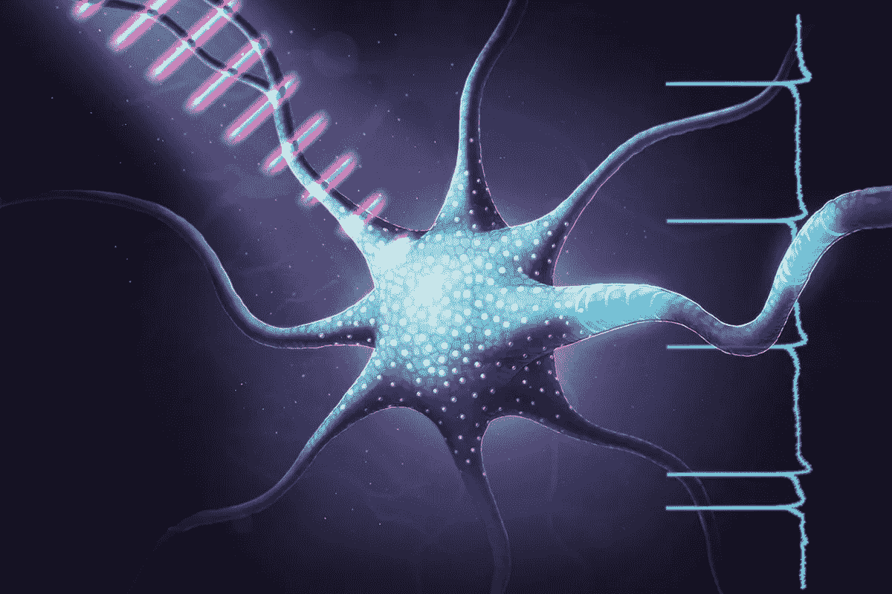
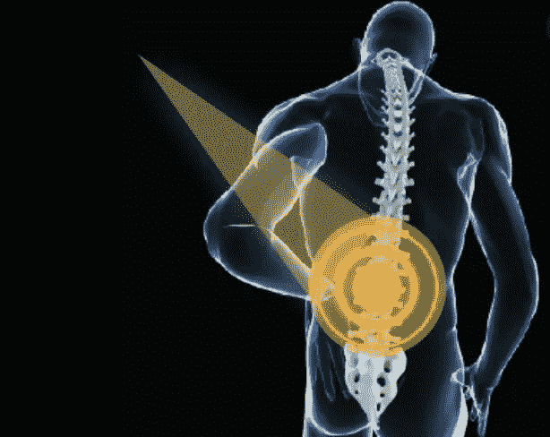
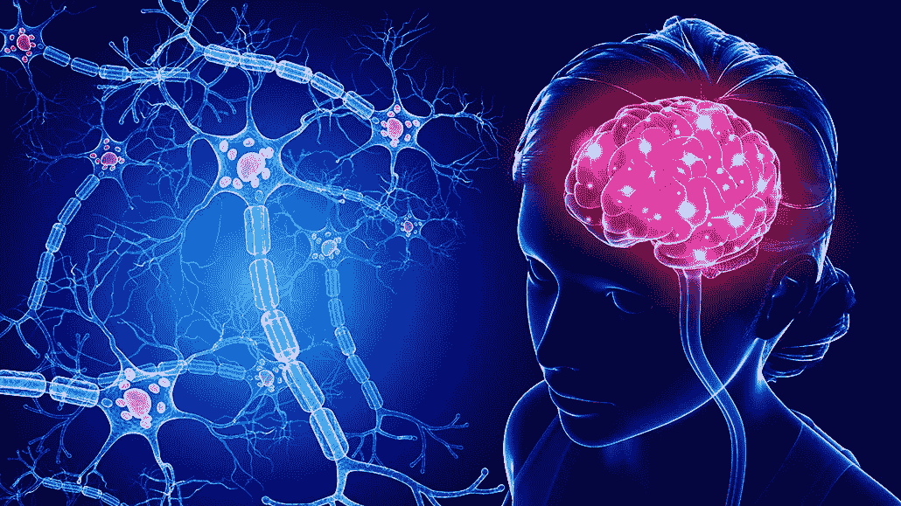

# 这项新兴技术可以利用光和基因工程控制大脑

> 原文：<https://medium.com/geekculture/this-emerging-technology-can-control-the-brain-using-light-and-genetic-engineering-51911dda5b20?source=collection_archive---------8----------------------->

## 光遗传学导论

人脑是一个极其复杂的系统，大约有 860 亿个神经元。它是我们所说、所想、所做的一切的中心，除了我们不必再三考虑的功能之外，它还帮助我们完成日常任务。大脑的能力确实令人难以置信，它同时执行许多不同功能的能力令人惊叹。然而，问题也可能发生在大脑中，通常表现为恶性肿瘤或神经(基于大脑的)疾病。一些基于大脑的疾病是基于特定大脑区域之间的过多活动(如焦虑)。其他情况发生在区域之间没有足够的活动时，或者某些神经元的性能恶化时(如阿尔茨海默氏症)。

这些情况对患有这些疾病的患者非常有害，会降低他们的生活质量和能力。在过去，这已经用诸如药物、电神经刺激和治疗的解决方案来解决。这些解决方案有时是有效的，但经常被发现是无效的，随着时间的推移效果下降，只是暂时有效，或者不精确。此外，神经科学家仍然没有获得人类大脑及其神经元连接的完整彻底的地图(参见我关于连接组学的文章了解更多细节！)这使得改进这些方法具有挑战性。

**随着神经科学和技术(neurotech)的新发展，科学家们正在开发一种独特的新工具，可以提供关于大脑连接和信号如何在大脑中传播的新信息，同时作为各种大脑疾病的有效、高效和一致的治疗方法。**这种方法被称为光遗传学，它有可能彻底改变神经科学的未来。

> **在我们深入研究光遗传学之前，这里有一个大脑如何构造和如何工作的高层次概述。**

大脑可以以各种方式分成不同的部分，但在最小的层次上，它是由神经元组成的，神经元是组成神经系统的特化细胞。它们通过在神经元之间形成通路的突触上发射电脉冲来传递信息。平均每个神经元有大约 1000 个突触，所以信息能够迅速传播到许多不同的地方。对于光遗传学来说，该系统的一个重要方面是神经元利用电脉冲和化学脉冲进行交流的方式。这些脉冲被称为动作电位。

The four parts of a neuron

神经元有四个部分:树突、细胞体、轴突和轴突末梢。树突接收来自其他神经元的信号，如果信号足够强，则只传递给细胞的其余部分(传递给轴突末梢，轴突末梢然后将信号发送给其他神经元)。这是神经元放电的时候。

这种信号是否被传输取决于被称为离子的带电粒子。像钠和钾这样的离子被隔离在神经元的内部和外部。只有当离子通道受体打开时，它们才能进出，充当内外之间的桥梁。当神经递质锁定离子通道受体的外部时，离子通道受体打开，然后离子可以四处移动。**当两种离子混合在一起，内外结合，就产生了动作电位，细胞就开火了。**

When an action potential is generated, the cell fires and sends signals to other neurons.

光遗传学是一种操纵动作电位来增加或减少某些神经元区域之间的交流和放电的工具。它很特别，因为与刺激目标区域附近每个神经元的深度大脑刺激等工具相反，它完全不精确，只能应用于特定的选定神经元组。

## 那么什么是光遗传学呢？

**光遗传学是一种神经科学技术，利用光和基因工程来控制大脑中的神经元群(因此才有了本文的标题！).**它的工作归功于通道视紫红质，这是一种光学(与光有关)蛋白质，因为它天然存在于单细胞藻类等植物中，以帮助其进行光合作用。当某种颜色的光(对于这种特定类型的视蛋白来说是蓝光)照射到植物上并到达视紫红质通道时，蛋白质就会产生电信号，打开其细胞的离子通道，让它们启动，以进行光合作用。

科学家们想到，如果他们获取通道视紫红质并将其植入大脑，他们也能够用光控制神经元的离子通道。他们能够发现不同种类的视紫红质，这些视紫红质对不同类型的光敏感，并具有不同的功能，如一些用于神经元的兴奋(增加活动)，而另一些用于抑制(减少活动)。由于它们对不同类型的光敏感，一个人甚至可以在大脑中有多种类型的通道视紫红质，使用其中一种而另一种没有任何反应！

基于大脑中自然发生的称为神经调节的生理过程，这可以同时对整组神经元有效。神经调节是指一个神经元使用化学物质来控制一组神经元。它在大脑中定期发生，可用于光遗传学的优势，以便同时控制多个单个神经元。

通过外科手术插入视紫红质对神经元进行基因改造。一种被称为腺相关病毒(AAV)的视蛋白构建体通过立体定位手术被注射到大脑中。大脑中还插入了一个脑机接口(BCI ),它将按照指示传递光来控制视紫红质。由于视紫红质是一种自然产生的蛋白质，大脑能够始终如一地接受它。

一旦进行了基因修饰，就可以随时进行光遗传学。光遗传学这个名字来源于光学(因为光和视蛋白是被使用的工具)和遗传学(因为为了达到这个目的需要基因工程)的结合。

A laser of colored light performing optogenetics on a neuron

当进行光遗传学时，特定颜色的目标光将照射在特定的大脑区域。**该区域的转基因神经元会产生反应，相应地增加或减少它们的活动水平。其他类型的视蛋白对那种颜色的光不敏感，即使光照射它们也不会有反应。**这非常有帮助，因为光遗传学可以在一个人身上发挥多种不同的功能，而不会相互影响。

虽然光遗传学作为一项技术仍处于小鼠试验阶段，但在过去五年中，德国实验室取得了巨大的进步，并表明它可能在五年内用于人类。

## 光遗传学可以用来做什么？

目前，有两个主要的基于大脑的光基因应用领域:了解信息如何传播的研究和医疗条件的治疗。

光遗传学可以被利用的第一种方式是作为一种研究工具来了解大脑中特定的突触连接以及信息在其中的传播。通过刺激一个特定的神经元或一组神经元放电，科学家可以通过观察电脉冲被发送到哪里，以及当这些神经元依次传播脉冲时，电脉冲是如何传播的，来了解信息是如何从该神经元具体传播的。这增加了我们对神经元如何传播信息的理解，也有助于我们绘制每个特定神经元和突触连接的能力。这些成就朝着更大的目标努力，即在神经元水平上获得完整的大脑地图。

这对于其他电刺激技术来说非常具有挑战性，因为当如此多的邻近神经元同时被激活时，很难跟踪一个特定神经元的过程。通过使用光遗传学的特殊刺激能力，科学家们能够以更容易的方式跟踪一个神经元。**这有助于我们更接近神经元及其突触连接的完整地图，以及理解每个神经元的强度或意义。**

Neurons can be targeted by light in order to learn about their connections to other neurons.

至于医疗应用，光遗传学正在各种医疗条件下进行测试，但主要是那些已经成功应用深度脑刺激的条件。虽然这些技术的精确度和具体细节是相同的，但高水平的概念是相似的，这意味着 DBS 治疗的疾病可能通过光遗传学治疗得更好。**这包括许多类型的疾病:神经退行性疾病，如帕金森氏症，精神疾病，如广泛性焦虑，以及神经发育疾病，如自闭症。**

特别是基于光遗传学仍处于其发展的早期阶段这一事实，基于该技术的研究应用可能在一段时间内成为光遗传学的主要用途。它不仅是一个更简单的概念，而且还需要更少的商业化和光遗传学设备的广泛使用。也就是说，许多实验仍在进行，以将光遗传学作为大脑疾病的工具，因为这有可能成为一个非常成功的市场，既可以帮助人们，又可以盈利。

> 但是等一下，还没完呢…

光遗传学是一种用于操纵神经元的技术。当面对神经元这个词时，大多数人都会将这个词与大脑中的神经细胞联系起来。然而，全身都有神经。组成这些神经的细胞仍然是神经元。那么这对光遗传学来说意味着什么呢？

这意味着神经系统内身体的其他部分也可以进行光遗传应用！身体的另一部分是心脏，它已经被用于许多光遗传应用案例的实验。心脏中大约有 40，000 个神经元，这意味着有大量的神经元材料可供使用。基于心脏的光遗传应用包括心脏起搏、再同步、心律失常终止等。用于激活这些神经元的方法是不同的(如光诱导二聚化和光老化)，但总的原理是相同的。到目前为止，根据使用案例的数量和效率，大脑是最受欢迎的光遗传应用，但在未来，这也是一种有趣的潜在有用的技术应用。

One interesting application of optogenetics outside of the brain is for chronic pain throughout the spine.

## 光遗传学的伦理关注

鉴于光遗传学需要侵入性的脑机接口技术，并且经常被称为“现代精神控制”，伦理问题无疑已经在整个领域出现。

仅侵入式脑机接口就有大量的伦理问题，其中许多问题都围绕着一种恐惧，即机器会记录除了它专门负责记录的个人数据之外的个人数据，并通过 BBI(脑脑接口)将数据导出到外部计算机或另一台 BCI。**实事求是地说，这种可能性相当低。**脑机接口尚未达到任何有意识的状态，对于它们来说，读取一种单独类型的数据，然后对其进行解释并导出，似乎也不太可能。这种担忧很大程度上是源于具有侵入性的新兴技术的社会污名。

然而，一旦阅读和控制大脑这两个方面开始发挥作用，就会有一系列全新的类似问题。这些担忧很大程度上与 BCI 在未经同意的情况下控制人的大脑，或者以一种不同于他们预期的方式和时间控制人的大脑是一致的。这种情况发生的概率同样很低，除非该技术出现某种故障，这也是相当罕见的。**这是另一个耻辱和社会规范的例子，它们对一项技术而不是科学事实或数据产生了恐惧。**

There are many ethical concerns based in the technology’s ability to control the brain at any time with ease.

## 结论

尽管它尚未被批准用于人类，但光遗传学已被证明在神经科学领域有多种有用的应用。这项技术的优点似乎超过了缺点和担忧，最近的进展表明，光遗传学可以很快成为主流医学技术。

在未来，光遗传学可能会有独特的应用，比当前的模型(如深度脑刺激或药物治疗)更加精确和有效。再多一点研究和测试是阻挡在光遗传学和未来接受更先进和成功治疗的大脑疾病患者之间的唯一障碍。

## 关键要点

1.  光遗传学是一种神经科学技术，它利用光和遗传工程来操纵大脑中的神经元。
2.  这项技术之所以有效，是因为两个关键的神经科学原理:动作电位(神经元外部内外带电离子的混合，导致其放电或神经刺激器与离子通道受体的连接)和神经调节(神经元使用化学物质控制其他类似神经元群)。
3.  为了建立光遗传学，一个人必须接受视紫红质(一种流行的种类是在藻类中发现的通道视紫红质 2)的外科注射，并在他们的大脑中植入侵入性 BCI，它将彩色光照向神经元。
4.  在大脑中，使用光遗传学的两个主要目的是了解大脑的连接和治疗神经疾病。光遗传学还可以应用于大脑以外的领域，如心脏。
5.  有许多关于侵入性 BCIs 和控制大脑的伦理问题，主要是关于在一个人不知情或未同意的情况下使用这些工具执行功能。
6.  光遗传学非常酷，可能对神经科学和医学的未来有巨大的影响！

## 额外内容

如果你超级感兴趣或好奇，这里有一两家公司在这个领域工作！我没有把它们放在文章的主体部分，因为它们主要是为了出售光遗传学实验设备，因为光遗传学还不允许用于人类，但它们仍然很酷，所以如果你已经做到这一步，请检查它们！

[科学](https://www.scientifica.uk.com/techniques/optogenetics)

[科博尔特公司](https://hubner-photonics.com/products/lasers/optogenetics-solutions/)

[激光发光技术](https://www.laserglow.com/product/byapplication/applications-optogenetics/?https://www.laserglow.com/scientific/?utm_source=google&utm_medium=adwords&utm_campaign=scientific&utm_content=lab-lasers&gclid=Cj0KCQjwqp-LBhDQARIsAO0a6aKXKNb7AYskjFPWPhIvGlA3eEqTX0YZ3lHwnLG3sqxP0BXW6-ShJQwaAnyuEALw_wcB)

感谢你阅读我的文章，希望你喜欢！我叫刘冰·博恩施泰因，今年 15 岁，我对神经科学的分支和神经疾病充满热情。我很乐意在 LinkedIn 上联系，或者你可以在 rainabornstein@gmail.com 联系我，与我交谈或合作。我等不及收到你的来信了！