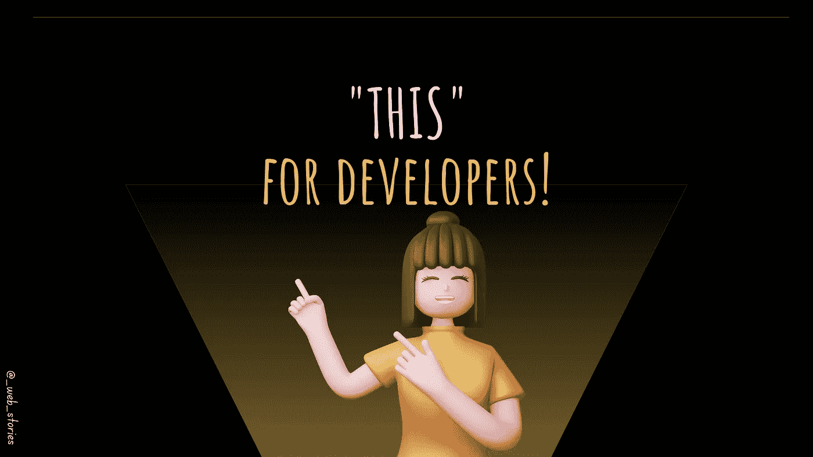

# 开发商的“这个”！

> 原文：<https://medium.com/geekculture/this-for-developers-5dc91d499677?source=collection_archive---------13----------------------->

## 这是网络世界的意义。

By FAM

## 你好👋

对于普通人来说，*谓人或物。对于我们这些开发者来说， ***“这个”*** 有不同的含义，不是吗？*

*对于普通人来说，这是一个 ***世界，限定词，或者代词。*** 对于我们这些开发者来说，是一个 ***关键词*** 无法更改。*