# 这就是如何将你的 Pico W 连接到互联网并从网络上控制它

> 原文：<https://medium.com/geekculture/this-is-how-to-connect-your-pico-w-to-the-internet-and-control-it-from-the-web-e24086843c9f?source=collection_archive---------6----------------------->

## 除了 Python 什么都没有

我最近制作了一个新视频，展示如何拿着你的[全新 Pico W](https://www.raspberrypi.com/news/raspberry-pi-pico-w-your-6-iot-platform/) ，将它安全地连接到互联网，并从网络界面控制它——所有这些都是用 Python 和 [Anvil](https://anvil.works/) 实现的。

**看看下面的视频或视频的文字版本。**

Video Tutorial Showing How To Connect An Anvil App To A Pico W

```
**Want to connect?**[Follow me for more](https://codingwithryan.medium.com/) software development content!
```

# 文本版本

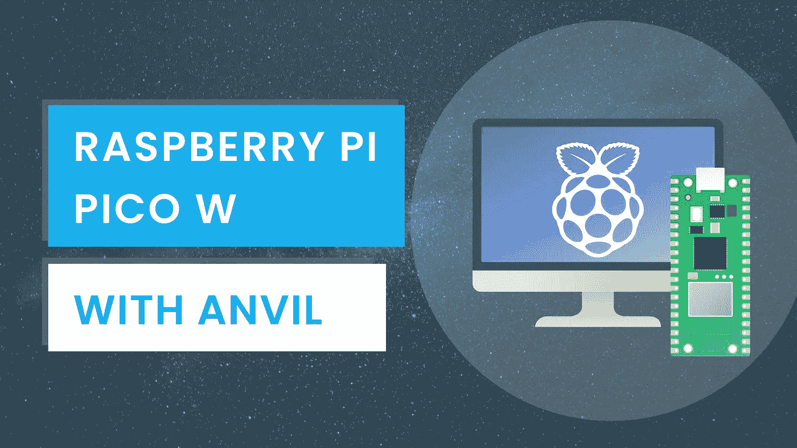

广受欢迎的 Raspberry Pi Pico 微控制器的下一次发展就在这里。Raspberry Pi Pico W 增加了板载 wifi，非常适合创建物联网设备。

在 3 个步骤中，我将教你如何创建和部署一个简单的 web 应用程序，这样你就可以学习如何远程控制你的 Pico W。

该应用程序将是一个简单的在线应用程序，只有一个按钮，使微微闪光的 LED。

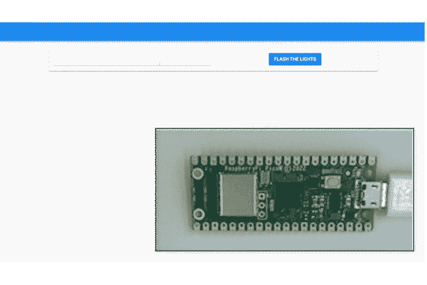

## 步骤 1——创建一个 Anvil 应用程序来控制我们的 Pico

我们将使用 Anvil 构建 web 应用程序，Anvil 是一个只使用 Python 构建 web 应用程序的平台。

第一步，我们将首先创建 Anvil 应用程序，它将无线控制我们的 Pico。我们将去[anvil.works/build](https://anvil.works/build)创建一个新的空白应用程序。


Creating a new blank app

点击编辑器顶部的应用名称，将其更改为“Pico App”。

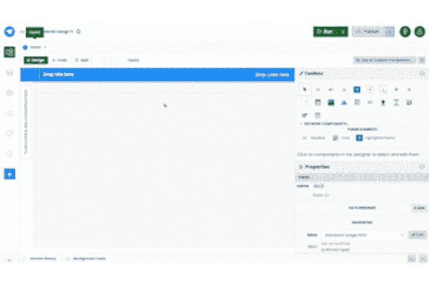

Renaming the app

接下来，让我们启用[上行链路](https://anvil.works/docs/uplink)。我们将使用上行链路连接到我们的 Pico。

单击编辑器边栏中的添加功能按钮，并选择上行链路。

接下来，我们将单击“启用服务器上行链路”按钮。

复制上行链路密钥，稍后我们将在 Pico 上的 Python 脚本中使用它来建立我们的应用程序和 Pico 之间的连接。

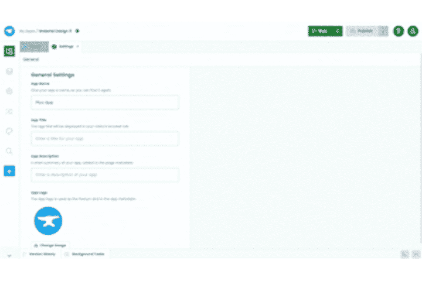

Enabling the Uplink and copying the Uplink key

现在，我们的 Anvil 应用程序中的上行链路已启用，让我们进入第 2 步，设置我们的 Pico。

## 步骤 2 —设置我们的 Pico

要设置我们的 Pico，我们需要安装砧固件。

首先，我们将按住 Pico 上的 BOOTSEL 按钮，并将其插入我们的计算机。

一旦 Pico 的驱动器出现在您的计算机上，释放 BOOTSEL。

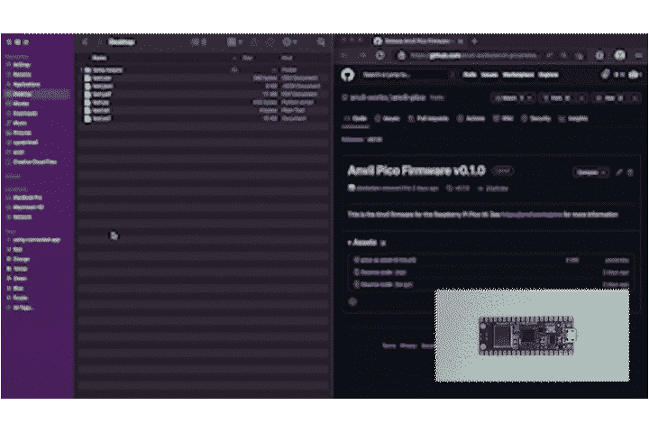

Connecting the Pico to our computer

然后，我们将从以下链接下载 Anvil 的 Pico 固件文件(pico-w-anvil-v *<版本号>* -complete.uf2):

> [https://github.com/anvil-works/anvil-pico/releases](https://github.com/anvil-works/anvil-pico/releases)

下载完成后，把文件复制到 Pico 的硬盘上。一旦文件拷贝完毕，我们的 Pico 就会重启。

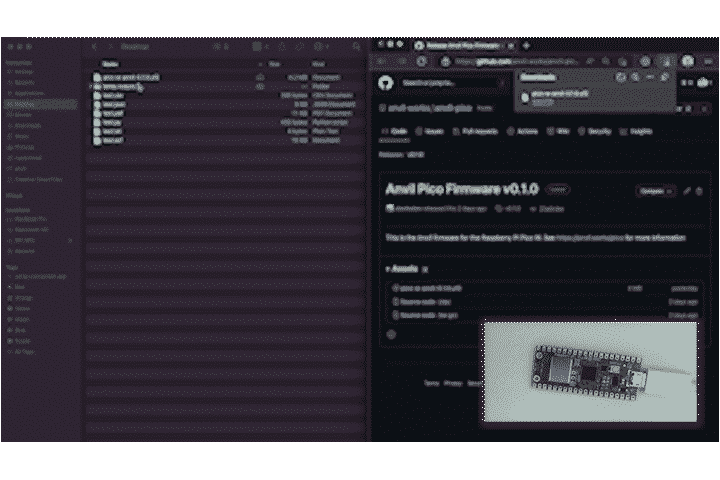

Adding the `pico-w-anvil-v0.1.2-complete.uf2` firmware file to our pico

打开 Pico 的驱动器，编辑 boot.py 和 main.py 文件。

在 boot.py 文件中，编辑 Wifi 连接凭据以匹配您的 Wifi 网络。


Editing boot.py and adding our wifi credentials

然后，在 main.py 文件中，在导入语句下面，添加我们之前复制的上行链路密钥。

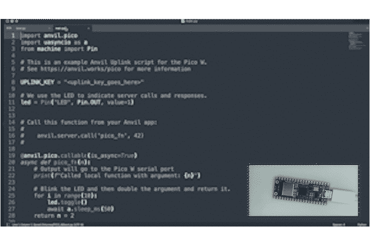

Adding the Uplink kay to main.py

main.py 是存储您想在 Pico 设备上运行的任何函数的地方。

默认情况下，Anvil 的 main.py 文件包含一个`pico_fn`函数。这是一个简单的函数，它使 Pico 上的灯闪烁，并演示了可以将 Python 对象从 Anvil 应用程序传递到 Pico。

`@anvil.pico.callable`装饰器让 Anvil 应用程序知道这个函数可以从 web 上调用。`pico_fn`功能是我们将从 web 应用程序中调用的功能。

The default `pico_fn` function in main.py

保存 boot.py 和 main.py。

通过弹出磁盘并重新连接 Pico，重新启动 Pico 以保存更新。

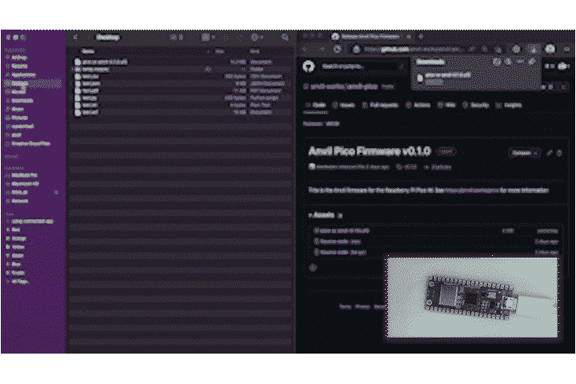

Rebooting the Pico W

Pico 将闪烁几次，表示它已连接到互联网。

让我们回到我们之前创建的 Anvil 应用程序

## 步骤 3—创建用户界面并发布到 web

在设计器中，我们将一个按钮拖放到应用程序的表单中。我们将文本更改为“闪灯”，并通过将其角色更改为`primary-color`来设置样式。

接下来，我们将添加一个文本框，并将其类型设置为 number。这将让我们的应用程序的用户输入一个数字，并将数据传递给我们的 Pico。

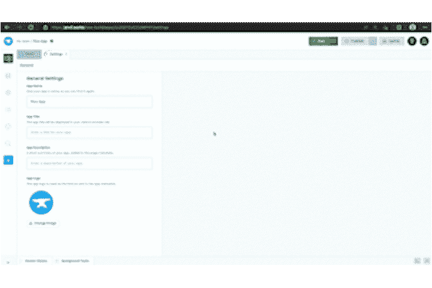

Adding a Button component and a TextBox component

双击设计器中的按钮。这将为我们的客户端代码添加一个函数，每次单击按钮时都会调用这个函数。

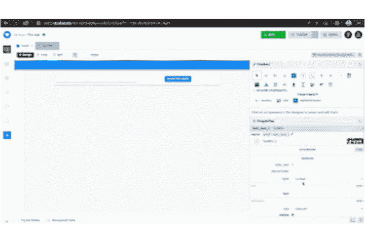

Adding a click event function to the button

在函数内部，让我们调用 pico 的 main.py 文件中的`pico_fn`函数。

我们将把 web 应用程序的用户输入的数字传递给 Pico 函数。

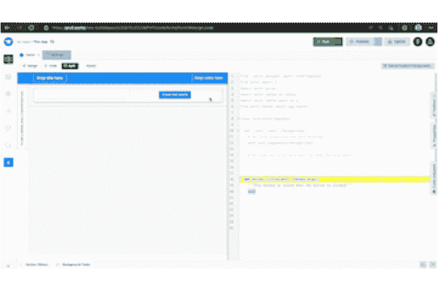

Calling the `pico_fn` function in our click event function

The finished Button click event function

现在我们已经对功能进行了分类，我们可以通过单击编辑器右上角的发布按钮来在线部署该应用程序。让我们选择“添加公共 URL”并将 URL 更改为有意义的。

如果我们导航到我们选择的 URL 并按下我们的应用程序按钮，Pico 上的 led 将会闪烁。

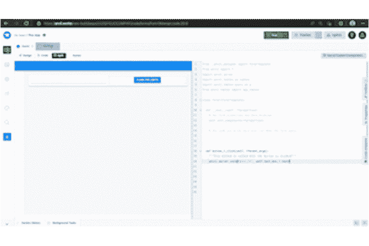

就是这样！现在，我们已经将 Pico 微控制器连接到互联网，并部署了一个 web 应用程序来控制它。点击下面的链接，查看完成的 Anvil 应用程序:

> [https://anvil . works/build # clone:uu 2 qiydjcumphiy = DLI 6 ctz 5 CBL 3 us 575 zvtopwb](https://anvil.works/build#clone:UU2QIYDJCCUMPHIY=DLI6CTZ5CBL3US575ZVTOPWB)

# 结论

我刚刚向您展示了如何只使用 Python 和 Anvil 从 web 上控制 Pico W。

Anvil 可以免费使用——今天就去 anvil.works/pico[看看更多的例子和完整的文档。](https://anvil.works/pico)

```
**Want to connect?**[Follow me for more](https://codingwithryan.medium.com/) software development content!
```