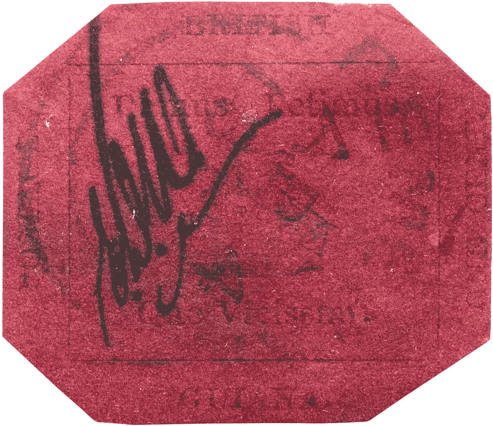

# 按重量计算，这是世界上最贵的物品

> 原文：<https://medium.com/geekculture/this-is-the-worlds-most-expensive-item-by-weight-a1d65359a284?source=collection_archive---------3----------------------->

## 而我只买了一小部分！

Credit: [Wikimedia Commons](https://commons.wikimedia.org/wiki/File:British_Guiana_1856_1c_magenta_stamp.jpg)

***这是邮票。***

老实说，如果你只是点击这篇文章来找出世界上最贵的东西是什么——那就是**这张**邮票。

成本:*830 万美元仅用于约 ***40 毫克的彩纸*** ！*