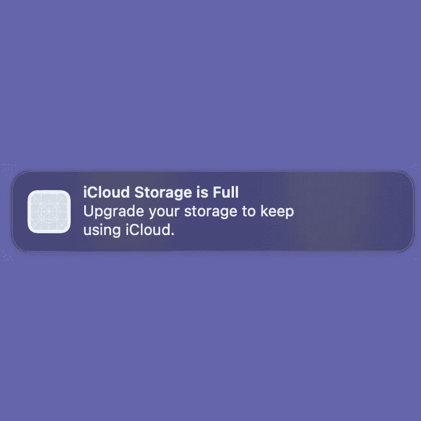

# 这个 macOS 通知是苹果的耻辱

> 原文：<https://medium.com/geekculture/this-macos-notification-is-the-shame-of-apple-ddded0707c8a?source=collection_archive---------2----------------------->

## 使用黑暗模式来销售订阅是不允许的

似乎就在不久前，操作系统还作为你和你电脑上安装的东西之间的一个几乎透明的层而存在。这一层有多透明，很大程度上表明了操作系统有多成功。