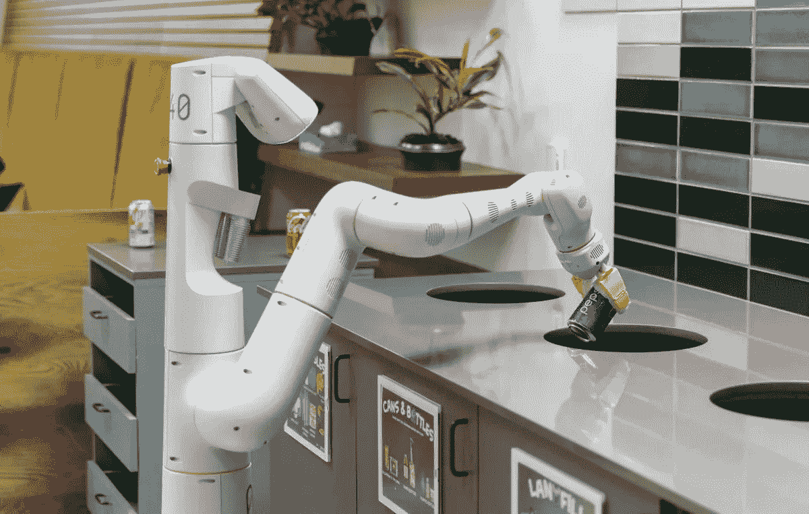

# 这个机器人会帮你做所有的家务！你就问吧。

> 原文：<https://medium.com/geekculture/this-robot-will-do-all-your-chores-just-ask-it-b37ac976046c?source=collection_archive---------24----------------------->

如果你想看这篇文章的视频，请点击上面的链接。

今天，我们将考虑一个相当新的人工智能机器人系统，它将做你所有的家务！基本上就是你自己的私人管家或者管家。来自谷歌的 PaLM-SayCan 是他们研究实验室最新模型的一部分。该模型有两个主要部分，Say 和 Can。就像你可能已经发现的那样，是自然语言的一部分，接受基于文本的指令。这个语言部分是谷歌的 PaLM 模型，能够理解句子的上下文。另一端的 Can 是使用机器人执行任务的执行组件。该项目是谷歌和日常机器人的合作成果。build robots 是一家脱胎于 X 的机器人公司，前身是 Google X。该公司的目标是制造能够帮助我们在日常生活中执行任务的机器人。这些任务可能非常简单、重复或乏味。今天，机器人系统非常昂贵，而且高度专业化以完成某些任务。它们执行的指令是硬编码的命令，比如“拿起一个盒子”然而，他们在理解长期活动和对高层目标做出推论方面有困难，包括像“我打翻了我的橘子汽水”这样的用户请求。你能给我拿来一个替代品吗？”

由于最近在像 PaLM 这样的大型语言模型的训练方面取得了进展，现在各种各样的任务都可以由机器人完成，并取得了最先进的成果。语言模型通常不与其周围环境交互或监控其回复的结果，因此这些语言模型由于其训练过程的性质而本质上不基于现实世界。因此，对于机器人来说，在现实世界中，它可能会用困难、危险或不合理的句子来响应请求。让我们探索用不可执行的任务回复请求的语言模型的例子。例如，如果有人问:“我把饮料洒了，你能帮忙吗？”流行的语言模型 GPT-3 回答说，“你可以试试用真空吸尘器，”尽管机器人可能会觉得这样做有风险或不切实际。FLAN 语言模型通过响应“对不起，我不是故意弄洒的”来响应相同的查询，这对于执行来说不是有效的响应，也不是必需的道歉。。

PaLM-SayCan 是一种创新的方法，试图通过可操作的任务为语言模型提供坚实的现实基础。为了完成一项任务，该模型使用了谷歌所谓的思维链提示。这就是模型在其规划阶段分解高级任务的方式。例如，当被要求带一杯替代的橘子汽水时，PaLM-SayCan 将任务分成:1。找一杯橘子汽水，2。拿起橘子汽水，3。带给你，4。放下橘子汽水，5。完成了。

当年，当妈妈总是要求从冰箱里拿电视遥控器或水时，PaLM-SayCan 在哪里？未来的孩子对此一无所知。太幸运了。

PaLM-SayCan disposing of a can

目前，机器人执行任务的速度很慢，示例视频已经加速，以展示系统的能力。

现在是统计数据的时候了。该系统与 PaLM 连接后，规划阶段的成功率提高了 14%。此外，成功完成的任务增加了 13%。为了教会模型学习这些基本动作，收集了来自 12，000 个成功剧集的训练数据。在 11 个月的时间里，10 个机器人进行了 68，000 次演示，这些演示受到了监控，从而确保了项目的成功。结果显示，在 101 个动作的范围内，PaLM-SayCan 在 84%的时间里选择了正确的技能序列，在 74%的时间里正确地执行了它们。这尤其令人着迷，因为它第一次展示了语言模型的改进如何能够导致机器人技术的进步。这项研究表明，语言建模的进步可能有一天会对机器人技术有用，弥合这两个科学领域之间的差距。

从这里开始，谷歌希望更全面地理解语言模型如何通过机器人的真实世界体验得到改善。谷歌发布了一个开源机器人模拟设置，希望它能够成为未来将机器人学习与复杂语言模型相结合的研究的有用工具。我会把下面的链接发给那些有兴趣尝试这些模拟的人。

机器人设置遵守所有完善的机器人安全规则，如风险评估、物理控制和紧急停止。你不会希望你的机器人把刀误认为勺子，然后扔给你！那将是一个噩梦般的情况，不是吗？你可以看到为什么安全是重要的。逐步增加和监控可执行任务集是交付成功系统的合理方法。PaLM-SayCan 的一个竞争者可能是特斯拉仍在开发的特斯拉机器人。这个名为 Optimus 的人形机器人将是一个通用机器人，用于无聊和重复的任务。关于这个项目的状态还没有太多的更新，但是一旦有新的报告发布，我们会报道的。

在未来几年内，这些机器人应该能够很容易地理解你的请求，然后以快速安全的方式执行所需的任务。你最想从 PaLM-SayCan 得到的任务是什么？请在评论区告诉我。我希望你今天学到了一些东西。

谢谢大家！

**资源**:

棕榈赛坎

论文:【https://say-can.github.io/assets/palm_saycan.pdf 

博客:[https://ai . Google blog . com/2022/08/forward-helied-robots-grounding . html](https://ai.googleblog.com/2022/08/towards-helpful-robots-grounding.html) 模拟设置:[https://github . com/Google-research/Google-research/tree/master/say can](https://github.com/google-research/google-research/tree/master/saycan)

# **相关内容:**

使用人工智能从任何东西构建 3D！VR &元宇宙世界建筑 

***为你写代码的 AI！和工程师一样优秀？***