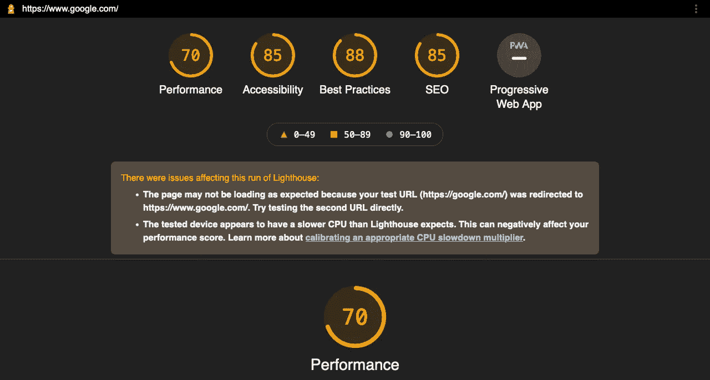

# 这个简单的特技让我发布了一个快速的角度应用程序。

> 原文：<https://medium.com/geekculture/this-simple-stunt-lets-me-release-a-speedy-angular-application-741d5803a44a?source=collection_archive---------18----------------------->


Photo by [Karol Kasanicky](https://unsplash.com/@karolkas?utm_source=medium&utm_medium=referral) on [Unsplash](https://unsplash.com?utm_source=medium&utm_medium=referral)

## 每一个。单身。时间。

如何确保您的 Angular 应用程序在每次部署时都做好了生产准备？

> 你能做些什么来确保你永远不会部署一个慢角度的应用程序？

如何在 Angular 项目中使用 Lighthouse 包，以确保每次部署时都能取得好成绩？

嗯…

> **先说个故事** …

…关于一家名为 LeanTech 的蓬勃发展的初创公司，其 Angular 应用服务于数百万用户。

LeanTech 有一个由 5 名资深开发人员组成的团队，他们非常了解 Angular。因为事情正在蓬勃发展🤑他们决定雇佣一个名叫 Joe 的初级 Angular 开发者。

Joe 是一名新的开发人员，对 Angular 了解不多。他太傻了，在 Angular 应用程序的`index.html`文件的`<head>`部分添加了 3 个不同的脚本标签。😮

接下来发生了什么？

服务于数百万用户的 Angular 应用程序现在要多花 3 秒钟来加载。由于开发人员从未使用过生产应用程序，直到一位愤怒的用户报告了这个问题，才过了几天。😠

> **那么，你如何避免这样的情况呢？**

每次部署 Angular 应用程序时，您如何确保您的生产代码得到了适当的优化？

在这篇短文中，我将向您展示如何永远不要再部署一个缓慢的角度应用程序。

我将向您展示如何在 Angular 应用程序投入生产之前测试其速度和性能。确保您的 Angular 应用程序每次都能提供出色的用户体验。

> 我们将使用一个名为 Lighthouse 的工具来自动测试我们的 Angular 应用程序的性能。

你可以用不同的方式。

Lighthouse 是 Google 创建的一个分析网页性能的应用程序。

它支持谷歌 Chrome 浏览器，但也可以作为 NPM 软件包、浏览器扩展甚至命令行界面安装。

传言谷歌用 Lighthouse 来监控网页性能。如果你的网页太慢，你的排名将会输给更快的网站，这意味着如果你的 Angular 应用程序需要良好的 SEO 排名(例如，一个电子商务网站)，那么你应该在部署之前检查性能得分，以确保你是绿色的。

撇开 SEO 不谈，验证 Angular 应用程序的性能是一个很好的实践，不管它的目的是什么，所以这适用于你，不管 SEO 与否。

如果你对 Lighthouse 如何工作的细节感兴趣，你可以在这里阅读更多的。

# 如何在您的 CI 渠道中进行快速灯塔检查？快速肮脏的方法。

那么，在 Angular 应用程序上运行性能测试的最快方法是什么呢？

[灯塔词](https://developers.google.com/web/tools/lighthouse/#cli)。

以下是如何安装它与 NPM。

```
npm install -g lighthouse
```

或者你更愿意用纱线。

```
yarn global add lighthouse
```

一旦安装完毕，以下是使用方法。

```
lighthouse <angular-app-url>
```

当您运行这个命令时，它将运行一个性能测试，并将结果保存在一个 HTML 文件中，如下所示。



# 使用 Lighthouse 包在你的 Angular 应用上运行一个 [Pagespeed Insights](https://developers.google.com/speed/pagespeed/insights/) 测试

但是，难道没有更自动化和可伸缩的方法来检查您的 Angular 应用程序的性能吗？

当然有。

在您的 Angular 应用程序中，首先安装 Lighthouse 包。

```
npm install --include=dev lighthouse
```

或者纱线。

```
yarn add lighthouse --dev
```

接下来，我们将在 Angular 应用程序的根目录下创建一个脚本。我将这个文件命名为`lighthouse.js`。

```
const lighthouse = require('lighthouse');
const chromeLauncher = require('chrome-launcher');

(async () => {
  const chrome = await chromeLauncher.launch({chromeFlags: ['--headless']});
  const options = {logLevel: 'info', output: 'html', onlyCategories: ['performance'], port: chrome.port};
  const runnerResult = await lighthouse('http://localhost:4200', options);

  console.log('Report is done for', runnerResult.lhr.finalUrl);

  const performanceScore = runnerResult.lhr.categories.performance.score * 100;
  console.log('Performance score was', performanceScore);

  await chrome.kill();

  if (performanceScore < 80) {
    throw("Performance score to low for production release.");
  }
})();
```

然后我们将添加一个`postbuild`脚本来检查我们最新的构建。

```
"scripts": {
    ....
    "postbuild": "ng serve & node lighthouse.js && exit"
  },
```

那么我们刚才做了什么？

1.  我们创建了一个脚本，用 Lighthouse 库测试我们的应用程序。
2.  我们在每次构建后运行脚本。
3.  如果性能指标小于 80，我们的`postbuild`步骤就会失败。

[](https://school.danielk.tech/course/unleash-your-angular-testing-skills?utm_source=medium&utm_medium=banner&utm_campaign=unleash_testing_skills)

# 结论

我的朋友，这是对你的 Angular 应用程序进行性能检查的一种快捷方式。并确保您发布一个优化的 Angular 应用程序…每。单身。时间。

当然，剥猫皮的方法不止一种。您可以创建一个定制的 Webpack 配置，并使用 lighthouse Webpack 插件来检查您的应用程序。

或者，您可以将 Lighthouse 添加到您的 CI 构建流程中，并仅在您决定部署时运行性能测试。

你可以选择什么对你最好。

但是不管你决定选择哪种方式，我已经给了你简单的步骤，告诉你如何永远不要再部署一个缓慢的角度应用程序。

如果您喜欢这篇文章，并认为它很有用，请点击👏按钮，关注我，获取更多类似本文的精彩文章。

**关注我:** [GitHub](https://github.com/dkreider) ，[媒体](https://dkreider.medium.com/)，[个人博客](https://danielk.tech)


*原载于*[*https://danielk . tech*](https://danielk.tech/home/angular-and-pagespeed-insights)*。*