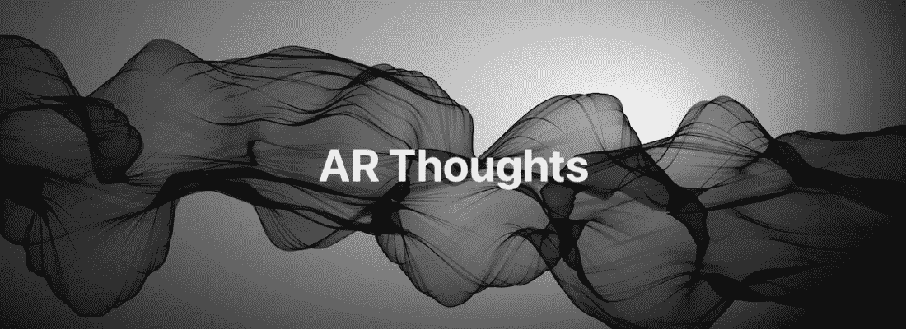

# 关于增强现实的思考

> 原文：<https://medium.com/geekculture/thoughts-on-augmented-reality-a7e2ea80706?source=collection_archive---------11----------------------->

嗨，我是安迪。当 AR 进入我的生活时，我已经是一名核训练师了。合成背景对我理解 AR 到底是什么帮助很大。相机跟踪，深度通道遮挡，锚定，密集点云重建，变换矩阵是我所习惯的。

我在 2011 年开始了解 AR，当时我正在从事一个剧院项目，在 Quartz Composer 应用程序和 Kinect 传感器的帮助下，几个粒子系统被固定到 performance actor 上。后来有了 HoloDesk 和 HoloLens，Vuforia 和 Project Tango。从 2017 年开始，我一直在教 ARKit 和 RealityKit。

在过去的十年里，我已经形成了一个增强现实体验应该是什么的特定愿景，主要是从用户的角度出发。在这个故事里，我想和你分享我对这个话题的一些想法。

## 2030 年

我坚信，世界上没有一家 IT 公司，在建立自己的 AR 生态系统时，可以吹嘘对增强现实在 8-10 年后的前景有一个清晰的想法。这并不奇怪，因为根本不可能预测导致最终结果的相关事件的顺序——大多数公司的规划范围通常是 5 年。此外，我还概述了，以我的拙见，为了在 2030 年前创建一个全球 AR 生态系统，框架工程师应该关注什么。

## 眼镜和控制器

尽管苹果、微软、谷歌和 PTC 在过去几年做了大量的工作，但增强现实产业仍处于起步阶段。只有高分辨率 AR 眼镜的发布有助于实现切实的发展飞跃。同时，眼镜必须具有良好的性能、较长的电池寿命和有吸引力的价格。蓝牙 IMU 控制器的种类应该是广泛的:戒指，手镯，手套，操纵杆，粘性传感器等。智能标签的第一次迭代已经推出:苹果 AirTag，三星 SmartTag，谷歌磁贴…

## 硬件限制

普通用户并不关心一个模型有多少个多边形，或者它的纹理分辨率是多少。用户只是想在 AR 应用程序中感受 3D 场景的 wow 效果。为了实现这样的用户体验，框架的工程师需要摆脱推荐的限制:100，000 个多边形和 2K 纹理。显而易见，这种情况的实现需要半导体制造的技术突破——处理器向皮米级过渡。此外，采用高容量石墨烯电池是任何 AR 眼镜制造商的首要任务。

## 在线渲染场

由于 5G 高速移动互联网的广泛采用，框架的开发者将能够在设备外呈现 AR 内容。在几台功能强大的远程计算机上使用光线跟踪阴影渲染高多边形模型，然后通过互联网传输结果帧，与在设备上渲染相比，这似乎是非常合理的。顺便说一下，中位 5G 用户能够观看 8K，120 fps，10 位彩色视频流。很好，不是吗？

## 重新本地化

关于云重新本地化已经说了很多，今天我谈论这个话题毫无意义——许多初创公司现在都准备提出自己的解决方案。然而，如果 AR 市场的主要参与者能够在一个多节中提供现成的工具来组合根本不同的场景(基于 ARKit、ARCore、MRTK 或 Vuforia 构建)，那就太好了。基本上，这意味着每个专有框架的世界锚应该可以互换。除此之外，地理锚必须在任何地方工作，不仅仅是在大城市的中心街道；而合并两个相邻地点的 AR 世界地图，应该就像说“cheese”一样简单。

## 场景重建和物体遮挡

2022 年 1 月，iToF 和 dToF 移动激光传感器的工作距离在 5 米以内。将工作距离增加至少两倍，将显著扩展重建场景的边界，并且将对提高深度通道的质量和深度做出重要贡献。但是，尽管如此，高质量深度通道的集成(广泛用于日常的 NUKE 合成)使任何 AR 框架能够以最高的精度将虚拟对象与现实世界的对象分开。

## 相机截锥的远裁剪平面

现代 3D 引擎不擅长渲染 1000 米以外的虚拟模型。在离摄像机相当远的地方，模型用伪像渲染。正如你可能猜到的，光线投射方法也受到距离的限制。工程师们将不得不解决这样一个问题，即用户如何在距离设备 5 公里的地方放置一个高质量的摩天大楼模型。

## 跟踪误差

AR 中最严重的问题之一是随着距离积累的跟踪误差:用户行进的距离越长，AR 世界地图的准确性就越低。卫星互联网提供商很有可能会帮助我们修正我们的 AR 世界地图。

## 价格合理的内容

你有没有想过:AR 最重要的是什么？答案是显而易见的——它的内容。内容创作者将不得不从头开始制作适用于 AR 的庞大动画 3D 模型库。当然，对于许多独立开发者来说，摄影测量就像一股新鲜空气——然而，静态模型需要变得有活力。问题是:并不是每个公司都有专业的角色动画制作人。在这种情况下，实时记录骨骼动画的能力是未来最重要的 AR 功能。

## 类似元宇宙的服务

元宇宙和扎克伯格的想法都没有让我兴奋。我希望增强现实能够帮助人们的生活，而不是让他们上瘾。除此之外，当扎克伯格的元宇宙完全实施时，它将与最初的想法不同。

## 结论

今天，AR 有足够多的弱点——不稳定的跟踪，光线估计的不完善，不现实的物理，不支持折射材料。但所有这些缺点与未来 AR 的潜力相比都微不足道。想象一下司机和行人、医生和餐馆老板、建筑师和设计师、水管工和电工、游戏玩家和教育工作者的可能性…

最后，我想说一件显而易见的事情:所有主要的框架开发者都已经到了增强现实库应该成为他们操作系统的一部分的时候，这意味着很快我们将不会看到我们习惯的 AR 框架，而是全新的 xrOS、realityOS、Windows Reality 或 Real Fuchsia 的诞生。

我们生活在一个美好的变革时代。

再见！