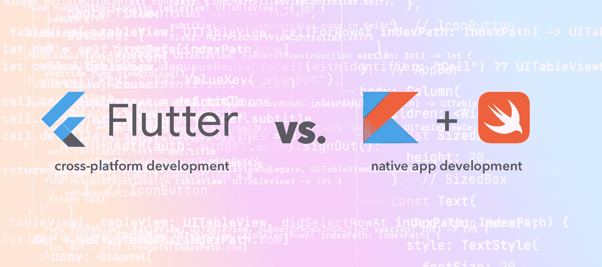

# 关于 Flutter 与 Native App 开发的思考

> 原文：<https://medium.com/geekculture/thoughts-on-flutter-vs-native-app-development-35fcc23d6954?source=collection_archive---------7----------------------->

在我开发移动应用的过去 10 多年里，已经有许多不同的跨平台甚至“无代码”的解决方案来开发移动应用。想到了 React Native、Appcelerator Titanium、Adobe Cordova、Ionic、Xamarin。我已经用前两个构建了生产应用程序，所以我在过去有跨平台系统的丰富经验。