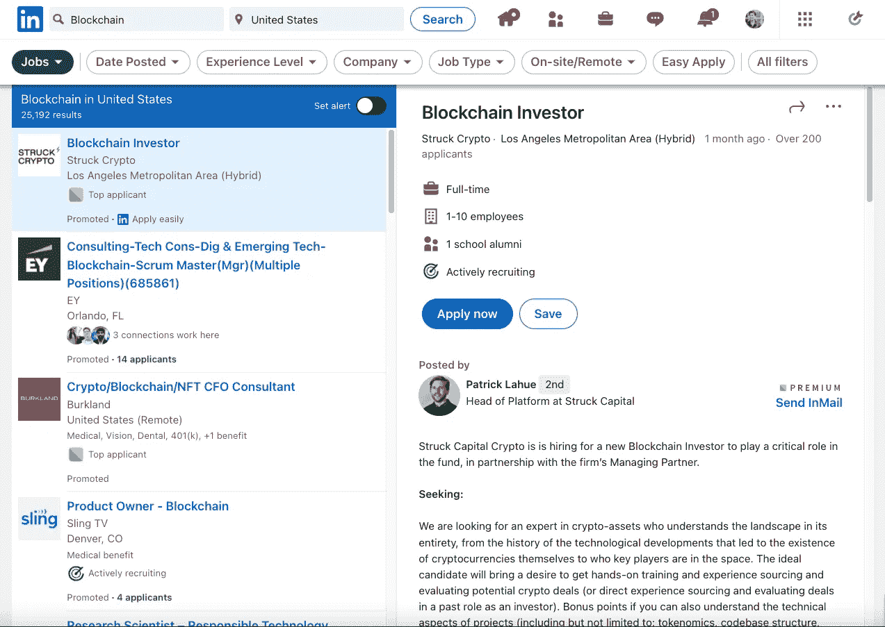
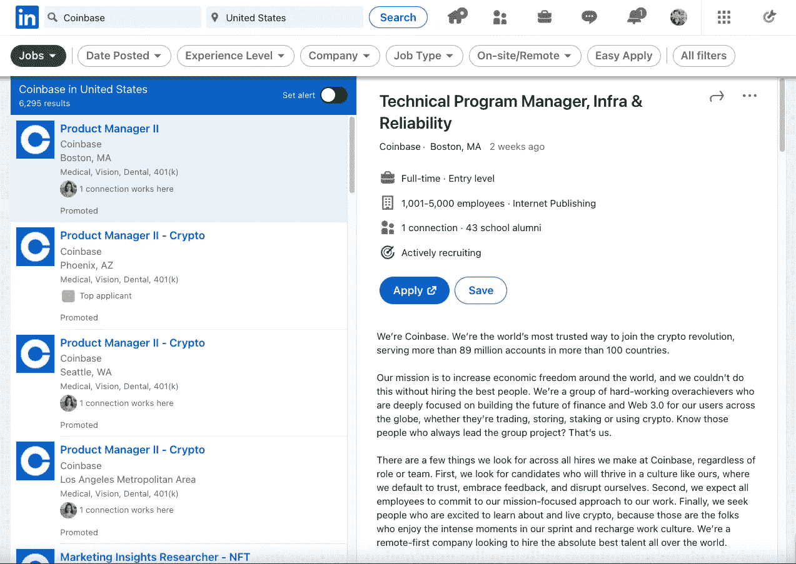
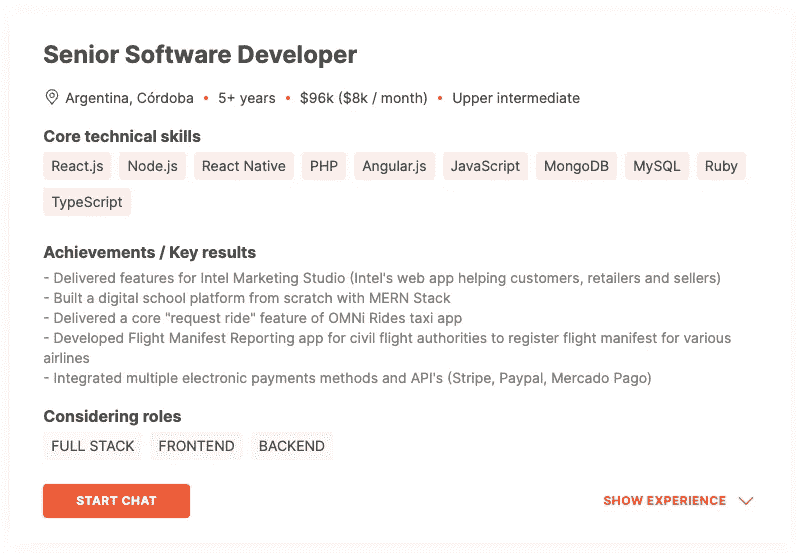
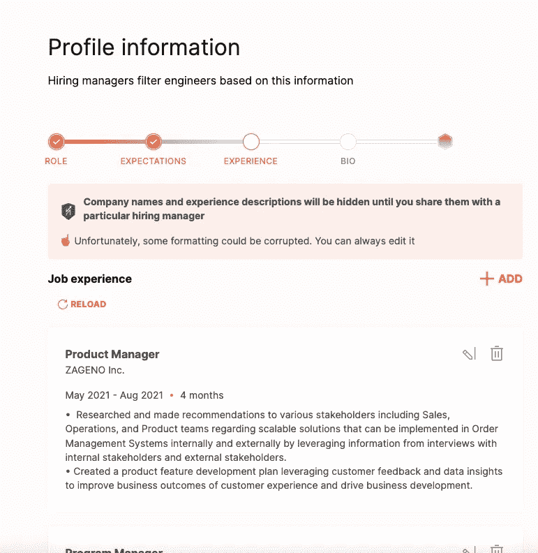
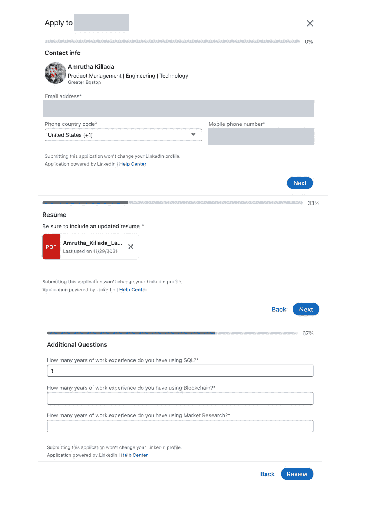
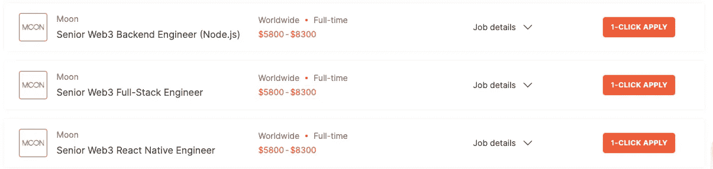
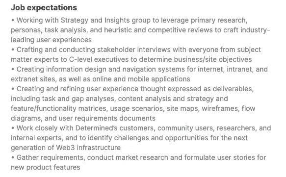

# 关于新 Web3 求职平台 Huntd 的思考

> 原文：<https://medium.com/geekculture/thoughts-on-new-web3-job-platform-huntd-febf24b82a5?source=collection_archive---------11----------------------->

Source: Tianyi Ma on Unsplash

每天我都习惯在 [Product Hunt](https://medium.com/u/b8b4445269d0?source=post_page-----febf24b82a5--------------------------------) 上回顾当天的新产品，这有助于我了解市场上现有产品的市场差距。例如，尽管市场上充斥着许多笔记和待办事项应用程序，但日常生产力应用程序还是推出了。一个新的生产力应用程序将推出，其功能比市场上现有的应用程序有所改进，人们会尝试它们。因为完美总是被渴望，方便总是被重视。由于这个习惯，我遇到了一些令人惊讶的产品，我用它们来使管理生活变得更容易，但最终被收购或取消，以至于现在再也没有免费的模型可用了。

今天我偶然发现了一个 Web3 工作平台，以前我写过一篇关于寻找 Web3 工作的文章，你可以在这里找到它——它通过当前的就业市场分析和在哪里找到想要的职位。

 [## 我作为一名新毕业生进入网络世界的旅程

### 我现在是麻省理工学院的研究生，将于 2022 年 5 月毕业，我有销售和运营的背景…

medium.com](/geekculture/my-journey-as-a-new-grad-into-the-world-of-web3-pm-jobs-ac10a7f98ba8) 

为什么是亨特？

Huntd 是寻找 Web 3 工作的一站式平台，这些工作分散在 LinkedIn 的平台列表中。在 LinkedIn 上，你必须了解 Web 3 中的技术或公司，才能找到你想申请的职位。与 LinkedIn 不同，Huntd 让我发现了 Web 3 世界中的创业工作。Huntd 还为寻找 Web3 工作提供了一个很好的起点，因为它提供了一个创业公司的列表，其中许多创业公司很难或不可能通过招聘人员和只提供大公司职位的求职板找到。

Source: Screenshot from my profile on LinkedIn

Source: Screenshot from my profile on LinkedIn

在他们的产品搜索发布页面上，Huntd 展示了它的主要特性，解释了为什么创建它，并描述了它正在努力实现的目标。我喜欢 Huntd 的一点是，它允许求职者保留自己的身份，让雇主有机会考察他们的技能和经验，而不是他们的名字或照片。

Source: Screenshot from my profile on Huntd

Huntd 还承诺通过聊天功能与初创公司创始人和招聘经理直接联系，你也可以下载他们的应用程序来跟上你的谈话。

您可以在他们的产品搜索发布页面上找到有关其功能的更多信息。

作为一名今年 5 月毕业的研究生，我一直在申请新的工作，尝试不同的平台。到目前为止，这是我最喜欢的申请过程。我最讨厌工作申请过程的一些事情是，他们要求你输入你的经历和教育，即使你附上了简历。一些平台提供解析你的 LinkedIn 个人资料或简历，这从来不是我所期望的，并迫使我再次重复这个过程，有时这些平台要求我创建个人资料，不久我就收集了几十封电子邮件和密码。Huntd 一直是完美解析我简历的唯一平台！我非常高兴，我不需要对它做任何改动！

Source: Screenshot from my profile on Huntd

它还能让你跳过许多步骤，直接开始申请。我经常使用 LinkedIn 的一键申请(Easy Apply)；在提交申请之前，它要求我通过几个步骤。

Source: Screenshot from my profile on LinkedIn

Huntd 提供了一个有用的功能，使您可以直接在工作横幅上查看工资信息，为求职者决定申请创造急需的透明度和信息。

Source: Screenshot from my profile on Huntd

Huntd 还为候选人提供了一个空间来谈论他们对工作的期望，通常这部分过程通常发生在候选人的面试过程中。这对于招聘人员和候选人来说是一个巨大的附加价值，可以帮助他们确定招聘人员或公司是否能够提供候选人想要的经验。

Source: Screenshot from my profile on Huntd

我希望看到 Huntd 有更多的改进，增加教育部分、GitHub 项目亮点和跟踪应用程序状态。

祝大家求职顺利！