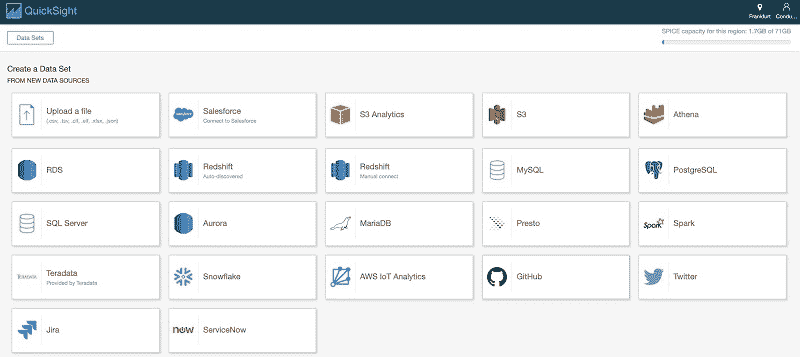
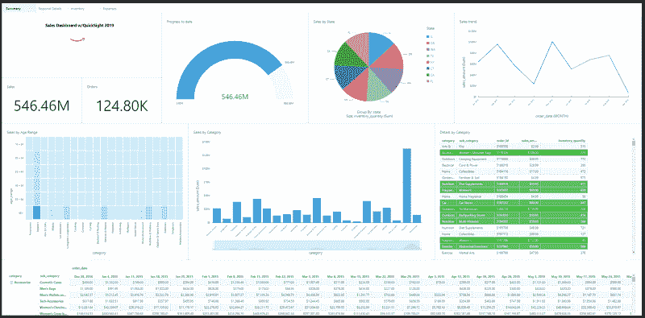
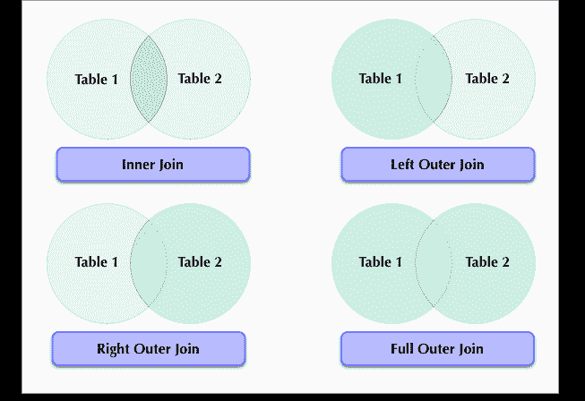
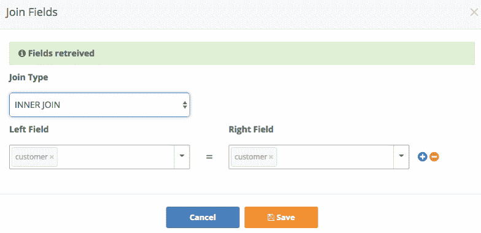
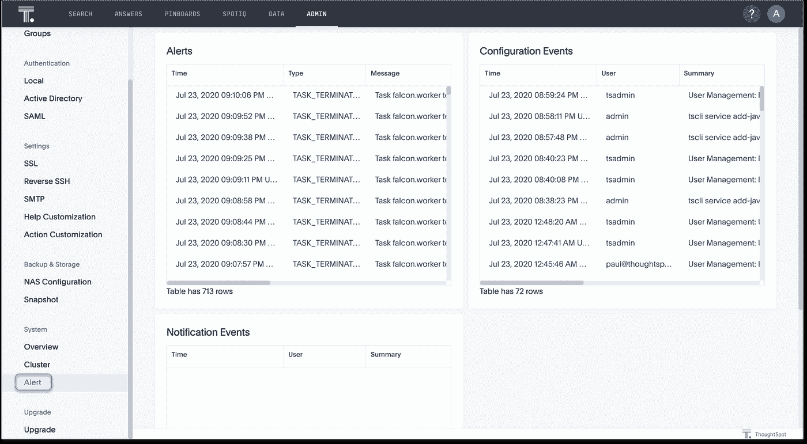
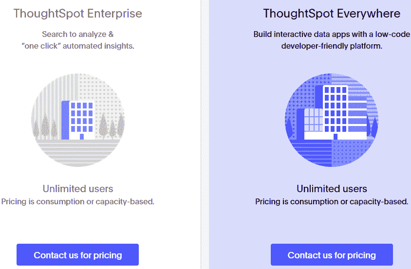

# thought spot vs AWS quick sight vs Knowi

> 原文：<https://medium.com/geekculture/thoughtspot-vs-aws-quicksight-vs-knowi-f9daf5c419cf?source=collection_archive---------6----------------------->

三向比较，了解哪种 BI 工具最适合您的使用案例

Image by Author

# **简介**

在过去的几十年里，商业智能工具已经帮助数据分析师和业务用户创建了仪表板和可视化。这促进了部门和高管的数据驱动决策，以支持公司目标。但是，要使用仪表板，必须先创建它。人们必须引入数据，选择和应用可视化，并以回答业务问题的方式设计仪表板。这可能需要几个小时甚至几天。

为了克服上述挑战，一些商业智能工具实现了基于搜索的分析功能。基于搜索的分析允许业务用户用简单的英语提问，并以可操作的数据和可视化的形式获得答案。这使用户不必手动编写 SQL 查询或创建数据可视化。

[ThoughtSpot](https://www.thoughtspot.com/) 、 [AWS Quicksight](https://aws.amazon.com/quicksight/) 和 [Knowi](https://www.knowi.com/) 是一些支持基于搜索的分析的流行商业智能工具。ThoughtSpot 于 2012 年推出，而 AWS Quicksight 和 Knowi 均于 2015 年发布。

这些 BI 工具之间没有太多的比较。我们决定对 ThoughtSpot、AWS Quicksight 和 Knowi 进行三方比较，以了解它们之间的关系。在进行比较之前，让我们先对每个 BI 工具做一个简单的概述。

# 思想点

ThoughtSpot Logo

[ThoughtSpot](https://www.thoughtspot.com/) 是一个大数据分析和商业智能平台，允许其用户轻松、实时地探索、分析和共享商业分析数据。该平台由人工智能提供支持，这有助于它将一千名数据分析师的力量掌握在一名商业人士的手中。ThoughtSpot 允许您通过搜索或单击从数据中提取见解。

ThoughtSpot 由首席执行官阿吉特·辛格(Ajeet Singh)和来自微软、谷歌、甲骨文和亚马逊的其他六人于 2012 年创立。该公司的目标是通过搜索驱动的数据分析，将数据分析推向“人类规模”。

# AWS Quicksight

AWS Quicksight Logo

[AWS Quicksight](https://aws.amazon.com/quicksight/) 是来自亚马逊的商业智能平台。该平台由机器学习提供支持，运行在云中。借助 AWS Quicksight，您可以根据自己的数据为同事创建仪表板和可视化效果，而无需考虑他们的地理位置。这种仪表板和可视化可以帮助业务用户从数据中提取洞察力以进行决策。仪表板和可视化也可以嵌入到网站、门户和应用程序中。

AWS Quicksight 也是一个可扩展的平台，可大规模扩展以支持成千上万的用户，而无需额外的基础架构管理。

该平台还集成了许多数据源。它最初是在 re:Invent 2015 上宣布的，目标是提供一个更快、更简单的商业智能工具。

# Knowi

Knowi Logo

[Knowi](https://www.knowi.com/) 是一个统一的商业智能平台，它缩短了原始数据和基于证据的行动之间的距离。它通过其数据虚拟化功能实现了这一点，该功能消除了通过繁琐的 ETL 过程获取数据的需要。这使得 Knowi 成为一个不同于 ThoughtSpot 和 AWS Quicksight 等其他 BI 工具的独特 BI 平台。Knowi 还与 NoSQL 数据源进行了本机集成，允许其用户直接分析非结构化数据，这是传统 BI 工具所不提供的功能。因此，Knowi 用户不必经历移动数据所需的昂贵且耗时的步骤。

Knowi 有一个由自然语言处理驱动的搜索驱动的分析功能。它的用户可以用英语提问，并立即得到答案。Knowi 于 2015 年推出，如今是全球大企业的首选 BI 平台。

# thought spot vs AWS quick sight vs Knowi

在文章的这一部分，我们将讨论 ThoughtSpot 和 AWS Quicksight 和 Knowi 的相互比较。将考虑以下核心领域:

*   部署
*   用户友好性
*   连接/集成
*   形象化
*   基于搜索的分析
*   嵌入式分析
*   多源连接
*   警报/异常检测
*   机器学习算法
*   定价
*   客户支持

# 部署

ThoughtSpot 可以部署为云解决方案或本地设备。所有的 ThoughtSpot 节点必须在同一个子网和平台上，任何两个节点之间的连接都不能被阻塞。

AWS Quicksight 是为云而生的。

Knowi 有一个基于云的版本和一个本地版本，可以通过网络浏览器访问，不支持桌面安装。它还为其企业用户提供内部/云/混合部署选项。

# 用户友好性

ThoughtSpot 有一个用户友好的用户界面，可以让初学者很容易地快速搜索并自己创建可视化效果。然而，它并不那么互动。

AWS Quicksight 有一个现代化的直观用户界面，用于数据发现和可视化。这使得它成为一个很好的商业智能工具，即使是对数据分析的初学者来说。

Knowi 有一个简单、直观、可定制的用户界面。然而，它为数据工程师提供的用户界面非常复杂，用户可能需要一段时间来适应。

因此，AWS Quicksight 拥有三个 BI 工具中最直观的用户界面。

# 连接/集成

ThoughtSpot 提供了 ThoughtSpot 加载器(tsload)工具，这是一个命令行工具，用于将 CSV 文件中的数据加载到 ThoughtSpot 数据库模式中。这是将大量数据加载到 ThoughtSpot 的最合适的方式。您还可以使用该工具来编写重复数据加载的脚本。ThoughtSpot 还为其用户提供认证的客户端，即 JDBC 和 ODBC，用于从他们的 ETL 工具和其他数据库加载数据。ThoughtSpot 用户还可以在电子表格中准备数据，并通过其用户数据导入功能通过用户界面上传数据。这个特性允许 ThoughtSpot 用户自己加载少量数据。ThoughtSpot 用户还可以将 JDBC 驱动程序连接到 Pentaho，并使用它将数据导入 ThoughtSpot。

Amazon Quicksight 支持与各种数据源的集成。在 AWS Quicksight 中可以用作数据源的关系数据存储包括 Amazon Athena、Amazon Aurora、Amazon Redshift、Amazon OpenSearch Service 7.7 或更高版本、Amazon Redshift Spectrum、Amazon S3 分析、Amazon S3、Apache Spark 2.0 或更高版本、Exasol 7.1.2 或更高版本、AWS IoT Analytics、MariaDB 10.0 或更高版本、MySQL 5.1 或更高版本、Oracle 12c 或更高版本、Microsoft SQL Server 2012 或更高版本、PostgreSQL 9.3.1 或更高版本、雪花、Teradata 14。

AWS Quicksight data sources (Source-aws.amazon.com)

要访问任何其他数据源，您必须链接它们并将它们的数据导入到支持的数据源中。Amazon Athena 数据库、Amazon RDS 实例和 Amazon Redshift 集群必须在 AWS 中。其他数据库实例必须位于 Amazon EC2、本地/本地数据库或互联网可访问环境中，才能从 AWS Quicksight 访问。

Knowi 支持集成超过 36 个结构化和非结构化数据源，如 MongoDB、Elasticsearch、Apache Cassandra 等。

Knowi data sources (Source-knowi.com)

与其他 BI 工具不同，Knowi 支持与 NoSQL 数据源的本地集成。您可以从它们那里提取数据，而不需要依赖第三方驱动程序和“关系化”数据。它使用“数据虚拟化”功能，允许您处理所有类型的数据，无论是结构化还是非结构化，无论是大还是小。Knowi 还有一个强大的 REST API 集成，可以连接到 API 并连接不同来源的数据。

因此，Knowi 支持最高数量的集成。它能够提供与 NoSQL 数据源的本机集成，并处理非结构化数据，这使它有别于 ThoughtSpot 和 AWS Quicksight。

# 形象化

ThoughtSpot 支持不同的数据可视化方式。其搜索驱动的分析功能为用户提供即时回答，以自动数据可视化的形式返回见解。

最佳图表取决于用户查询的性质。一些支持的可视化包括柱形图、条形图、折线图、饼图、散点图、气泡图、漏斗图、热图、表格和许多其他图表。虽然 ThoughtSpot 会自动返回最佳的数据可视化模型，但是用户可以根据自己的需要调整标签、轴和图表类型。

AWS Quicksight 还提供了各种各样的视觉效果，您可以使用它们来显示您的数据。这些可视化的例子包括箱线图、条形图、圆环图、填充图、数据透视表、树形图、单词云等等。

A sample AWS Quicksight dashboard (Source-aws.amazon.com)

创建可视化后，AWS Quicksight 允许您对其进行定制以满足您的需求。一些可能的自定义包括更改可视化类型、应用过滤器和排序可视化数据。要创建可视化，您可以选择要在可视化中显示的数据字段，AutoGraph 将让 Amazon Quicksight 确定要使用的最佳可视化类型。

Knowi 为您提供了 30 多种不同类型的可视化工具，您可以使用它们来显示您的数据。您可以向单个页面添加多个可视化效果来创建仪表板。Knowi 还允许您定制您的仪表板和可视化，以满足您的需求。如果您熟悉 JavaScript，Knowi 允许您创建定制的可视化来帮助您满足您的特定需求。

因此，与 ThoughtSpot 不同，AWS Quicksight 和 Knowi 允许用户定制他们的可视化以满足他们的特定需求。Knowi 允许用户通过 JavaScript 创建定制的可视化效果，从而更上一层楼。

# 基于搜索的分析

ThoughtSpot 有一个基于搜索的分析功能，可以帮助用户从他们的数据中获得自动化的见解。该功能允许 ThoughtSpot 用户通过搜索分析他们的数据，并在几秒钟内生成报告和仪表板。搜索结果被转换成 SQL，并立即计算出答案。

AWS Quicksight 有一个基于搜索的分析功能，称为亚马逊 Quicksight Q，由机器学习提供支持。但是，此功能仅适用于 Quicksight 企业版用户。有了 Q，Quicksights 用户可以用自然语言提出关于他们数据的问题，并通过相关的可视化得到答案。q 还提供商业术语和短语的建议，并进行拼写检查，以避免您必须记住数据中的确切术语。

Knowi 还有一个强大的基于搜索的分析功能，由自然语言处理(NLP)提供支持。Knowi 还在 Slack 和微软团队中引入了这种基于搜索的分析功能，使其成为市场上独一无二的 BI 工具。Knowi 基于搜索的分析功能与 Slack 和微软团队的结合，允许用户直接从这些应用程序中用英语等自然语言提问，并获得即时答案。答案可以是数据或可视化的形式。

因此，与 ThoughtSpot 和 AWS Quicksight 相比，Knowi 在基于搜索的分析方面具有明显的优势。

# 嵌入式分析

ThoughtSpot 支持嵌入式分析，允许您将仪表板和可视化嵌入到业务门户或应用程序中。您还可以使用这个特性来嵌入搜索驱动的体验，并允许用户询问他们自己的数据问题。该功能还允许您将 liveboards 嵌入到您的应用程序中，以便随时发现真知灼见。

AWS Quicksight 还允许其用户将仪表板和可视化嵌入到他们的应用程序中。该特性使用按使用付费的架构，这意味着您只需在用户访问仪表板或报告时付费。其企业版支持匿名嵌入，这一功能允许任何读者访问您的嵌入式报告和仪表板，而无需提供。

Knowi 提供了许多选项来支持嵌入式分析。您可以生成仪表板的 URL，并将其嵌入到外部应用程序中。Knowi 允许其用户创建一个安全的 URL，该 URL 使用参数来确保用户只看到他们应该看到的数据。它还提供了单点登录 API，便于系统中的用户进行令牌交换，以将用户权限映射到 Knowi。

# 多源连接

ThoughtSpot 支持四种类型的连接，包括内部连接、左外部连接、右外部连接和完全外部连接。

ThoughtSpot joins (Source-thoughtspot.com)

它允许您在 ThoughtSpot web 界面上创建或编辑连接时选择连接类型。默认情况下，ThoughtSpot 使用内部连接类型。然而，ThoughtSpot 需要将数据加载到其中，并且需要在上面进行索引。这导致所有内容都必须保存在内存中，从而大大增加了成本。

AWS Quicksight 允许您对数据执行连接操作。Quicksight 还支持跨数据连接，允许您连接不同来源的数据。但是，数据源必须受 AWS Quicksight 支持，包括文件到文件、数据库到数据库和文件到数据库。

Knowi 支持跨多个数据源的连接，以混合和存储组合数据。连接操作是基于数据源之间的公共字段来执行的。

Creating a join in Knowi (Source-Knowi.com)

Knowi 支持内连接、左外连接、全外连接、右外连接和循环连接。它使用内部联接作为联接操作的默认类型。Knowi 旨在支持跨多个数据源的数百万条记录的大规模连接操作。它还为用户提供了优化连接操作的机制，以加快处理速度。与 ThoughtSpot 不同，Knowi 拥有虚拟数据集的概念，在执行连接之前不需要将原始数据加载到其中。

ThoughtSpot 支持对同一数据源的连接操作，而 AWS Quicksight 和 Knowi 支持跨多个数据源的连接操作。

# 警报/异常检测

ThoughtSpot 生成三种类型的通知，即警报、配置事件和通知事件。

ThoughtSpot alerts (Source-thoughtspot.com)

警报显示发送警报的时间、警报的类型和警报消息。配置事件通知显示对系统配置所做的任何更改。通知事件警报向用户发送数据加载警报，描述执行操作的用户以及操作完成的时间。用户还可以将 ThoughtSpot 配置为通过电子邮件接收提醒。

为了及时了解数据的变化，AWS Quicksight 允许您创建阈值警报。您可以为您的数据设置阈值，并在数据超过阈值时收到电子邮件通知。您还可以在 AWS Quicksight 支持的任何 web 浏览器上查看警报。

Knowi 还有一个提醒功能，可以帮助您及时了解数据或业务可能发生的重要变化。当在您的数据中检测到特定条件、阈值和异常时，Knowi 的这一功能会发送实时通知。Knowi 还允许其用户根据数据中的阈值、异常或自定义条件直接在小部件上设置警报。用户可以通过 webhook、电子邮件或 Slack 接收警报。

# 机器学习算法

ThoughtSpot 通过其 SpotIQ AI 引擎提供机器学习能力。该引擎使用洞察力检测算法来快速从数据中发现洞察力。该引擎使用 DataRank 算法，通过收集最终用户的反馈来了解随着时间的推移什么对最终用户最重要。这有助于微调系统以备将来使用。

AWS Quicksight 具有许多机器学习功能，包括异常检测、自然语言叙述、贡献分析和预测。这些使用户能够轻松地从数据中提取见解并做出预测。

Knowi 带有机器学习算法，用于执行分类、回归分析和时序异常检测等任务。正在计划在 Knowi 中实现聚类和深度学习算法。

Knowi machine learning algorithms(Source-knowi.com)

Knowi 还为其用户提供了一个数据准备向导，帮助他们在进行监督建模活动之前清理数据。Knowi 还可以与 Tensorflow 和亚马逊 Sagemaker 等第三方机器学习工具集成。

# 定价

ThoughtSpot 尚未在其网站上提供定价信息。要获得详细的 ThoughtSpot 定价信息，请联系 ThoughtSpot 团队。它提供了两种定价方案，即 ThoughtSpot Enterprise 和 ThoughtSpot Everywhere。

ThoughtSpot pricing plans (Source- thoughtspot.com)

这两个计划都使用基于消费或容量的许可模式，其中定价取决于组织如何利用 ThoughtSpot 产品。Thoughtspot 的年度合同价值约为 30 万美元(几年前)。因此，它价格昂贵，并且需要大量硬件/计算资源。

AWS Quicksight 有两层定价计划，标准版和企业版。这两个计划都为 Quicksight 用户提供了创建和共享数据可视化的工具。然而，标准版不支持活动目录集成。企业版支持两种类型的用户，即作者和读者，而标准版只支持作者。标准版按年收费 9 美元/月，按月收费 12 美元/月。企业版按年收费，每个用户每月 18 美元，如果按月收费，每个用户每月 24 美元。

就像 ThoughtSpot 一样，Knowi 也没有公开其定价信息。相反，他们在其网站上提供了一个表格，您可以填写该表格来获取定价信息。Knowi 有三种定价方案，即基本版、团队版和企业版。每个计划都配有全面的入职培训和技术支持。Knowi 还为创业公司和非营利组织提供折扣。需要用户等的电子邮件报告不收费。在其他系统中。

这三个 BI 平台使用不同的定价方法。ThoughtSpot 根据消费情况向用户收费。AWS Quicksight 向用户收取固定的月费或年费，这是三种 BI 工具中最便宜的。Knowi 的目标是根据不同用户的需求定制成本。

# 客户支持

ThoughtSpot 提供了多种帮助方式。他们制作了产品文档和视频来帮助您回答可能会遇到的一些问题。您还可以在 ThoughtSpot 社区上提出问题，并从其他 ThoughtSpot 用户那里获得答案。

ThoughtSpot Community (Source-community.thoughtspot.com)

ThoughtSpot 允许您在办公时间通过电话联系他们的专家。您也可以通过向 ThoughtSpot 团队发送电子邮件或通过他们的支持门户提交支持票证来联系他们。

AWS Quicksight 提供了大量文档来回答您可能会有的一些问题。他们还有一个知识中心，里面有 AWS 客户的常见问题及其答案。如果您的问题没有答案，您可以查看 AWS 说明性指南，AWS re:Post，或者从您的 AWS 帐户创建一个案例来联系 AWS 支持团队。但是，您不能通过电话联系 AWS 支持团队。

Knowi 有一个知识库，用户可以在这里输入他们的问题，并以文章的形式获得答案。用户还可以在键入时获得可能回答他们问题的热门文章建议。

Knowi help center(Image by author)

Knowi 还会发送关于 BI 平台最新更新的发行说明。他们最近推出了一个社区论坛，提供了可能对用户有帮助的问题和答案。Knowi 用户还可以通过 Zendesk 支持的聊天系统提交门票，并获得问题的答案。

# thought spot vs AWS quick sight vs Knowi—最终想法

从上面的讨论中，三种 BI 工具都有其独特性。每个 BI 工具也有自己的优点和缺点。

ThoughtSpot 是一个很好的商业智能平台，适合任何寻求搜索支持的数据可视化工具的企业，即使是商业(非技术)团队也可以使用。它不支持来自不同数据源的连接操作，并且使用基于消费的定价模型。

如果您的企业正在寻找一个具有中等数量的数据可视化选项和有限数据集成选项的 BI 平台，请选择 [AWS Quicksight](https://aws.amazon.com/quicksight/) 。Quicksight 将允许您连接来自多个受支持数据源的数据。它还使用固定价格的月度或年度定价方案。

如果您的目标是使用具有灵活定价计划和处理非结构化数据能力的 BI 平台，请选择 [Knowi](https://www.knowi.com/) 。Knowi 还将让您连接到 NoSQL 数据源，并缩短您从原始数据到采取基于数据的行动的旅程。虽然 Knowi 和 AWS Quicksight 在同一年推出，但 Knowi 在功能方面已经击败了 ThoughtSpot，并提供了一种更现代的方法来解决分析问题。