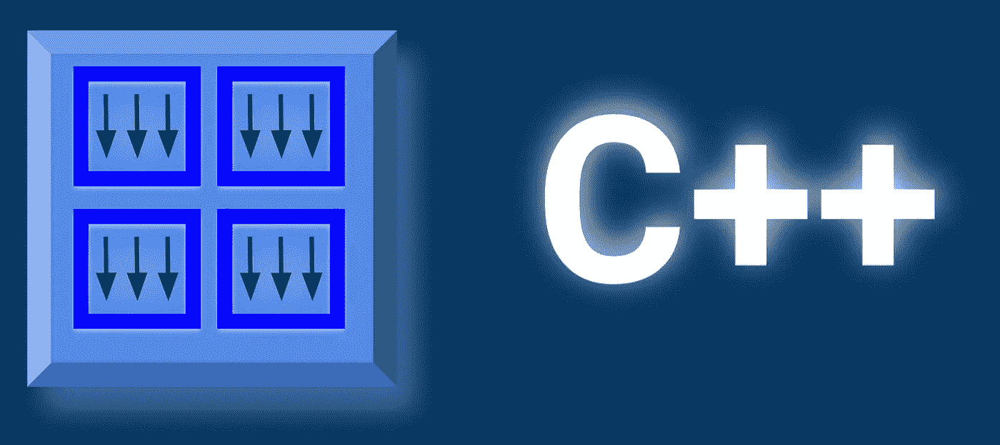
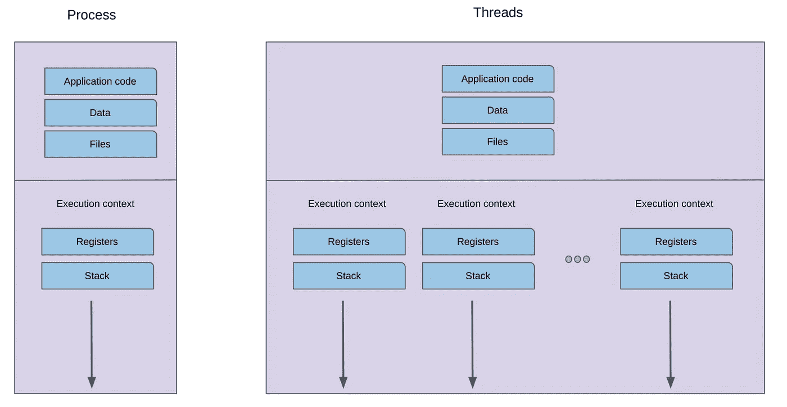
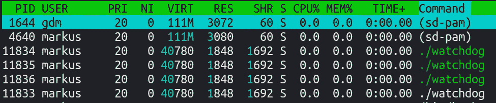
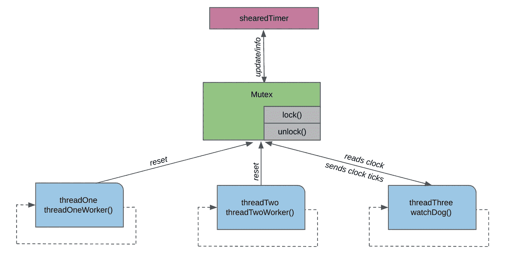

# C++中的线程。看门狗 app。简单的方法。

> 原文：<https://medium.com/geekculture/threads-in-c-watchdog-app-simple-approach-a4447493889f?source=collection_archive---------11----------------------->



by author

在本文中，我将演示一个简单的应用程序，它将让您理解计算机科学中的线程概念(这里是在 Linux 中运行的 C++)。请注意，我们将只讨论线程领域的基础知识，然而，很好地理解我们将要介绍的应用原理，肯定会给你在自己的程序中部署以下概念带来很大的优势。

在开始之前，我将简单介绍一下计算机科学中的线程。操作系统(OS)负责代表您运行的应用程序管理硬件。你开发和编译的应用程序存储在磁盘中(**静态实体**)。当你发出运行应用程序的命令时，代码被“转移”到 RAM 存储器中，并且可以作为一个**活动实体**(进程)被关联。您可以在同一个 CPU 上启动多个进程(相同或不同)。这些应用程序中每一个都可以处于不同的状态，例如正在执行或正在等待，但仍然是一个进程。

每个进程都可以表示为代码、数据(进程开始运行时加载的静态数据)、堆(动态分配的内存)和堆栈(在程序执行时增长和减少的内存——它是按后进先出顺序组织的——列表)。
每个进程由地址空间(V0 — Vmax)中的地址唯一标识。有虚拟地址。由于虚拟内存管理的复杂性(我们启动不同的应用程序，使用不同的编译器等)，与物理地址内存(DRAM)没有直接的联系。操作系统必须将虚拟地址映射到物理内存。这是通过**页表**完成的。因此，虚拟地址等于 0x56543 的一个变量必须通过页表映射到例如 DRAM 中的 0x9864728。

请考虑下图，它描述了进程和线程之间的区别。如上所述，进程由地址空间表示，包含前面提到的所有块。
然而**线程**代表独立的执行上下文。它们是同一个虚拟地址空间的一部分。这意味着，它们将共享所有的虚拟和物理地址映射。线程也将共享相同的代码、数据(共享内存)和文件。然而(就像我们在下面的例子中展示的那样)，它们将执行不同种类的指令集，虚拟空间和物理内存的不同部分。每个线程都有自己的堆栈、堆栈指针和线程专用寄存器。



by author

让我们回到讨论的核心，考虑下面的多线程应用程序，它会让你更好地理解 C++编程的这个时代。我们的应用程序非常简单。想法如下(请在阅读时也考虑下图，其中描述了所考虑的应用的主要摘要)。
应用程序运行 4 个线程:main，其中其他三个线程分别定义为 threadOne、threadTwo 和 threadTree。

```
std::thread your_thread (functionToBeCalled); 
// spawn new thread that calls functionToBeCalled()
```

线程 main 具有最高优先级，当它完成时，应用程序终止。
为了保持其他线程(我们之前定义过)的活动，我们需要向主线程发送指示，表明它必须等待其他线程完成剩余的指令集。它通过 join()方法实现。

```
your_thread.join();
```

在我们的例子中，线程:threadOne、threadTwo 和 threadTree 分别运行在循环函数 threadOneWorker、threadTwoWorker 和 watchDog 的“长时间”中。整个应用程序正在运行，而它将被终止。

关于下图，我们可以看到所有四个线程都在运行。
您可以在 htop 中验证这一点，并搜索看门狗命令。



正如我们之前提到的，线程是独立运行的，但是它们可以共享相同的内存。
在我们的应用程序中，我们可以说线程 threadOne 和 threadTwo 在我们的系统中做一些事情(例如，一个线程负责读取)，但是另一个线程运行负责发送的指令集。最后一个线程:threadThree 运行名为 watchDog 的函数，该函数计算时间(在本例中为 5*200 毫秒)。这是一个时间空间，我们可以在没有警报的情况下运行应用程序，我们可以说“看门狗在叫”。当这段时间过去时，将发出警报。
你可以想象一下**看门狗**的作用。通过计算时间(最终预期时间计数器将被重置)，看门狗监控线程一和线程二，并在重置时间过去时发出警报(这只是一个简单的示例，显示了如何组织这种情况)

在此时间间隔(5*200 毫秒)内，时间必须设置为 0。这是由函数 threadOneWorker 或 threadTwoWorker 完成的。请看看我们称之为不同睡眠时间的函数。1900 的 threadOneWorker，750 的 threadTwoWorker。线程:threadOne、threadTwo 和 threadTree 共享同一个内存:shearedTimer，它保存实际计数器(200 毫秒过去的次数)。对指定共享内存的访问由互斥体管理(保护)。这是一种防止“线程竞赛”的特殊机制。这意味着对内存的访问(在我们的例子中是 shearedTimer)是允许一个线程同时进行的。互斥体可以被关联为存储器的“门”。门(互斥体)可以关闭。线程调用方法 lock()并通过调用 unlock()方法打开门(给其他线程一个访问内存的机会)。
通过看下面的伪代码来感知直觉。您也可以通过直接分析我们的应用示例来获得直觉。

```
/pseudo-codeshared_memory;
mutex; //controls access to share_memorydef your_thread_1(funct_1); 
//definition of thread which calls function funct_1def your_thread_2(funct_2);
//definition of thread which calls function funct_2//your_thread_1 and your_thread_2 runs independently and fights for access to share_memory// the share_memory is available for one that at the time.
// the control for the availability is performed by mutexfunct_1 () {
mutex.lock();
call (sheared_memory) // your_thread_2 DO NOT have an access to //memory
mutex.unlock ()
}funct_2 () {
mutex.lock();
call (sheared_memory) // your_thread_1 DO NOT have an access to //shared_memory
mutex.unlock ()
}
```

当线程 lock()访问内存(具有访问共享内存的权限)时，线程可以修改内存值。其他线程必须等待互斥体被解锁。

将您的程序编译为(在 Linux 中):

```
g++ watchdog_medium.cpp -o watchdog -pthread
```

并运行:

```
./watchdog
```

在下面的程序中，我们有一个 threadOneWorker()，它尝试每隔 1900 毫秒重置一次时间— **太长时间**不会引发警报(如果我们禁用 threadTwo，我的意思是我们只运行 threadOne)和 threadTwoWorker()，它每隔 750 毫秒重置一次计时器(在警报弹出之前 250 毫秒)。



by author

拜托，受点启发，玩玩这个程序。调整每个线程功能的睡眠时间。检查更改的效果。

感谢您的阅读。