# iOS 中的多线程-第 3/4 部分

> 原文：<https://medium.com/geekculture/threads-in-ios-part-2-c4f44e885f5f?source=collection_archive---------11----------------------->

## n 操作，n 操作的优点，操作

如果你想知道什么是线程，多线程以及 gcd 是如何工作的，请参考我的第一个博客[这里](https://manasaprema04.medium.com/threads-in-ios-gcd-nsoperation-part-1-64e460c0bdea)。

# n 操作队列:-

另一种创建线程的方法是使用操作。创建操作实例后，将操作提交给 OperationQueue。OperationQueue 将管理线程，并负责运行您提供给它的操作。

**什么是运营？**表示与单个任务相关联的代码和数据的抽象类。

**操作状态:-** 操作对象在内部维护状态，以确定何时执行是安全的，并通过操作的生命周期通知外部客户端进度。

以下是操作状态

1.  `**isReady**` **:** 当一个操作准备执行时，通知客户端。当操作准备好立即执行时，它返回`true`,如果它所依赖的未完成的操作仍然存在，则返回`false`。

*   `**isExecuting**` **:** 这告诉我们操作是否正在执行分配的任务。如果操作正在执行其任务，则`isExecuting`返回`true`，否则返回`false`。
*   `**isFinished**` **:** 告知某项操作成功完成任务或被取消。在`isFinished`值变为`true`之前，操作队列不会将操作出队，或者操作对象不会被清除。
*   `**isCancelled**` **:** 通知客户端请求取消操作。

如何取消操作？

我们可以如下使用`cancel()`取消操作。我们可以通过`isCancelled`检查操作是否被取消

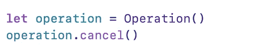

**对**的影响`**cancel()**`

*   你的行动已经结束了。在这种情况下，cancel 方法不起作用。
*   您的操作已经在执行中。在这种情况下，系统不会强制停止您的操作代码，而是将 cancelled 属性设置为 true。
*   您的操作仍在队列中等待执行。在这种情况下，您的操作将不会被执行。

## 如何才能创造运营？

开发者不需要直接使用它。Foundation 提供了两个系统定义的子类`InvocationOperation`和`BlockOperation`来执行任务。

创建操作主要有三种方式:-

1.  块操作
2.  InvocationOperation
3.  自定义操作

**块操作:-**

管理一个或多个块的并发执行的操作。

`BlockOperation`类从`Operation`类延伸而来。您可以使用此对象一次执行几个块，而不必为每个块创建单独的操作对象。当执行一个以上的块时，只有当所有的块都完成执行时，操作本身才被认为完成。

利用系统定义的`BlockOperation`看起来如下:

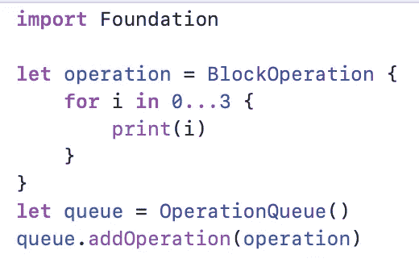

> 在这里，块操作被添加到操作队列中。操作队列在某个后台线程上启动操作并执行它。

也可以通过直接在队列中添加块来完成:

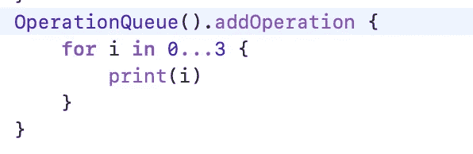

如何同时执行一个或多个块？

我们可以使用`BlockOperation`一次执行一个或多个块，而不需要创建新操作，如下所示

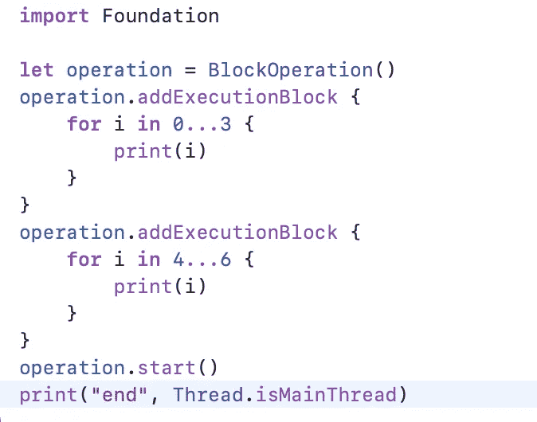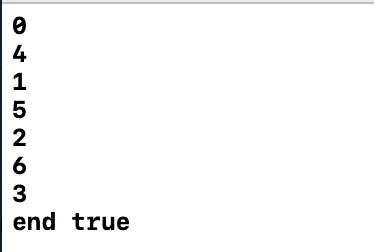

如你所见，添加到块操作本身的任务/块同时执行，但是块运行`synchronous manner`意味着它阻塞了调用 start 的线程，在我们的例子中它是主线程。

我们可以通过在任何其他线程中调用`start()`方法来解锁主线程，但这会阻塞调用`start()`方法的线程。

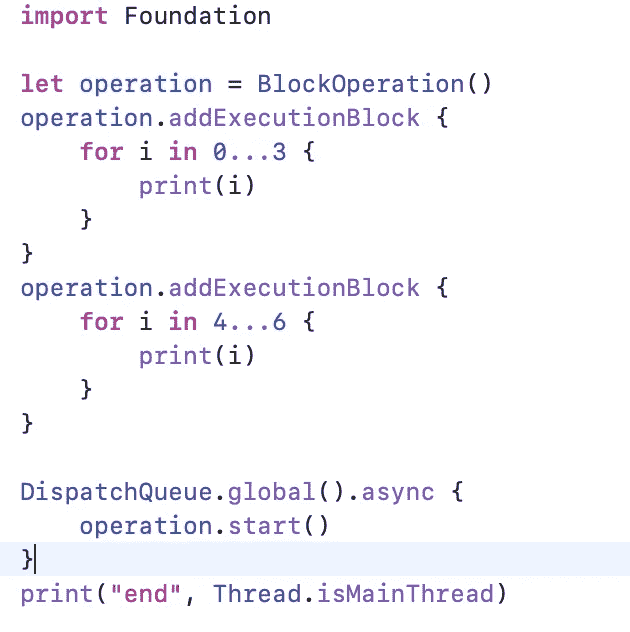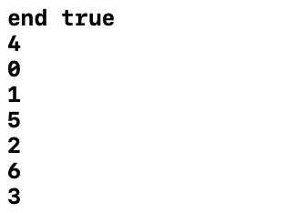

**InvocationOperation:-**

在 objective C 中，我们可以创建`NSInvocationOperation`，而 Swift 中没有。

**自定义操作:-**

子类化`Operation` 让你可以完全控制自己操作的实现，包括改变操作执行和报告状态的默认方式。

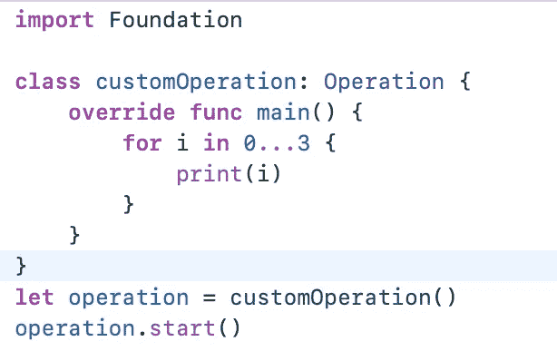

This will block the main thread bcz here we are calling start() in main thread

创建自定义并发操作，如下所示:-

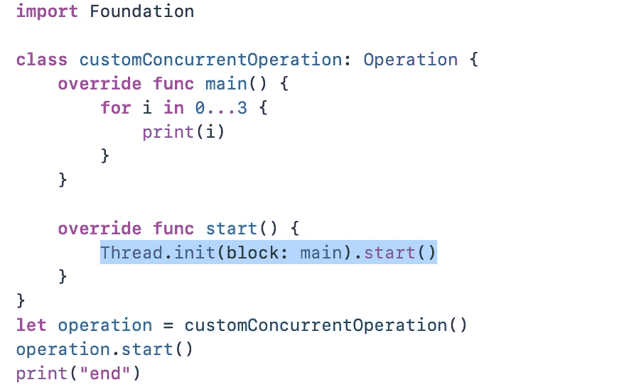

对自定义操作调用`cancel()`方法:

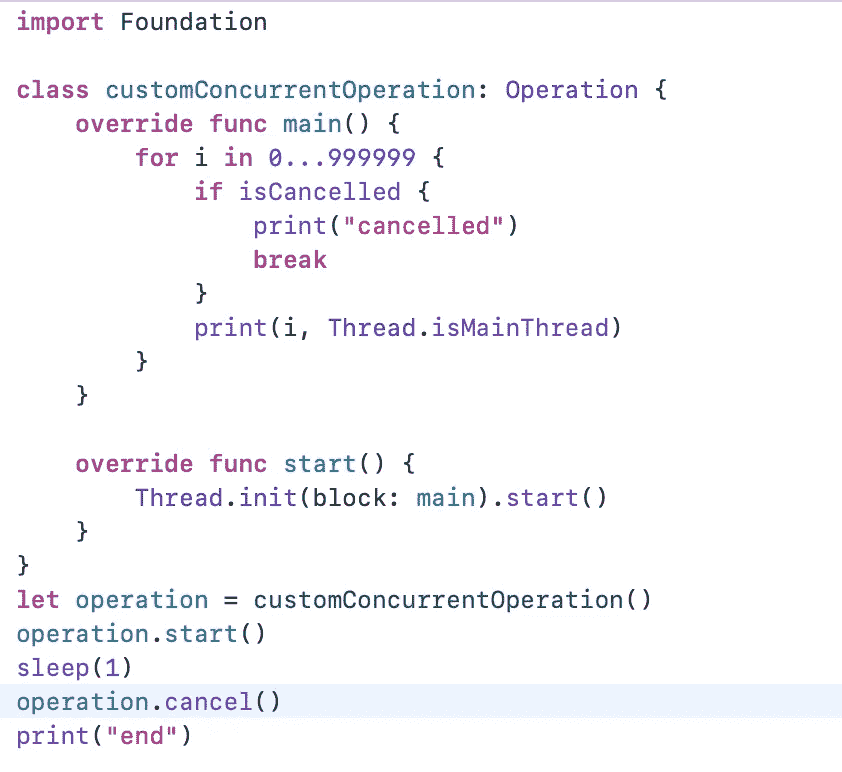

# 操作队列:-

操作队列是 Cocoa 对 GCD 的高级抽象。不是自己动手操作，而是交给操作队列。然后它处理调度和执行。

操作队列根据优先级和 FIFO 顺序执行其排队的`Operation`对象。

一个操作队列通过在第二线程上运行操作来直接执行它的操作，或者间接地使用`libdispatch`库(即中央调度)

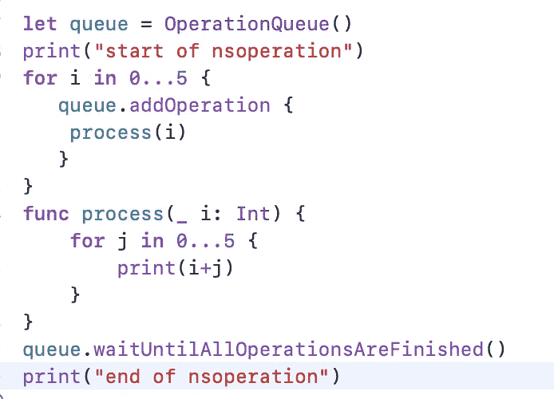

> 您可以添加任意多的操作，但它们不会同时执行。相反， `***OperationQueue***` *根据系统条件限制操作次数*

我们可以取消操作队列

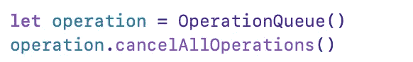

> *操作队列保留操作，直到它们完成。挂起具有未完成操作的操作队列会导致内存泄漏。*

**如何在操作队列上设置最大并发操作？**

`maxConcurrentOperationCount`帮我们设置最大并发操作，但建议不要设置。

> `*maxConcurrentOperationCount*`设置为`*1*`，允许操作一个接一个的结束。它充当串行队列

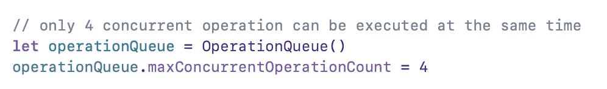

> 缺省值是-1，这意味着让系统决定

**队列如何决定一次可以运行多少个操作？**

这取决于硬件。默认情况下，`OperationQueue`会在后台进行一些计算，并根据它运行的平台决定最大可能的线程数量。

**操作队列按照什么顺序执行任务？**

队列中的操作是根据它们的就绪性来组织的，即(`isReady`属性返回`true`)、优先级&依赖性，并被相应地执行。

如果所有排队的操作都有相同的`queuePriority`并在被放入队列时准备好执行，那么它们将按照提交到队列的顺序执行。否则，操作队列总是执行相对于其他就绪操作具有最高优先级的操作。

直到一个操作对象的所有相关操作都执行完毕，它才准备好执行。

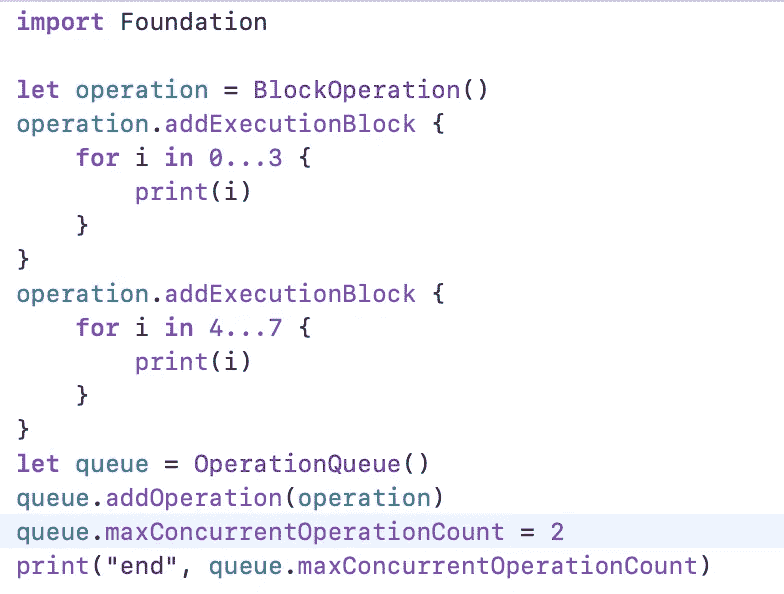

**Adding operation to operation queue and set maxConcurrentOperationCount**

**如何在操作间添加依赖关系？**

考虑这样一种情况，您需要调用两个 api，在这些 api 完成之后，您需要解析一个响应，然后您需要使用依赖管理器来实现这一点

**操作之间没有依赖关系**

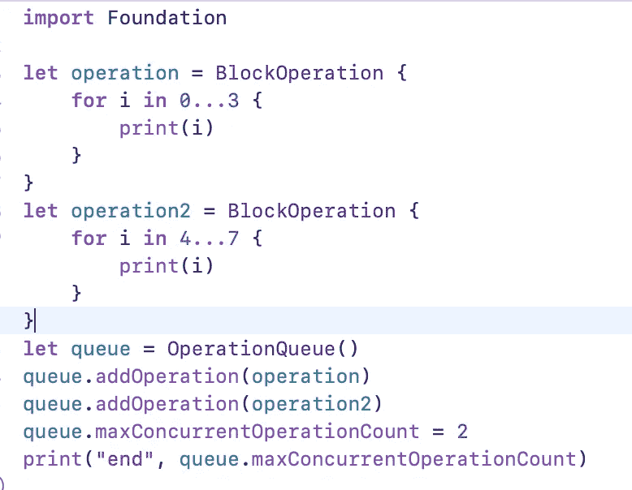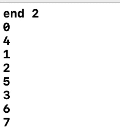

**与**之间存在依赖关系的操作

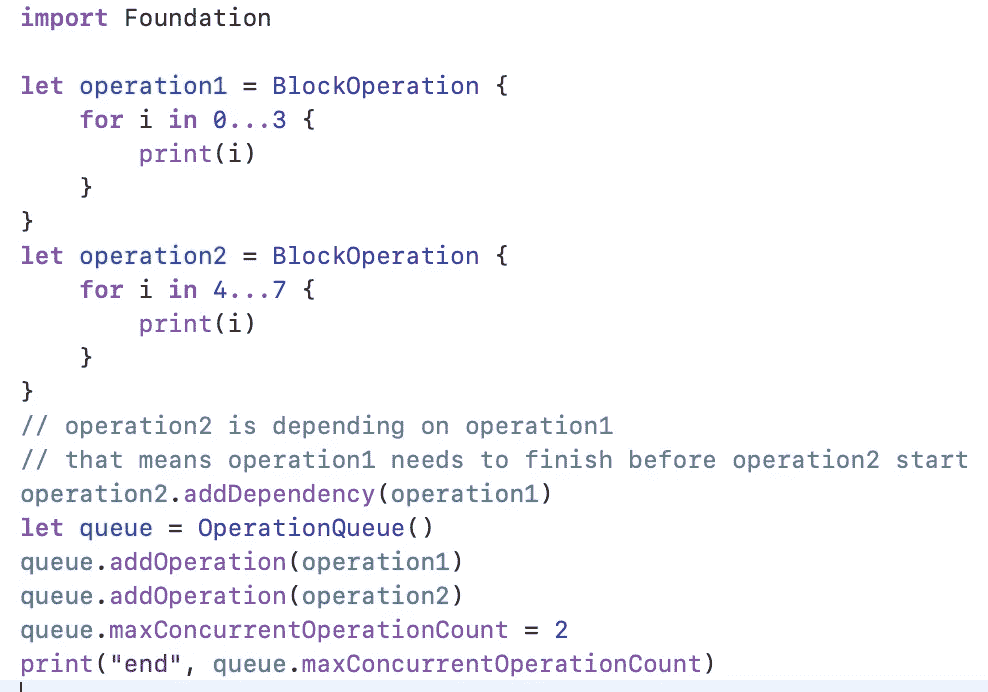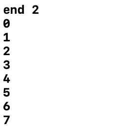

## 使用操作队列的调度组实施:-

我们使用 GCD 调度组特性来阻塞一个线程，直到一个或多个任务执行完毕。

我们通过依赖关系使用操作队列实现了相同的行为。当您在所有指定任务完成之前不能做任何事情时，这很有用。

在某些情况下，你需要并发运行，当所有的任务完成时，我们需要调用一些方法来表明所有的任务已经完成。这可以通过使用`waitUntilFinished`来实现

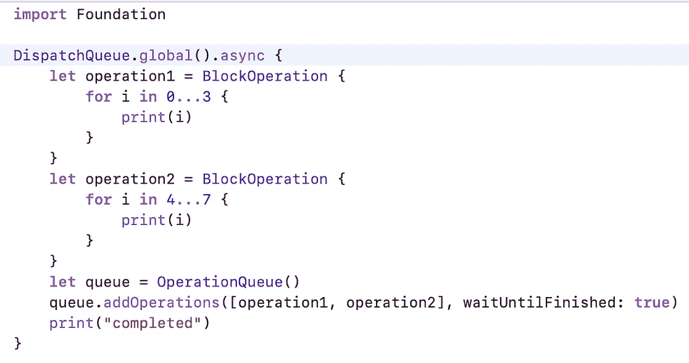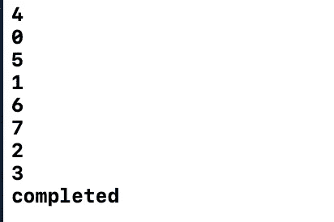

## 异步与同步操作:-

如果您计划手动执行操作对象，而不是将其添加到队列中，那么您可以将操作设计为以同步或异步方式执行。

操作对象默认是同步的。当您直接从代码中调用同步操作的`start()`方法时，该操作会在当前线程中立即执行。

当您调用异步操作的`start()`方法时，该方法可能会在相应的任务完成之前返回。异步操作对象负责在单独的线程上调度其任务。

# 操作队列优于 GCD 的优势:-

1.  操作队列是队列模型的高级抽象，是在 GCD 之上建立的。
2.  操作 API 提供了对依赖关系的支持。您可以非常容易地在任务之间创建复杂的依赖关系，虽然在 GCD 中您可以实现它，但是您必须做大量的工作。
3.  NSOperation 和 NSOperationQueue 类有许多可以使用 KVO(键值观察)来观察的属性。
4.  您可以监视操作或操作队列的状态。
5.  可以暂停、恢复和取消操作。一旦您使用 Grand Central Dispatch 分派任务，您就不再能够控制或洞察该任务的执行。它提供对操作生命周期的控制
6.  您可以指定可以同时运行的队列操作的最大数量。这使得控制同时运行多少操作或创建串行操作队列变得容易。

7.与 GCD 不同，它们不符合先进先出的顺序。

# 注意:

*   **要了解更多关于 GCD 和线程的信息，请阅读第一部分** [**这里的博客:**](/geekculture/threads-in-ios-gcd-nsoperation-part-1-64e460c0bdea)
*   **有关 DispatchWorkItem、DispatchGroup、DispatchBarrier、DispatchSemaphore、DispatchSources 的更多信息，请阅读第 2 部分** [**博客**](https://manasaprema04.medium.com/multithreading-in-ios-part-2-3-fe0116ffee5)
*   [**参考博客了解面试问题，了解多线程问题**](https://manasaprema04.medium.com/27632d180f39)

享受你的编码。 **我希望你能从这篇博客**中学到一些东西。**请** ***点击下面的鼓掌按钮👏去帮助别人找到它！。跟我上*** [***中***](/@manasaprema04) ***。***