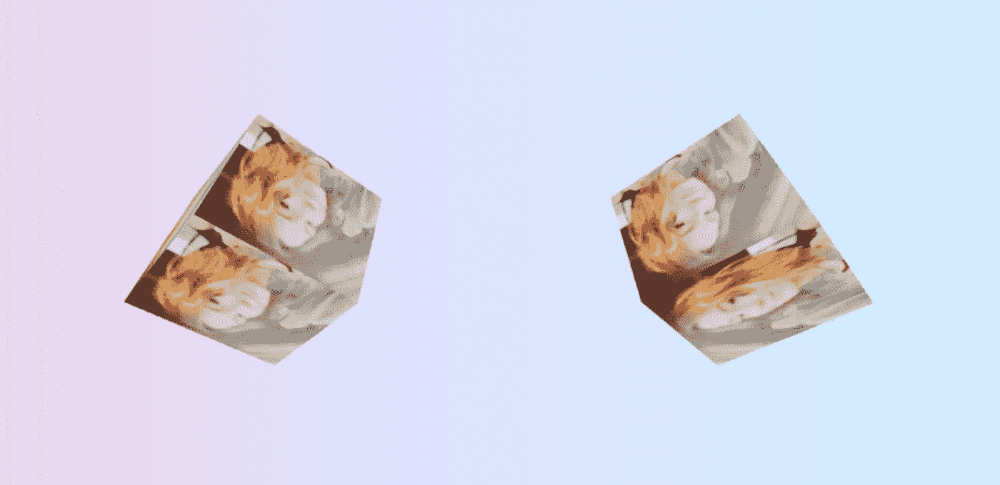

# Three . js in React with React-Three-Fiber

> 原文：<https://medium.com/geekculture/three-js-in-react-with-react-three-fiber-d6e88512341f?source=collection_archive---------31----------------------->



曾经有一段时间，渲染动画 3D 计算机图形依赖于专有浏览器插件的存在，用户必须安装这些插件来修改他们的浏览器。在 21 世纪初，一个叫做 WebGL (Web Graphics Library)的 JavaScript API 出现来解决这个问题；它允许在任何兼容的网络浏览器中渲染 2D 和 3D 图形，而无需使用任何外部插件。

WebGL 允许我们的下一项技术存在——three . js。three . js 是一个高级 JavaScript 库和 API，再次用于在 web 浏览器中显示动画 3D 图形，而不使用浏览器扩展。Three.js 库非常丰富，包括了一些有用的特性，比如几何体、灯光、着色器和某些动画。

当到了我自己学习一项新技术的时候，作为我作为软件工程学生期间的最后一次技能评估，我知道我想做一些艺术和创造性的事情。使用代码生成浏览器内动画对我来说是一个直接而明显的选择，我开始浏览可以与我最喜欢的语言 React 结合使用的技术。随着我对 Three.js 了解的越来越多，我发现已经存在一个专门用于与 React 集成的库。该库被称为 React-Three-Fiber，它可以用于通过可重用的自包含组件以声明方式构建场景，这些组件对状态做出反应，并且不需要特殊处理即可与 React 的生态系统一起工作。

要开始使用 React-Three-Fiber，只需使用以下代码行将其安装在 React 应用程序的终端中:

```
npm install three @react-three/fiber
```

使用 R3F 创建的每个场景都需要从画布开始，我们将从 R3F 库导入画布，如下所示:

```
import { Canvas } from '@react-three/fiber'
```

画布将是我们 3D 物体存在的舞台。在

<canvas>和</canvas>

标签中，返回了灯光的分量，以及你正在照明的对象(在这个例子中，我们将使用一个盒子)。R3F 库提供了几种类型的灯光，包括来自所有方向的 ambientLight 和点光源，点光源在 x、y 和 z 轴上的位置是声明的。在这里，我们使用两种类型的光，以及一个聚光灯，来创建一个带有一些阴影的均匀的光。

```
return (<Canvas><ambientLight intensity={0.5} /><spotLight position={[10, 10, 10]} angle={0.15} penumbra={1} /><pointLight position={[-10, -10, -10]} /><Box position={[-2.2, 0, 0]} /><Box position={[2.5, 0, 0]} /></Canvas></div>);
```

这里，我们返回了两个盒子，根据它们的道具在 x、y 和 z 轴上指定的位置，它们将位于画布中的不同点。这些盒子是在它们自己的函数中构建的，其中几何图形和材质是在一个叫做<mesh>的东西中指定的，这个东西是使用 useRef()设置的:一个普通的老式 React 钩子。然后，当盒子在

<canvas>组件中返回时，它们已经知道它们是由什么组成的。构建盒子函数看起来像这样:</canvas></mesh> 

```
const Box = (props) => {const mesh = useRef();const [active, setActive] = useState(false);useFrame(() => {mesh.current.rotation.x = mesh.current.rotation.y += 0.01;});const texture = useMemo(() => new THREE.TextureLoader().load(image), []);return (<mesh{...props}ref={mesh}scale={active ? [2, 2, 2] : [1.5, 1.5, 1.5]}onClick={(e) => setActive(!active)}><boxBufferGeometry args={[1, 1, 1]} /><meshBasicMaterial attach="material" transparent side={THREE.DoubleSide}><primitive attach="map" object={texture} /></meshBasicMaterial></mesh>);}
```

这里有很多东西要解开，但基本上，这段代码留给我们的是两个彼此独立旋转的立方体，它们具有图像的纹理，当被单击时，它们的大小会增长一次，当再次被单击时，它们会收缩回原始大小。当我们在

<canvas>中返回<box>组件时，我们声明了盒子在画布上的位置。</box></canvas>

就是这样！我们现在已经正式召唤了一个 3D 物体，并告诉它如何表现，这一切都是通过使用 React-Three-Fiber 实现的。R3F 能够做的还有很多，使用这段代码中的参数是一个很好的起点。上传一些不同的纹理，改变灯光，玩规模或调整旋转的物理！无论你做什么，享受我们今天一起学习的新技术。