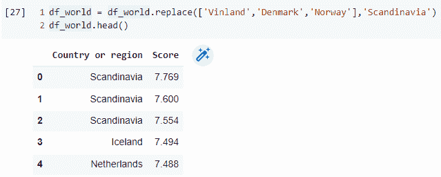
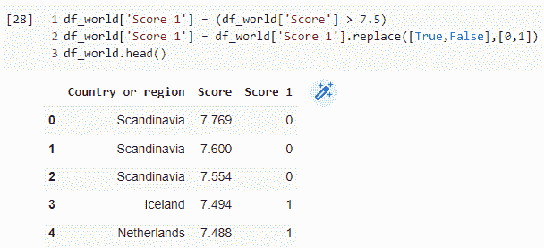
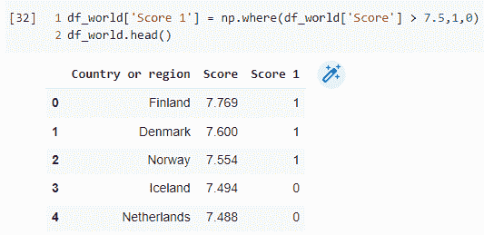
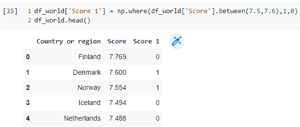
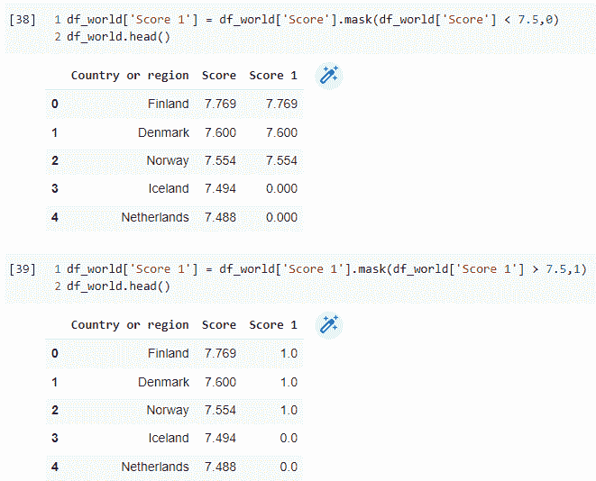

# 三个被忽略但功能强大的 Python 函数来代替“替换”函数，用于破解数据帧

> 原文：<https://medium.com/geekculture/three-overlooked-but-powerful-python-functions-to-replace-the-replace-function-for-hacking-101abf184fef?source=collection_archive---------16----------------------->

[How to Upgrade and Replace Lightbulbs | The Family Handyman](https://www.familyhandyman.com/article/how-to-replace-a-lightbulb/)

如果你经常使用 Python，你可能知道强大的 [*熊猫*](https://pandas.pydata.org/) 库，这是这种语言数据分析的支柱。此外，您可能还知道一些关键函数，这些函数使处理数据帧变得更加容易，例如:

*   *形容*
*   *为空*
*   *合并*
*   *至 _ 日期时间*
*   *数值计数*
*   *str*
*   *dropna*
*   *分组依据*
*   *排序值*
*   *串联*
*   *枢轴*
*   *剧情*
*   *应用*

这个清单还在继续。

这些绝不是 Python 中与数据帧相关的函数的详尽列表。还要注意，这些函数中有些是熊猫函数( [*pd.concat*](https://pandas.pydata.org/docs/reference/api/pandas.concat.html) ，[*PD . to _ datetime*](https://pandas.pydata.org/docs/reference/api/pandas.to_datetime.html)等。)而剩下的都是 dataframe 函数( [*df.dropna*](https://pandas.pydata.org/docs/reference/api/pandas.DataFrame.dropna.html) ， [*df.pviot*](https://pandas.pydata.org/docs/reference/api/pandas.DataFrame.pivot.html) 等。).然而，它们都是可用于切片和切割数据帧的函数。

另一个关键的 dataframe 函数是 [*df.replace*](https://pandas.pydata.org/docs/reference/api/pandas.DataFrame.replace.html) ，我们将在本文中详细介绍。对于许多用户来说，作为机器学习工作流程的一部分，该功能已经成为[数据清理](https://www.tableau.com/learn/articles/what-is-data-cleaning#:~:text=Data%20cleaning%20is%20the%20process,incomplete%20data%20within%20a%20dataset.&text=If%20data%20is%20incorrect%2C%20outcomes,though%20they%20may%20look%20correct.)和[特征工程](https://www.omnisci.com/technical-glossary/feature-engineering)的基石。

[6-Step Guide to Cleaning your HR Analytics Data — AIHR](https://www.aihr.com/blog/hr-analytics-data-cleaning-guide/)

让我们举一个例子，你有四个标签为“芬兰”的条目，但有一个条目误标为“文兰”。这就是*替换*功能作为快速数据清理解决方案派上用场的地方。语法应该是这样的:

***df _ world = df _ world . replace('文兰'，'芬兰')***

在上面的例子中，dataframe 中“Vinland”的每个实例都将被替换为字符串“Finland”。也可以使用以下代码自定义代码，使其在 dataframe 中只包含一列:

***df_world['国家或地区'] = df_world['国家或地区']。替换('文兰'，'芬兰')***

该函数还可以很好地将字符串列表替换为不同的字符串，如下例所示，其中**‘文兰’，‘丹麦’和‘挪威’**都分组到一个名为**‘斯堪的纳维亚’**的类别中。

说到分组，在特征工程中，经常需要将连续值分组到离散类别中，以使算法更有效地解释该特征。在下面的例子中，所有高于 7.5 的分数被标记为“0”，其余的被标记为“1”。

然而，生成这个解决方案需要两行代码，其中必须创建一个名为“Score 1”的单独变量。当一个条件是双边的时，使用 replace 函数事情会变得更加复杂。

这就是其他三个强大功能发挥作用的地方，它们可以被证明是*替换*功能的更好替代。

# np.where()

注意，这个函数是[*Numpy*](https://numpy.org/)*库的一部分，而不是熊猫库。*

**np.where* 函数的最大优点是它允许在单行代码中对一系列值使用 *if-else* 条件。它对分类变量同样有用，但在这种情况下，它与 *replace* 函数相比没有明显优势。*

*下面显示了一个示例语法:*

****df _ world[' Score 1 ']= NP . where(df _ world[' Score ']>7.5，1，0)****

*在上面的示例中， *df_world['Score']* 系列中任何大于 7.5 的值都被转换为' 1 '，所有其他值都被设置为' 0 '。然而，结果被存储在一个名为“分数 1”的新系列中。下面显示了上述样本的结果，使用的数据集与前面显示的相同。*

**

*正如我们所见，代码执行了与第一个示例相同的功能，使用*替换*，但是使用的代码行更少。*

# *df.between()*

*该功能是 *np.where* 的补充功能。*

**between* 函数的一个关键优势是，它可以接受两边有界的连续值的范围。换句话说，它可以同时适应大于 T39 的 T38 和小于 T41 的 T40，而 T42 NP . where T43 一次只能接受两个条件中的一个。*

*示例语法:*

****df_world['分数 1'] = np.where(df_world['分数'])。*(7.5，7.6)，1，0)之间***

*下面的示例实现了上面的代码，它将 7.5 到 7.6 之间的所有“分数”值转换为“1”，其余的转换为“0”。是的，它在逻辑和代码方面更复杂一些，但功能更强大。*

**

# *df.mask()*

*最后，我们得到了*屏蔽*函数，它不如函数之间的*函数强大，但在替换一系列值时，它仍然是*替换*函数的一个很好的替代。注意，它不允许一个 *if-else* 类型的条件，这正是它所缺少的。**

*语法如下:*

****df_world['分数 1'] = df_world['分数']。mask(df_world['Score'] < 7.5，0)****

*下面显示的是上述代码与*掩码*函数的实现，该函数执行与作为 *where* 函数的一部分显示的代码相似的任务。*

**

*如您所见，必须执行两行单独的代码(和条件)才能获得预期的结果。*

# *结论*

*综上所述， *replace* 对于不需要太多条件的小规模替换操作来说是一个很好的功能。然而，与*之间的*与*、*屏蔽*功能在处理以下情况时提供了更大的灵活性:**

*   *长范围的连续值*
*   *多重条件*

*这里提供了代码(用于示例)和数据集的链接[。Jupyter 笔记本包含上述功能如何工作的其他示例，提供了与*替换*功能的比较。](https://github.com/saychelsea11/Pandas_Replace_Function_Alternatives)*

*这就是这篇简短但甜蜜的文章的结尾。希望这有帮助！请在评论中告诉我，这些功能中哪些是你经常使用的，以及你处理过的最复杂的“替换”任务是什么。此外，请随意分享你经常使用的其他被低估的熊猫功能。干杯！*

**原载于 2022 年 1 月 18 日 http://thecraftofdata.com***。***