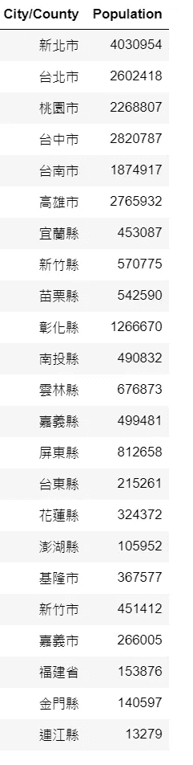
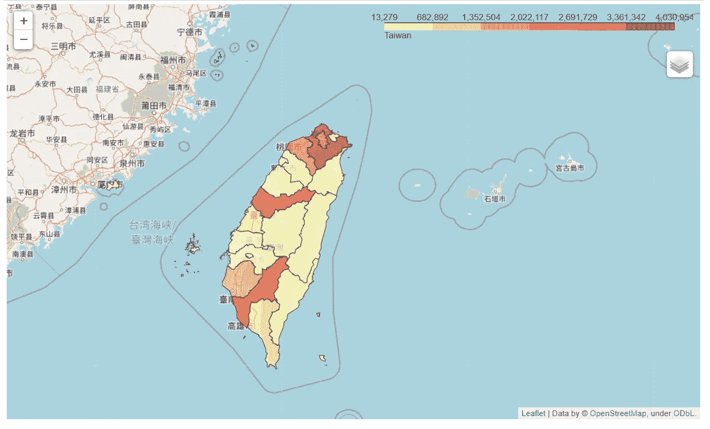
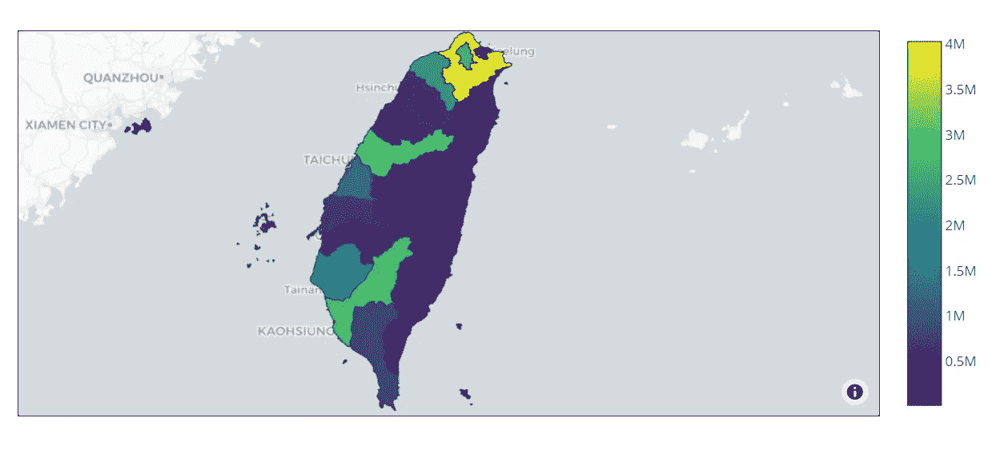
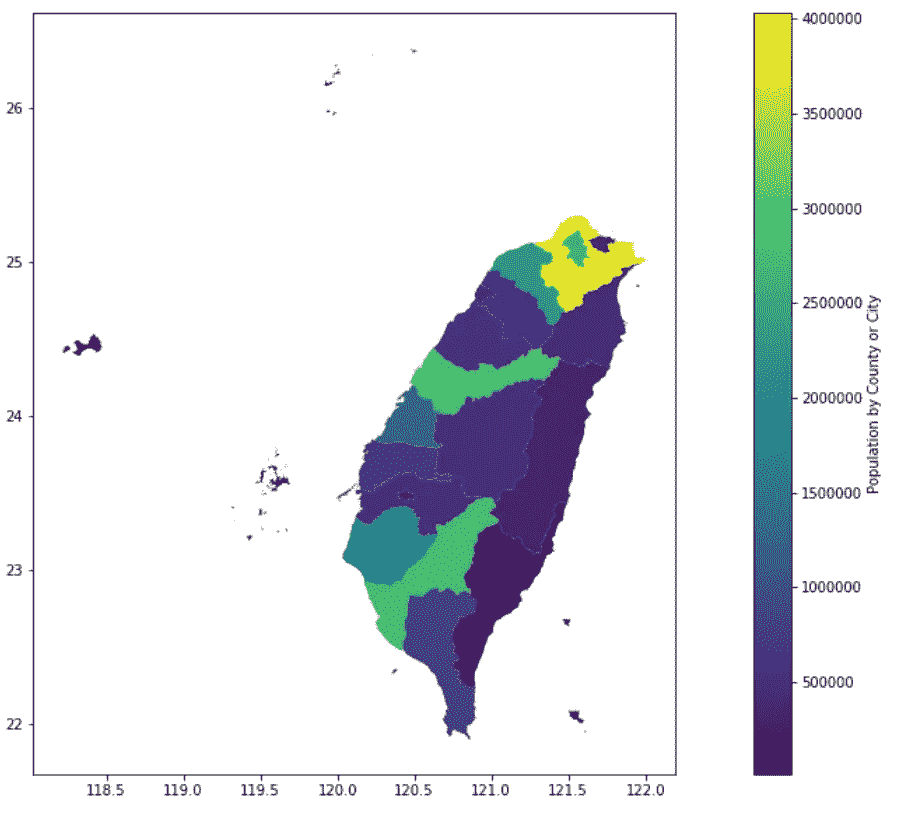

# 用 Python 绘制 Choropleth 图的三种方法

> 原文：<https://medium.com/geekculture/three-ways-to-plot-choropleth-map-using-python-f53799a3e623?source=collection_archive---------1----------------------->

Photo by [Angela Lo](https://unsplash.com/@angelalo?utm_source=unsplash&utm_medium=referral&utm_content=creditCopyText) on [Unsplash](https://unsplash.com/s/photos/sky-view-taiwan?utm_source=unsplash&utm_medium=referral&utm_content=creditCopyText)

Choropleth 地图是展示地理空间数据的绝佳选择。在本文中，我们将向您介绍三种绘制等值线图的方法。我们开始吧。

Github 回购:[此处](https://github.com/BurgerWu/Three-Methods-to-Plot-Choropleth-Map-Using-Python)

# 数据准备

为了展示我们的 choropleth 地图，我们获取了台湾每个市县的人口数据作为我们感兴趣的数据集。你可以在这个[网站](https://www.ris.gov.tw/app/portal/346)找到数据集。下面是经过清洗和数据处理后的最终数据图。我们将在后面使用这个数据帧来绘制弦线图。

# 获取 Json

Geojson 是 Choropleth 地图的重要组成部分，因为它记录了感兴趣区域的实际轮廓。这里可以找到来自[的台湾 geojson。至于其他国家或地区，你可以通过搜索互联网找到有用的信息。](https://raw.githubusercontent.com/g0v/twgeojson/master/json/twCounty2010.geo.json)

# 1.薄层

Folium 是一个专门可视化地理数据的 Python 库，当然也包括 Choropleth 地图。这是我们绘制 Choropleth 图的第一种方法。更多信息和文档，请点击查看[。](https://python-visualization.github.io/folium/)

下面是使用 follow 绘制 Choropleth 地图的代码。

以下是台湾行政区划人口的 Choropleth 地图使用 leav 的结果。

# 2.Plotly

Plotly 是一家加拿大软件公司，但在这个项目中，我们谈论的 Plotly 是一个以 Plotly 制作的交互式绘图而闻名的 Python 高级绘图库。你可以点击[了解更多信息。](https://plotly.com/python/)

下面是使用 Plotly 绘制 Choropleth 地图的代码。

下面是用 Plotly 绘制的台湾行政区划人口分布图。

# 3.地质公园

下面是使用 Geopandas 绘制 Choropleth 地图的代码。

以下是使用 Geopandas 绘制的台湾行政区划人口分布图。

# 结论

在这个项目中，我们使用三个不同的 Python 库来创建 Choropleth 地图，这三个库分别是 folium、plotly 和 geopandas。

## 叶子:

Folium 可以创建专业的交互式地图，但创建一个地图相对困难和复杂。它需要函数或工具提示对象来进一步增强地图。

## Plotly:

Plotly 可以创建专业的交互式地图，以及一些更多的默认功能和预建的样式。创建风格多样的地图可能会比 leav 方便一点。

## 地质公园:

Geopandas 可以创建非交互式地图，但构建一个地图相对较快。此外，geopandas 允许您使用大多数 Python 用户熟悉的 pandas 数据框架。

所有这三个都可以成功地传达我们希望通过 Choropleth map 分享的信息，由您决定哪一个最适合您。也提醒你自己，交互式地图应该比普通地图更消耗内存。

仍然有很多参数你可以尝试美化你的地图。除了搜索技术文档，还可以尝试在网上搜索，看看是否有人已经创建了您想要的文档。你可以在 [Github Repo](https://github.com/BurgerWu/Three-Methods-to-Plot-Choropleth-Map-Using-Python) 中找到这个项目的笔记本、数据集等信息。

# 参考

1.  走向数据科学:[https://towards Data Science . com/a-初学者指南-创建-a-cloropletes-地图-python-using-geo pandas-and-matplotlib-9cc 4175 ab 630](https://towardsdatascience.com/a-beginners-guide-to-create-a-cloropleth-map-in-python-using-geopandas-and-matplotlib-9cc4175ab630)
2.  https://blog.csdn.net/u010099080/article/details/104543491[CSDN](https://blog.csdn.net/u010099080/article/details/104543491)
3.  内政部:[https://www.ris.gov.tw/app/portal/346](https://www.ris.gov.tw/app/portal/346)