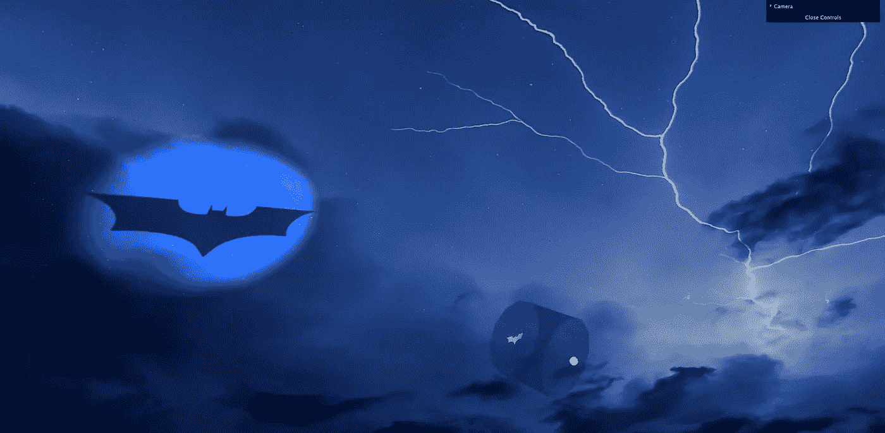
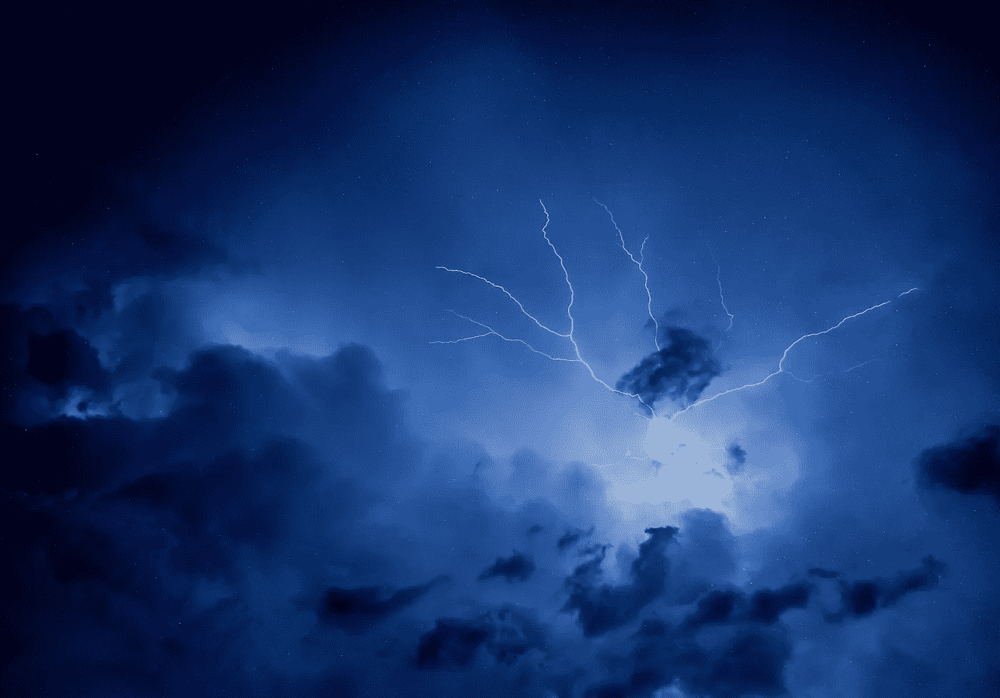
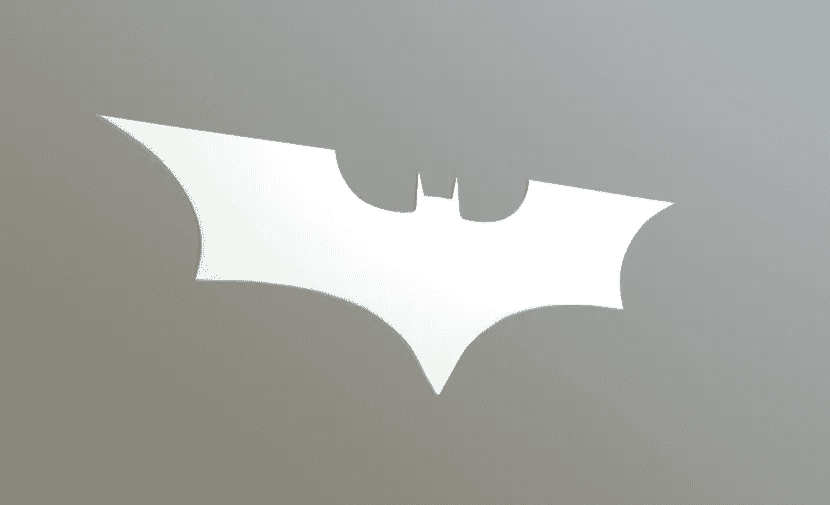
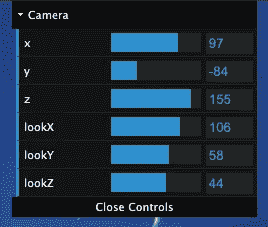

# 三个 j 动手——如何制作自己的蝙蝠信号

> 原文：<https://medium.com/geekculture/threejs-hands-ons-how-to-make-your-own-bat-signal-c27e96b49f2d?source=collection_archive---------25----------------------->



Bat Signal projected onto a thundering sky texture

我喜欢边做边学。在实践中学习的最好方法是做一些有趣的事情！这篇文章是一个实践指南，告诉你如何轻松地用 ThreeJS 制作你自己的蝙蝠信号。听起来很酷，对吧？

# 入门指南

我们将使用 Webpack，以及 Babel 和 Autoprefixer 等常用工具来为我们处理和打包所有文件。我喜欢从样板模板开始每个 ThreeJS 项目，这样我就可以一直重复使用。我目前使用的样板文件是在 Github 上公开发布的[，所以你可以随意拿起它，开始你自己的 ThreeJS 项目。如果你对如何为三个 JS 项目配置 Webpack 有任何疑问，请在下面留言。](https://github.com/franky-adl/threejs-boilerplate)

本文完成的项目也[公开托管在 Github](https://github.com/franky-adl/bat-signal) 上。

我的核心源文件的结构如下所示:

```
src
├── utils.js
├── dat-gui.js
├── gltf
│   ├── out.glb
│   ├── scene.bin
│   └── scene.gltf
├── index.html
├── index.js
├── style.css
└── texture
    └── nightsky.jpg
```

这不是最好的，但对于一个家庭车库级别的项目来说是可行的。

`utils.js`具有通用功能和在场景中创建/添加对象的功能。`dat-gui.js`对将右上角 GUI 控件添加到屏幕的代码进行分组。`gltf`文件夹中的`out.glb`是一捆`scene.bin`和`scene.gltf`文件，其中包含蝙蝠侠图标模型。`index.html`文件是加载`style.css`和`index.js`的网页(这是 Webpack 的入口点)。`nightsky.jpg`是本文开头显示的雷鸣天空的纹理。

# 关键概念

为了实现最终场景，我们需要理解以下概念:

*   环境照明
*   阴影
*   聚光灯
*   纹理加载
*   GLTF 装载

在接下来的几节中，我将通过代码逐一解释它们。

# 环境照明

[AmbientLight](https://threejs.org/docs/#api/en/lights/AmbientLight) 没有方向，它应用于场景中的所有对象。这就像直接在所有表面上绘制灯光一样。当我们希望我们的物体以最简单的方式被看到时，我们在场景中应用环境照明，而不需要担心它们是否被一些平行光照射到。

```
export function addAmbientLighting(scene) {
  const mainLight = new THREE.AmbientLight( 0xffffff, 0.9 )
  scene.add( mainLight )
}
```

AmbientLight 的构造函数:

```
AmbientLight( color : Integer, intensity : Float )
```

# 阴影

在我们讨论如何在这个例子中设置一个合适的聚光灯之前，我们必须知道如何在三个场景中设置阴影。实际上这很容易。按照[官方文档](https://threejs.org/docs/?q=Shadow#api/en/lights/shadows/SpotLightShadow)中的例子，我们首先需要像这样定义渲染器的 shadowMap 属性:

```
renderer.shadowMap.enabled = true;
renderer.shadowMap.type = THREE.PCFSoftShadowMap;
```

然后，我们还需要设置聚光灯来投射阴影，场景中的物体也要能够接收阴影。

关于阴影如何工作的更多细节，我推荐阅读[https://three js fundamentals . org/three js/lessons/three js-shadows . html](https://threejsfundamentals.org/threejs/lessons/threejs-shadows.html)。

# 聚光灯

[聚光灯](https://threejs.org/docs/?q=Spot#api/en/lights/SpotLight)的作用类似于现实生活中的聚光灯。它在特定的方向发出圆锥形的光。您还可以定义半影造成的衰减程度。聚光灯角度定义光锥的宽度，从方向的中心线到光锥侧面的线测量。

```
export function createSpotLight() {
  //Create a SpotLight and turn on shadows for the light
  const light = new THREE.SpotLight( 0xffffff, 2 )
  light.castShadow = true // default false
  light.position.set(0, 0, 10)
  light.target.position.set(0, 0, 0)
  light.angle = Math.PI/14
  light.penumbra = 0.35 //Set up shadow properties for the light
  light.shadow.mapSize.width = 512 // default
  light.shadow.mapSize.height = 512 // default
  light.shadow.camera.near = 0.5 // default
  light.shadow.camera.far = 500 // default
  light.shadow.focus = 1 // default return light
}
```

这里最重要的一点是将聚光灯的`castShadow`属性设置为 true。默认的阴影属性也显示出来，让你知道什么是可以改变的。`shadow.mapSize`定义该光线投射的阴影的分辨率，`shadow.camera.near`或`far`定义投射阴影的边界。如果物体落在这个距离范围之外，物体的阴影将不会被这个灯光投射。

# 纹理加载

为了简单起见，我们只需要两行代码就可以将图像加载到对象上。

```
const loader = new THREE.TextureLoader()
const material = new THREE.MeshPhongMaterial( {map: loader.load(SKY)} )
```

在这里，`SKY`是图像资产的路径。这样，用这种材料绘制的物体就获得了在其表面上绘制的图像。



The sky texture I used in this demo

# GLTF 装载

glTF 代表 GL 传输格式。这是一种在场景中存储所有需要的信息并在其他地方重新显示的有效方法。有时，与场景相关的外部二进制数据可能会保存在一个`.bin`文件中，因此只加载`.gltf`文件可能是不够的。在这种情况下，我们可以将`.bin`和`.gltf`文件捆绑成一个`.glb`文件，然后加载到我们的场景中。

`GLTFLoader`的示例代码用法:

```
import {GLTFLoader} from 'three/examples/jsm/loaders/GLTFLoader';...const loader = new GLTFLoader();
loader.load( '/path/to/out.glb', function ( gltf ) {
  const root = gltf.scene
  scene.add( root )
  ...
} );
```

`loader.load`函数的第二个参数是 glTF 模型加载后要执行的异步回调。正是在这个回调中，我们将加载的 glTF 模型添加到主场景中。

关于 glTF 加载的更多信息:[https://three js fundamentals . org/three js/lessons/three js-load-glTF . html](https://threejsfundamentals.org/threejs/lessons/threejs-load-gltf.html)



The glTF model I used in this demo was freely downloaded at [https://sketchfab.com/3d-models/batman-logo-9ba6f9ccd9bb45aaa88a37ff8a2aa66f](https://sketchfab.com/3d-models/batman-logo-9ba6f9ccd9bb45aaa88a37ff8a2aa66f)

# 核心代码解释

在`index.js`中，核心代码分为两个主要部分，`init`函数和`animate`函数。

`animate`函数是这个 ThreeJS 脚本的引擎。它调用`renderer.render(scene,camera)`使得场景实际上由 ThreeJS 渲染，然后调用`requestAnimationFrame(animate)`使得对于浏览器中的每一帧，递归调用`animate`将场景更新到最新状态。

在`init`函数中，我们首先初始化`scene`、`canvas`、`camera`、`cameraControls`和`renderer`对象；我们需要的所有基本东西。然后，我们添加我们的环境照明，添加天空，这基本上是一个有天空纹理的`PlaneGeometry`，加载蝙蝠侠图标模型和聚光灯。

在加载 GLTF 时，我们需要在将`gltf.scene`添加到主场景后执行额外的轴校正，因为我发现整个导入的场景默认情况下被 x 轴顺时针旋转了 90 度，可能是因为它是在 Blender 中创建和导出的。

请注意，我们需要将蝙蝠侠标志设置为能够投射阴影，将天空设置为能够接收阴影:

```
// in index.js
logo.children[0].castShadow = true// in utils.js
plane.receiveShadow = true
```

我还创建了一个简化的圆柱体形式的聚光灯容器/管。然后，我将聚光灯、圆柱体和蝙蝠侠图标组合在一个对象组中，这样我就可以整体移动或旋转它们。最后，我将对象组添加到主场景中。

```
const batSignal = new THREE.Group()
batSignal.add( light )
batSignal.add( light.target )
batSignal.add( light_representation )
batSignal.add( logo )
batSignal.add(cylinder)batSignal.position.set(130, 0, 50)
batSignal.rotation.set(Math.PI*3/9, Math.PI*2/9, 0)scene.add( batSignal )
```

你可能注意到我也在`init`和`animate`之后调用`addCameraGUI`。该功能让我们可以在运行时轻松调整相机的位置和方向，以便我们可以快速达到适合我们喜好的相机角度。



为此，我们还需要在每次渲染帧时调用`animate`中的`updateCameraLookat`。

本文到此为止。虽然这是一个初级的 ThreeJS 教程(因为我还是一个 ThreeJS 的初学者…)，但是希望你能学到新的东西！

我要感谢[https://threeJSfundamentals.org/](https://threejsfundamentals.org/)，对于像我这样的初学者来说，这是一个非常有用的网站，可以帮助他们学习并开始爱上三个 js！