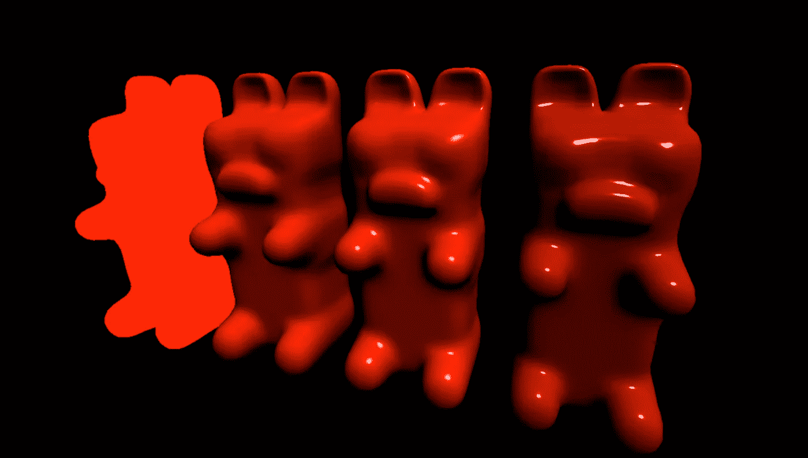
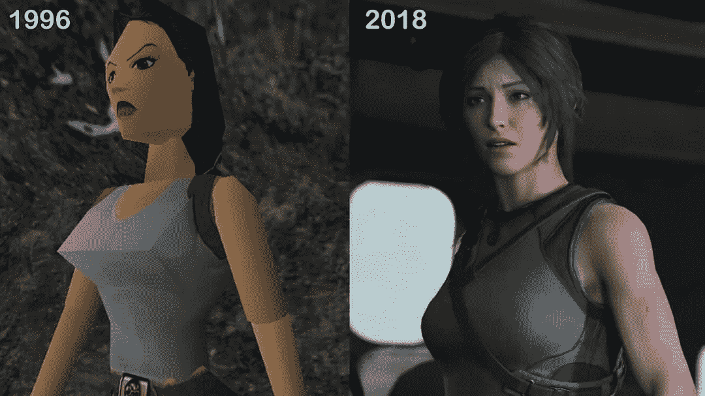
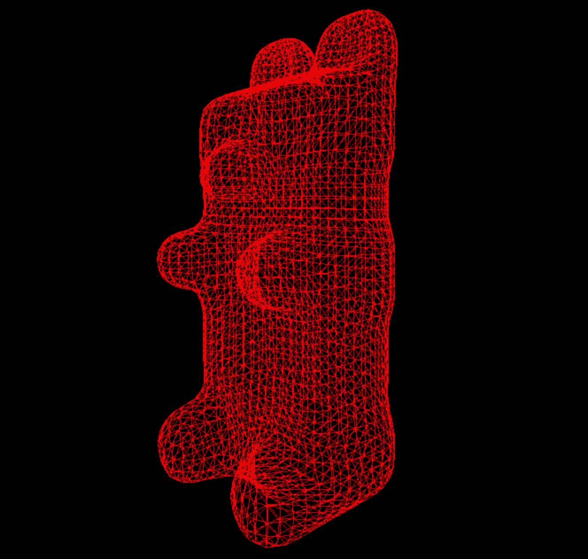
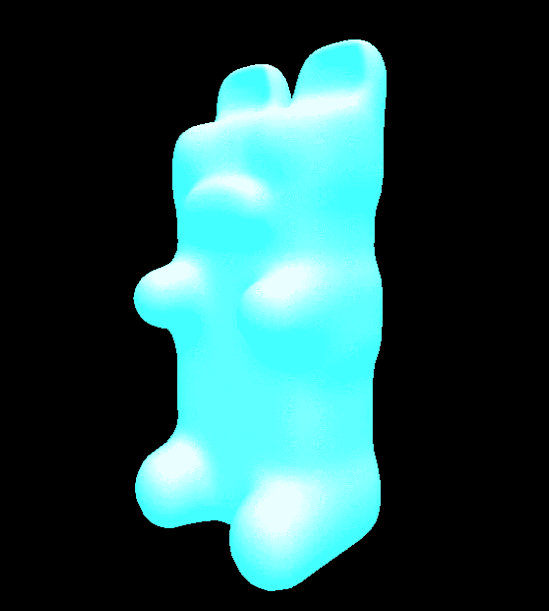
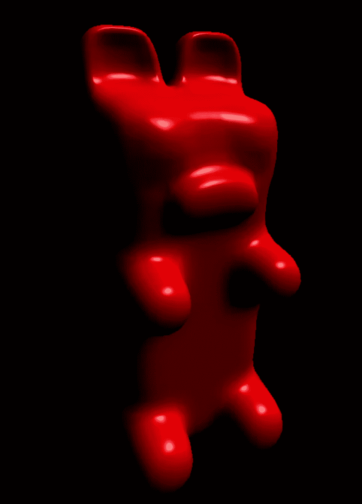
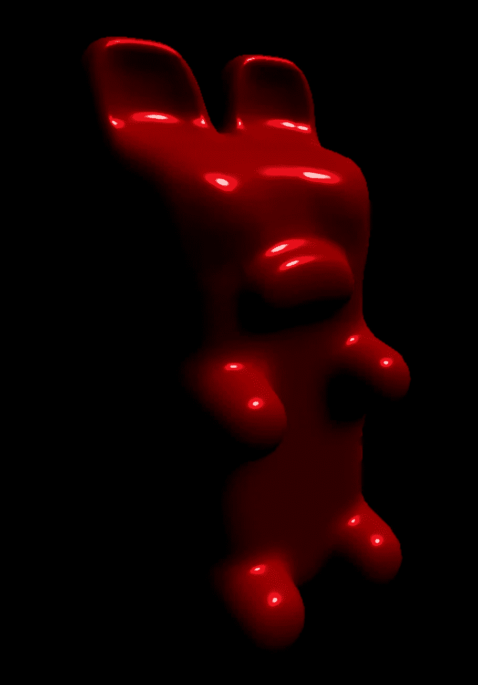

# ThreeJS 教程—比较最常见的材料

> 原文：<https://medium.com/geekculture/threejs-tutorial-comparing-the-most-common-materials-424eef8942a4?source=collection_archive---------8----------------------->



Which gummy bear you like best?

在让自己尝试了 ThreeJS 提供的每一种材料后，感觉就像见证了视频游戏图像质量的演变。这让我想起了 20 多年来萝拉·卡芙特的巨大变化:



[https://i.imgur.com/i62cHQl.jpg](https://i.imgur.com/i62cHQl.jpg)

在 ThreeJs 中，当你决定如何展示你的模型时，有几种材料可供选择。它有`[MeshDepthMaterial](https://threejs.org/docs/#api/en/materials/MeshDepthMaterial)`可以用灰度渲染网格上的每个像素；越近越白，越远越黑。它有`[MeshNormalMaterial](https://threejs.org/docs/#api/en/materials/MeshNormalMaterial)`，根据该点的法线方向渲染每个像素。但是今天，我要比较一下最常见的。

# 网状基础材料

这是最基本的材料。应用这种材质的网格通常只显示单一颜色。光照完全不会影响这种材质。当你用 [MeshBasicMaterial](https://threejs.org/docs/#api/en/materials/MeshBasicMaterial) 从不同的角度看一个物体时，在某些时候你就是搞不清楚你在看什么！

如果你想用一个简单的线框来渲染你的模型，这个材质是一个很好的选择。

```
new THREE.MeshBasicMaterial({color: '#F00', wireframe: true})
```



Red Gummy Bear wireframe using MeshBasicMaterial

# MeshLambertMaterial

与 MeshBasicMaterial 相比，这是一种更先进的材料。顾名思义，这种材质使用[朗伯反射](http://Lambertian reflectance)来模拟无光泽或无光泽表面上的光照。如果你正在渲染一辆汽车的哑光油漆工作，这种材料可能会做的工作。光照是在模型的每个顶点上计算的，并在顶点之间进行插值。

你也可以设置材料的“发射”颜色，它不受光照的影响，并添加在朗伯颜色之上。

```
new THREE.MeshLambertMaterial({color: '#F00', emissive: '#0FF'})
```



Cyan gummy bear using MeshLambertMaterial

# 网状材料

这种[材质](https://threejs.org/docs/#api/en/materials/MeshPhongMaterial)比朗伯材质稍微高级一点，因为它可以模拟镜面照明的光亮表面。光照是按像素计算的，而不是按顶点计算的，所以结果是更真实的光照，代价是更重的计算机处理。

您可以设置材质的“光泽”属性。值越高，材质越亮。

```
new THREE.MeshPhongMaterial({color: '#F00', shininess: 100})
```



Red gummy bear using MeshPhongMaterial

# 网格标准材料

这个[材质](https://threejs.org/docs/#api/en/materials/MeshStandardMaterial)使用基于物理的渲染，不同于我之前提到的材质。上面的 3 种材质都不是基于物理的，使用近似值计算照明。MeshStandardMaterial 是一种基于物理的材质，可在所有光照条件下真实工作。为了达到最大的精确度，光照也是按像素计算的。

两个主要属性在起作用:粗糙度和金属度。粗糙度越小，越亮。金属感对我来说是一个很难理解的概念，但随着价值的上升，它看起来更像金属。

```
new THREE.MeshStandardMaterial({color: '#F00', roughness: 0.2, metalness: 0.3})
```



Red gummy bear using MeshStandardMaterial

# 满座

你可能已经注意到了，这篇文章的主人公形象实际上是用我介绍的 4 种不同材料制作的小熊软糖。从左到右依次应用 MeshBasicMaterial、MeshLambertMaterial、MeshPhongMaterial 和 MeshStandardMaterial。

如果你想在你自己的电脑上渲染这些可爱的小熊软糖，看看我的 [Github repo](https://github.com/franky-adl/materials-demo) ！

# 信用

我用的小熊软糖模型是从[下载的，这个 3D 模型是 LittleWhiteElk](https://sketchfab.com/3d-models/gummy-bears-f5463367cb5247bdbaca78667e8e3260) 制作的，看起来比我这里的小熊软糖还要逼真！