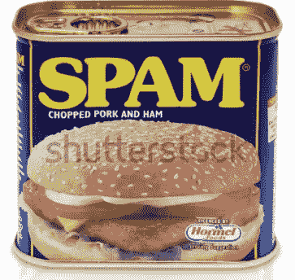

# 向需求扔开发垃圾邮件会造成混乱，而不是软件

> 原文：<https://medium.com/geekculture/throwing-developer-spam-at-requirements-creates-chaos-not-software-97f65967864d?source=collection_archive---------4----------------------->

## 开发者不是垃圾

[Spam](https://www.shutterstock.com/image-photo/leeds-united-kingdom-july-5th-2011-171401612)

> 两年后，垃圾邮件将被解决。比尔盖茨

开发人员有时被视为技术资源，都是一样的。一个新项目来了，你扔给它一堆类似的技术资源，并希望最好的。