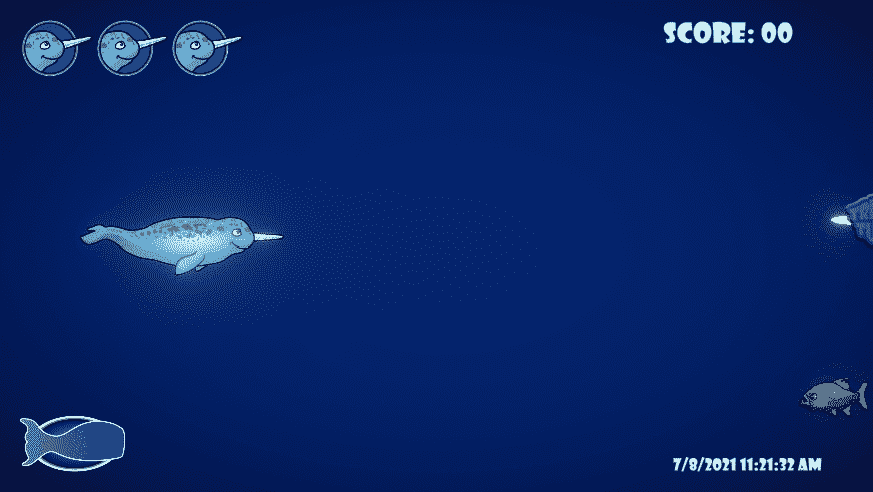

# 推进器用户界面:颜色和动画

> 原文：<https://medium.com/geekculture/thrusters-ui-color-and-animation-99b540d6989b?source=collection_archive---------23----------------------->

在我的前几篇文章中，我介绍了在我的游戏中构建一个推进器和相应的 UI 特性。我的**目标**现在是当玩家使用推进器时，通过改变进度条的**颜色**来匹配玩家的**输入**，最终确定我的 UI 栏的外观。我还想制作一个简单的**动画**，它将在推进器冷却方法**激活**时**循环。让我们开始吧！**