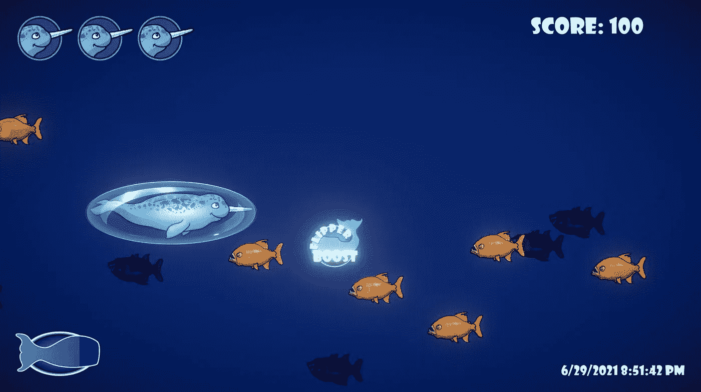

# 推进器用户界面第一部分:创造和准备艺术

> 原文：<https://medium.com/geekculture/thrusters-ui-part-i-creating-the-preparing-the-art-5f829f8aa13?source=collection_archive---------69----------------------->

让我的玩家能够通过按住左 shift 键来加速，对我来说是一个很好的举动，但正如他们所说的，一切美好的事情都要结束。让我的玩家无限制地使用推进器能力有点太友好了，所以是时候给这些推进器加上一条皮带了。

首先，我打开 Corel Draw 并创建两张 **PNG** 图片，我将**图层** …