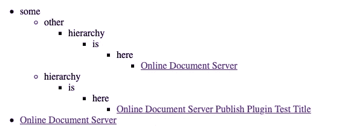

# 百里香叶|使用 Kotlin 和 Micronaut 创建动态层次树

> 原文：<https://medium.com/geekculture/thymeleaf-create-dynamic-hierarchy-trees-with-kotlin-micronaut-4b4449574f85?source=collection_archive---------11----------------------->

Photo by [Mila Tovar](https://unsplash.com/@virtualkee?utm_source=medium&utm_medium=referral) on [Unsplash](https://unsplash.com?utm_source=medium&utm_medium=referral)

这周我必须用 Kotlin 和百里香叶创建一个动态的树结构。我有一个 dataClass 节点，它有子节点、元数据和标题。这些子节点本身也是节点，因此也可以有子节点。这些节点中的最后一个被称为包含元数据的叶子。我需要做的是在一个 HTML 页面上显示整个结构，并使它成为动态的和可点击的，这样在开始时只能看到最高层。

# 创建控制器

控制器是该应用程序的两个主要部分之一。它负责向前端提供它需要处理的数据。因为我在这个项目中与 Micronaut 一起工作，所以我的控制器看起来像这样:

如您所见，findDocumentations 函数将监听根地址，并使用索引视图来显示响应。请注意，`Root().createWholeTree(metadataRepository.getAll())`只会创建数据树供我们使用。这个函数将只返回一个包含多个子节点的父节点。

# 在前端使用数据

首先，由于我们使用的是百里香，我们应该创建一个新的 index.html 文件，并在其中添加一些类似 xmlns:th 的东西。

最有趣的部分可能是第 11 行的列表项。在这个位置，将显示最低层次级别上的第一个项目。此列表项将被 menuFragment.html 文件中的 nestedMenu 替换。这里它还使用了 menuItemsList 属性，并将根对象的子对象发送给它，这是我们在控制器中发送的。

如果我们现在刷新主页，它会抛出一个异常，因为它找不到我们想要使用的片段。要解决这个问题，我们需要自己去创造。

# 定义菜单分段

menuFragment.html 实际上有两个不同的片段。一个是嵌套菜单，另一个叫做菜单。我们有两个独立的片段，因为一次我们需要一个完整的无序列表，就像我们从索引文件中调用它一样，而另一次我们只需要列表项本身。

如您所见，这些片段包含在它们自己的内部并被调用。菜单片段包含 nestedMenu 片段。nestedMenu 片段为 menuItemsList 中的每个 menuItem 创建一个列表项，它通过其参数获得该列表项。在这个列表项中，要么是一个动态生成的位置链接，要么只显示一个标题，并创建一个包含新菜单片段的新部分。

其工作方式是，只有结构的叶节点包含元数据。其他节点只有标题和子节点。这样，我们可以根据需要创建尽可能多的层次，因为我们知道只有叶节点可以包含元数据，并且之前的所有内容都需要调用菜单片段。

这本身将创建一个看起来像这样的树。

显然，这看起来并不漂亮，需要用一些适当的 css 来设计。

添加 css 后，我们可以看到只有第一层会显示出来，正如我们所希望的那样。问题是，现在它是不可点击的，我们不能访问上面有层次结构的链接。

为了解决这个问题，我们需要编写一点 javascript 并为 click 事件添加一个 eventListener。这个简单脚本的最终版本如下所示:

如果我们把这个脚本放到 index.html 文件中，我们应该能够像预期的那样点击层次结构。

# 反射

## 什么进展顺利

这个任务中最简单的部分可能就是控制器了。我在几分钟内就安装并运行了它，Micronaut 文档写得非常好，在某些情况下非常有用。CSS 和 JavaScript 部分也很简单，因为我在 W3Schools 上找到了一个很好的例子，我可以在我的项目中或多或少地直接使用它。

## 什么需要改进

首先，我在用百里香叶创建片段和理解这些片段可以像你在 Kotlin 中处理类一样调用自己时遇到了一些困难。开始的时候，我也遇到了一些直接在百里香叶中消耗数值的问题。过了一段时间，我找到了正确的方法，从那以后，几乎一切都很好。