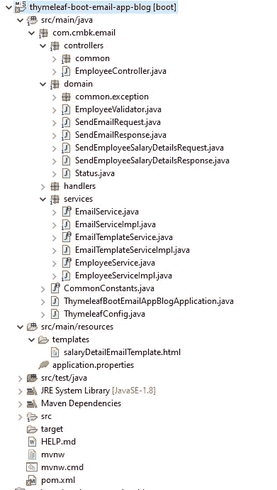
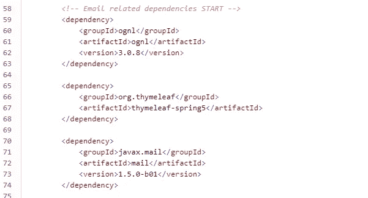
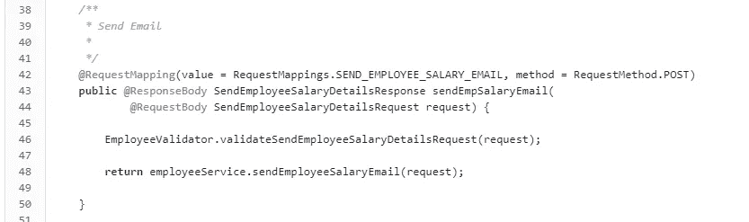
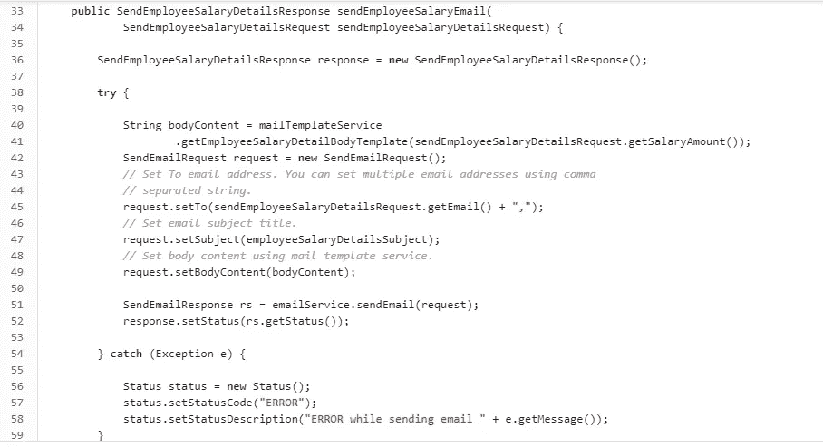
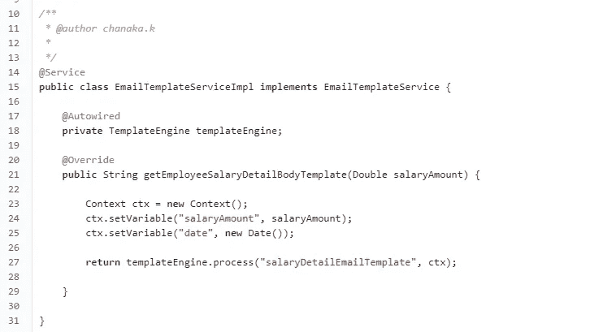
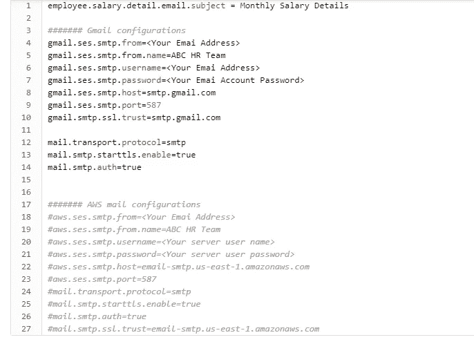
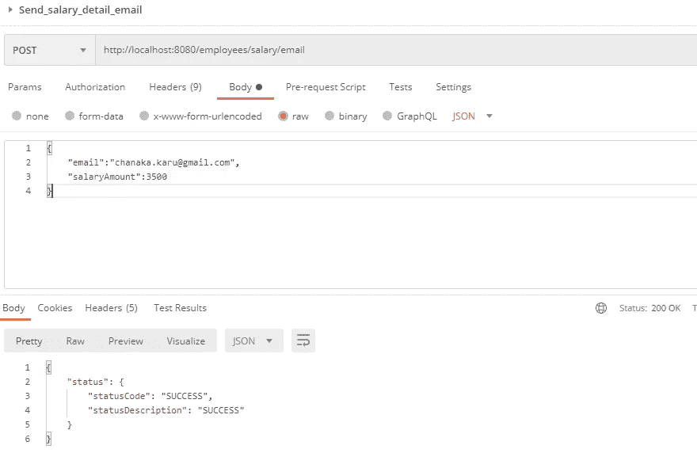
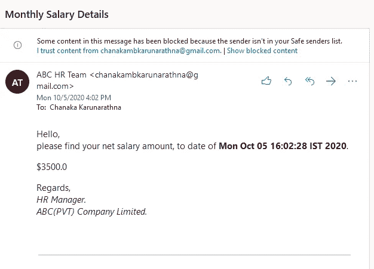

# 百里香电子邮件与 SpringBoot REST web 服务的集成

> 原文：<https://medium.com/geekculture/thymeleaf-email-integration-with-springboot-rest-web-service-31bea7c99b1d?source=collection_archive---------2----------------------->

如今，我们有一些技术可以将电子邮件服务与 java 应用程序集成在一起。但其中“百里香电子邮件集成”是发送电子邮件的一种出色方式。

因此，在这里，我们将按照 A-Z 步骤解释“如何将百里香电子邮件服务集成到 SpringBoot REST web 服务中”。在开始实现之前，你可以从 [**这里**](https://bitbucket.org/thymeleaf-boot-email-app-blog/thymeleaf-boot-email-app-blog/src/master/) 下载完整的 java 代码示例。在本例中，我将发送一封包含员工工资详细信息的电子邮件。

**技术**

Java 1.8
Maven 3 . 6 . 1
spring boot 2 . 2 . 7 . release
百里香叶-spring 5
javax . mail
log4j

**项目结构**

Project structure

**第一步:POM.xml(依赖关系)**

请从 [**这里**](https://bitbucket.org/thymeleaf-boot-email-app-blog/thymeleaf-boot-email-app-blog/src/master/pom.xml) 查看完整的 POM 文件。

**第二步:控制器电平变化**

从请求中获取电子邮件地址和工资金额，并在验证后传递给服务层。

**第三步:服务层变更**

请访问 [**这里**](https://bitbucket.org/thymeleaf-boot-email-app-blog/thymeleaf-boot-email-app-blog/src/master/src/main/java/com/cmbk/email/services/EmployeeServiceImpl.java) 获取完整的类文件并查看评论。我已经解释了每一步。

**步骤 3.1:创建电子邮件模板**

在这里，我们必须在 resources 文件夹中创建一个名为“ **templates** 的文件夹，并需要添加一个 HTML 文件(例如:**salaryDetailEmailTemplate.html**)。

salaryDetailEmailTemplate.html

EmailTemplateServiceImpl.java

这些 **${}** 值是可变参数。 [**里面的 EmailTemplateServiceImpl.java**](https://bitbucket.org/thymeleaf-boot-email-app-blog/thymeleaf-boot-email-app-blog/src/master/src/main/java/com/cmbk/email/services/EmailTemplateServiceImpl.java)**。**我们将把**工资金额**和**日期**添加到**上下文**对象中。一旦这个 Context 对象和 HTML 文件名被传递到 **process()** 方法中，它将以字符串值的形式返回邮件正文内容。

**步骤 3.2:设置地址、主题和正文内容**

为了设置电子邮件地址、电子邮件主题和电子邮件正文内容，我使用了这个**域类。
如果我们需要设置多个电子邮件地址，我们可以使用逗号分隔的字符串设置多个电子邮件地址。对于这个例子，我们从 [**属性文件**](https://bitbucket.org/thymeleaf-boot-email-app-blog/thymeleaf-boot-email-app-blog/src/master/src/main/resources/application.properties) 中选择电子邮件主题。**

****步骤 3.3:发送电子邮件****

**为了发送电子邮件，我们使用了一个不同的服务类，名为[**EmailServiceImpl.java**](https://bitbucket.org/thymeleaf-boot-email-app-blog/thymeleaf-boot-email-app-blog/src/master/src/main/java/com/cmbk/email/services/EmailServiceImpl.java)。请访问 bitbucket URL 查看实现。**

**这是这种整合的主要部分。在代码中，我用注释解释了每一行。我们首先从 [**属性文件**](https://bitbucket.org/thymeleaf-boot-email-app-blog/thymeleaf-boot-email-app-blog/src/master/src/main/resources/application.properties) 中获取连接配置信息。这个例子使用的是 Gmail 服务器，但是在属性文件中，我也提到了 AWS 电子邮件服务器的相关细节。**

****

**这个[**EmailServiceImpl.java**](https://bitbucket.org/thymeleaf-boot-email-app-blog/thymeleaf-boot-email-app-blog/src/master/src/main/java/com/cmbk/email/services/EmailServiceImpl.java)的类很泛。因此，您也可以在您的项目工作中直接使用这个实现。此外，这也将支持多个发件人电子邮件地址。请参见这个类**中的“**populate addresses(String to emails)”**方法。现在我们已经完成了实现，并准备测试它。****

****步骤 4:测试****

**简单地说，我们可以使用 Postman 脚本来测试这个实现。**

**但是在运行这个脚本之前，你必须在你的 Gmail 帐户中做一些设置更改，因为有一些安全问题。你必须先遵循以下步骤。**

1.  **登录您的 Gmail 帐户。**
2.  **转到**账户**选项卡。**
3.  **打开**不太安全的应用程序访问。****
4.  **在此之后，当你试图从你的应用程序发送邮件时，你会得到一个错误。**
5.  **然后进入**发现的安全问题**(是谷歌账户安全标签的第一个选项)。这里需要验证最后一个活动是自己验证的。**

**就是这样。现在你可以用邮递员或者任何你熟悉的方式发送电子邮件。请查找下面给出的邮递员请求。**

****

**Postman Request and Response**

**这是一封电子邮件。**

****

**希望这能对你有所帮助，请访问这里的 [**获取完整的代码示例**](https://bitbucket.org/thymeleaf-boot-email-app-blog/thymeleaf-boot-email-app-blog/src/master/) 。如果您有任何问题，请留言或评论。**